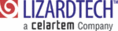
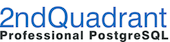
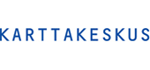
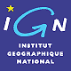

La Fundación OSGeo
================================================================================

La `Fundación para el Código Abierto Geoespacial (OSGeo) <http://osgeo.org>`_,
es una organización sin ánimo de lucro cuya misión es el soporte y la promoción del desarrollo colaborativo de tecnologías y datos geoespaciales abiertos. La fundación proporciona soporte económico, organizativo y legal a la comunidad de código abierto en su conjunto. Sirve como una entidad legal independiente a la que sus miembros de la comunidad pueden contribuir código, financiación y otros recursos, seguros de que sus contribuciones se mantendrán para el beneficio público. OSGeo también sirve como una organización para la promoción y difusión de la comunidad del código abierto geoespacial, y proporciona un foro común y una infraestructura compartida para la mejora de la colaboración entre proyectos.

Los proyectos de la fundación son accesibles y usables libremente bajo una 
 `licencia de código abierto certificada por OSI <http://www.opensource.org/licenses/>`_.

Este Live DVD y Máquina Virtual ha sido configurado por miembros de la comunidad OSGeo para poder demostrar su software libre geoespacial favorito. Se incluyen un buen número de proyectos que no pertenecen a OSGeo, algunos orientados a SIG y otros no, que esperamos que usted encuentre tan interesantes como nosotros. La fundación OSGeo no recomienda o garantiza ningún *software*, proyecto o empresas en concreto.

`Estas aplicaciones se distribuyen con la esperanza de que sean útiles, pero SIN NINGUNA GARANTÍA; incluso sin la garantía de COMERCIABILIDAD o ADECUACIÓN A UN PROPÓSITO CONCRETO.`

OSGeo Supporting Sponsors
--------------------------------------------------------------------------------

.. image:: ../images/logos/ordnance-survey_logo.png
  :alt: Ordnance Survey
  :target: http://www.ordnancesurvey.co.uk

OSGeo Associate Sponsors
--------------------------------------------------------------------------------

.. image:: ../images/logos/first-base-solutions_logo.png
  :alt: First Base Solutions
  :target: http://www.firstbasesolutions.com

.. image:: ../images/logos/astun.png
  :alt: Astun Technology
  :target: http://www.isharemaps.com

.. image:: ../images/logos/geocat_logo.png
  :alt: GeoCat
  :target: http://geocat.net/

.. image:: ../images/logos/borealis.jpg
  :alt: BOREALIS
  :target: http://www.boreal-is.com

.. image:: ../images/logos/camptocamp_logo.png
  :scale: 80 %
  :alt: Camptocamp
  :target: http://camptocamp.com

Para más información
--------------------------------------------------------------------------------

Para patrocinar OSGeo o conversar sobre las oportunidades de patrocinio en
detalle, puede ponerse en contacto con:

.. include :: ../osgeo_contact.rst

