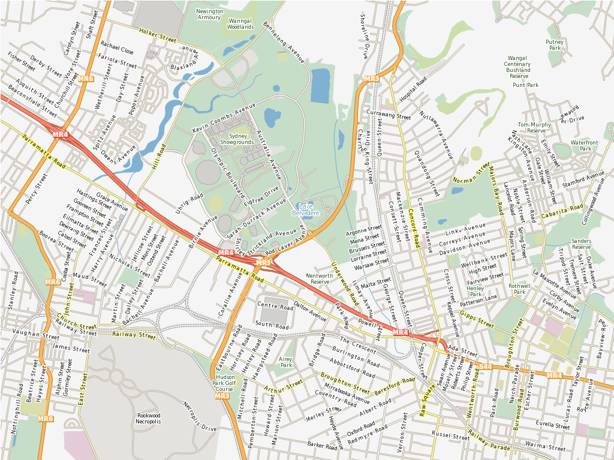

:Author: Alan Boudreault, Steve Lime
:Reviewer: Cameron Shorter, LISAsoft
:Version: osgeo-live5.5
:License: Creative Commons Attribution 3.0 Unported (CC BY 3.0)

.. image:: ../../images/project_logos/logo-mapserver-new.png
  :scale: 65 %
  :alt: Logo du projet
  :align: right
  :target: http://mapserver.org/

.. image:: ../../images/logos/OSGeo_project.png
  :scale: 100 %
  :alt: Projet OSGeo
  :align: right
  :target: http://www.osgeo.org

MapServer
================================================================================

Service Web
~~~~~~~~~~~~~~~~~~~~~~~~~~~~~~~~~~~~~~~~~~~~~~~~~~~~~~~~~~~~~~~~~~~~~~~~~~~~~~~~

MapServer est un moteur de rendu de cdonnées cartographiques `Opensource <http://www.opensource.org>`_ écrit en C. Au delà de la possibilité d'explorer des données SIG, MapServer vous permet de créer des "image maps" géographiques, qui sont des cartes permettant de diriger des utilisateurs vers du contenu web. Par exemple, `le compas pour les loisirs <http://www.dnr.state.mn.us/maps/compass.html>`_ du département des ressources naturelles du Minnesota fournit aux utilisateurs plus de 10 000 pages web, rapports et cartes via une seule application. La même aplication sert aussi de "moteur de carte" pour d'autres parties du site, fournissant un contexte spatial là où c'est nécessaire.

MapServer a été originellement développé par le projet ForNet de l’Université du Minnesita (UMN) en coopération avec la NASA et le département du Minnesota des Ressources Naturels (MNDNR). Plus tard il a été hébergé par le projet TerraSIP, un projet sponsorisé par la NASA entre l'UMN et un consortium d’organismes de gestion des sols.

MapServer est maintenant un projet de l\'`OSGeo <http://www.osgeo.org>`_, et maintenu par un nombre croissant de développeurs (proche de 20) tout autour du monde. Il est soutenu par un groupe d’organisations diverses qui financent les améliorations et la maintenance, et est administré au sein de l’OSGeo par le Comité de Gouvernance de Projet composé de développeurs et d’autres contributeurs.

Caractéristiques principales
--------------------------------------------------------------------------------

* Sorties cartographiques avancées

  * Éxécution de l’application et du dessin des objets fonction de l’échelle
  * Étiquetage des géométries incluant la médiation des collisions des étiquettes
  * Support des polices TrueType pour les étiquettes et les symboles
  * Automatisation d’éléments de cartes (barre d’échelle, carte de référence et légende)
  * Cartographie thématique en utilisant des classes basées sur des logiques ou des expressions régulières
  * Support de moteur de rendu différents avec des pilotes pour AGG, Cairo, GD, OpenGL et d'autres
  * Gestion spéciale pour générer des sorties tuilées

* Support de requêtes spatiales sophistiquées

  * Identifier les objets par attributs, point, rectangle englobant ou géometrie sur une ou plusieurs couches
  * Support pour l'interrogation sur des raster
  * Sortie customisable complétement en s'appuyant sur un sytème de modèle
  * Génération de sortie basée sur des appels à OGR 

* Support d'environnement de développement et de scriptage populaires

  * CGI/FastCGI
  * PHP, Python, Perl, Ruby, Java, et .NET

* Support multi-plateformes

  * Linux, Windows, Mac OS X, Solaris, et plus

* Une multitude de formats de données raster et vecteur

  * Support natif pour les shapefiles ESRI, PostGIS, ArcSDE d'ESRI et Oracle Spatial
  * De nombreux autres formats via GDAL et OGR

* Support de projection de carte

  * Reprojection de cartes à la volée avec plusieurs milliers de projections grâce à la bibliothèque Proj.4

Standards implémentés
--------------------------------------------------------------------------------

* Support de nombreux standards de l'Open Geospatial Consortium  (OGC):

  * WMS (client/serveur), WFS non transactionnel (client/serveur), WMC, WCS, Filter Encoding, SLD, GML, SOS, OM

Démo
--------------------------------------------------------------------------------

* `Itasca <http://localhost/mapserver_demos/itasca/>`_

Documentation
--------------------------------------------------------------------------------

* `Documentation MapServer 6.0.3 <../../mapserver/doc/index.html>`_

Détails
--------------------------------------------------------------------------------

**Site web:** http://www.mapserver.org/

**Licence:** `Licence style MIT <http://mapserver.org/copyright.html#license>`_

**Version du logiciel:** 6.0.3

**Plateformes supportées:** Windows, Linux, Mac

**Interfaces API:** C, PHP, Python, Perl, Ruby, Java, and .NET

**Support:** http://mapserver.org/community/

Guide de démarrage rapide
--------------------------------------------------------------------------------
    
* :doc:`Documentation du guide de démarrage rapide <../quickstart/mapserver_quickstart>`
