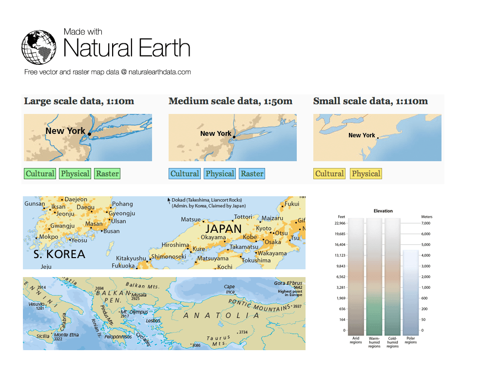

:Author: OSGeo-Live
:Reviewer: Cameron Shorter, LISAsoft
:Version: osgeo-live5.5
:License: Creative Commons Attribution 3.0 Unported (CC BY 3.0)

.. image:: ../../images/project_logos/logo-naturalearth.png
  :scale: 100 %
  :alt: Logo du projet
  :align: right
  :target: http://www.naturalearthdata.com/

Natural Earth
================================================================================

Données cartographiques
~~~~~~~~~~~~~~~~~~~~~~~~~~~~~~~~~~~~~~~~~~~~~~~~~~~~~~~~~~~~~~~~~~~~~~~~~~~~~~~~

Natural Earth fournit aux cartographes une solution "sur étagère" pour créer des cartes à un niveau mondiale, régional et étatique aux échelles 1/10 000 000, 1/50 000 000 et  1/110 000 000. Des informations à la fois politiques (administratives) et physiques (naturelles) sont inclues et les objets vectoriels s'alignent parfaitement avec les données raster associées.

Natural Earth résoud le problème commun que de nombreux cartographes rencontrent: trouver des données vecteur pour faire des cartes à petite échelle pour publication avec un niveau de détail approprié aux cartes qu'ils font.

Caractéristiques principales
--------------------------------------------------------------------------------

* Les objets vectoriels incluent les noms et d'autres attributs
* Les polygones les plus grands sont découpés pour une gestion plus efficace des couches bathymétriques.
* Vecteurs pratiques pour les projections qui se rejoignent précisément à 180 degrés de longitude. Les lignes contiennent assez des points pour lisser les contours dans les projections coniques, mais pas trop non plus sinon le temps de traitement serait pénalisé.
* La données raster inclut les reliefs en niveaux de gris et les teintes dégradées en fonction de l'altitude à partir des dernières données SRTM altitudinales de la NASA et est adaptée pour être cohérente avec les données vecteur Natural Earth.
* Optimisé pour l'utilisation dans les applications de cartographie en ligne, comme Google et Yahoo, avec des attributs dépendant de l'échelle pour gérer la visualisation en fonction de différents seuils de zoom.

Jeux de données
--------------------------------------------------------------------------------

Thèmes sur les données culturelles vecteur:
  Inclut les aires des pays, des territoires disputés, les états et les régions (divisions administratives de niveau 1), les lieux habités (agglomérations et villes). Les routes, les lignes ferroviaires, les polygones urbains, les parcs et les aires protégées, les groupes de nation du pacifique, et les indicateurs des eaux limitrophes qui complètent l'offre culturelle.

Thèmes des données physiques vecteur:
  Inclut les lignes de côte, les terres, les océans, les iles mineures, les récifs, les poins et objets de régions physiques, les rivières, les lacs, les zones glacées, les plates-formes glaciaire antarctiques, la bathymétrie, les lignes géographiques, et les graticules.

Thèmes des données raster:
  Reliefs en niveaux de gris, teintes dégradées en fonction de l'altitude, données dérivées des vues satellites d'occupation des sols, représentation environnementale idéalisée (sans impact anthropique), fonds des océans et bathymétrie. Des options de contenus incluent: l'occupation des sols, les reliefs ombragés, les eaux océaniques, et les drainages avec les lacs.

Détails
--------------------------------------------------------------------------------

**Site web:** http://naturalearthdata.com

**License:** Aucune, la donnée est dans le domaine public.

**Version de la donnée:** 1.4

**Format de données:** SHP and TIF+TFW

**Système de coordonnées spatial:** WGS84.

**Support:** http://naturalearthdata.com/forums/

