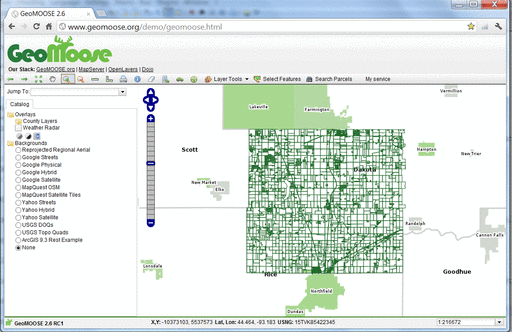

:Author: OSGeo-Live
:Author: Bob Basques
:Reviewer: Cameron Shorter, Jirotech
:Translator: Zoltan Siki
:Version: osgeo-live8.5
:License: Creative Commons Attribution 3.0 Unported (CC BY 3.0)

.. image:: ../../images/logos/OSGeo_project.png
  :scale: 100 %
  :alt: OSGeo Projekt
  :align: right
  :target: http://www.osgeo.org

GeoMoose
================================================================================

Web GIS Portal
~~~~~~~~~~~~~~~~~~~~~~~~~~~~~~~~~~~~~~~~~~~~~~~~~~~~~~~~~~~~~~~~~~~~~~~~~~~~~~~~

A GeoMOOSE egy böngésző alapú térképes keretrendszer megosztott kartográfiai
adatok megjelenítésére. Különösen hasznos megyei, városi és helyhatósági irodák
(ahonnan a GeoMoose származik) térbeli és nem térbeli adatainak kezelésére.
A MapServer és az OpenLayers funkcionalitását bővíti ki, hogy olyan beépített 
szolgáltatásokat nyújtson mint például az azonosítás művelet többrétegen, hogy
több réteget láthassunk és kezelhessünk, a szelekció művelet és keresés az 
adathalmazban.

A GeoMOOSE gyors, jól teljesít rétegek és/vagy szolgáltatások százaival
egyidőben. Több különböző forrásból érkező adatok különböző eszközökkel és 
eltérő menetrendek szerint kezelhetők, mivel minden térképi réteg saját
konfigurációs fájlokkal rendelkezik a publikáláshoz, a szimbólumokhoz, a 
sablonokhoz és a forrás adatokhoz.

A felhasználói felület könnyen testreszabható és a moduláris architektúrának
köszönhetően további szolgáltatások adhatók hozzá.

Alapfunkciók
--------------------------------------------------------------------------------
* Osztott adatkezelés több adatgazda között.
* Térképek: MapServer, Google, VirtualEarth, Tilecache, ArcGIS REST, WMS
  forrásokból.
* Az adatforrások konfigurálása többféle megjelenítéshez.
* Tájékozódás és szűrés adat katalógusokból.
* Eszközök: mérés, rajzolás, lekérdezés, fading, átrendezés, vetületváltás, nagyításra ugrás, koordináta kiolvasás, ...
* Megjelenítés: MapViewer, Bird's Eye, Side Menu, Navigation, Tabbed User Controls.
* XML based MapBook configuration file for User Interface, Source Layers and Tools.
* Integráció Mapserverrel.
* A moduláris tervezés lehetővé teszi az integráció nem térinformatikai rendszerekkel (mint például vagyonkezelés)
* Majdnem korlátlan számú réteg publikálása.
* PDF nyomtatás.

Implementált szabványok
--------------------------------------------------------------------------------
* WMS
* WFS (kliens)
* WFS-T (kliens)

Részletek
--------------------------------------------------------------------------------

**Honlap:** http://www.geomoose.org/

**Licenc:** MIT based license. http://www.geomoose.org/info/license.html

**Program verzió:** 2.7.1

**Támogatott platformok:** Windows, Linux, Mac

**Kereskedelmi támogatás:** http://www.geomoose.org/info/commercial_support.html

**Közösségi támogatás:** http://www.geomoose.org/info/mailing_lists.html

Gyorstalpaló
--------------------------------------------------------------------------------
    
* :doc:`Gyorstalpaló dokumentáció <../quickstart/geomoose_quickstart>`
