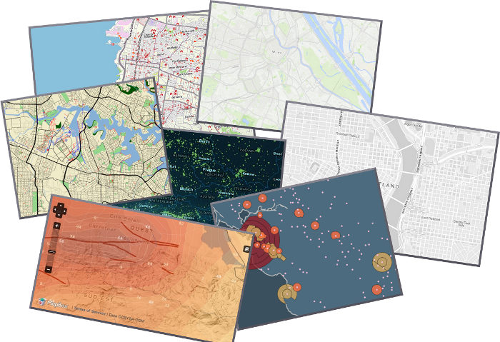

:Author: OSGeo-Live
:Author: Javier Sanchez
:Reviewer: 
:Version: osgeo-live6.5
:License: Creative Commons Attribution 3.0 Unported (CC BY 3.0)
:Translator: Luca Delucchi

.. image:: ../../images/project_logos/logo-tilemill.png
  :scale: 75 %
  :alt: TileMill
  :align: right
  :target: http://www.tilemill.com

Design studio per mappe Web
================================================================================

TileMill
~~~~~~~~~~~~~~~~~~~~~~~~~~~~~~~~~~~~~~~~~~~~~~~~~~~~~~~~~~~~~~~~~~~~~~~~~~~~~~~~

.. image:: ../../images/screenshots/1024x768/tilemill_interface.png
  :scale: 55 %
  :alt: TilleMill user interface
  :align: right

TileMill è uno strumento per creare mappe velocemente e facilmente per progettare mappe per il web
usando dati personalizzati. E 'costruito sul potente software per rendering di mappe open-source
Mapnik ( lo stesso software usato da OpenStreetMap e MapQuest per fare parte delle loro mappe )
e usa CartoCSS come linguaggio dello stile.

TileMill supporta sia di dati vettoriali ( csv, shapefile, kml. GeoJson) o raster (GeoTiff), e
può anche collegarsi a grandi dataset come PostgreSQL con PostGIS e OpenStreetMap. Mappe personalizzate
possone essere esportate in formati differenti come: .png, .pdf, .svg o MBTiles

Anche se TileMill è uno studio di design potente, al fine di utilizzare in modo efficace si avrà
probabilmente bisogno di usare con altre applicazioni GIS desktop (come QuantumGIS) per manipolare i
dati geospaziali in anticipo o editor di grafica (come GIMP) per creare e modificare le icone, i modelli
e le texture.

Caratteristiche principali
--------------------------------------------------------------------------------

* Caricare i dati da una vasta gamma di sorgenti
  
  * ESRI Shapefile
  * KML
  * GeoJSON
  * GeoTiff
  * CSV fogli di calcolo

* Connessione di database geospaziali

  * PostgreSQL + PostGIS
  * SQLite

* Gestione di layers personalizzati

* Stile dei dati

  * Stile usando colori preselezionati o personalizzati
  * Stili condizionati

* Aggiunta di tooltips e legende

* Esportazione di una mappa

  * File di immagine
  * Mappe incluse su una pagina web o CMS (WordPress, Drupal)

* JavaScript API

Standard implementati
--------------------------------------------------------------------------------

.. Writing Tip: List OGC or related standards supported.

* TileMill does not support OGC standards, like WMS or WFS. Rather it adheres to the widespread practices of z/x/y tile schemes used by Google and OSM and is based on the MBTiles and UTFGrid specifications.

Dettagli
--------------------------------------------------------------------------------

**Sito web:** http://tilemill.com

**Licenza:** BSD

**Versione software:** 0.10.1

**Piattaforme supportate:** Windows, Linux, Mac

**Interfacce API:** JavaScript

**Supporto:** http://www.tilemill.com

Guida rapida
--------------------------------------------------------------------------------
    
* :doc:`Documentazione introduttiva <../quickstart/tilemill_quickstart>`

