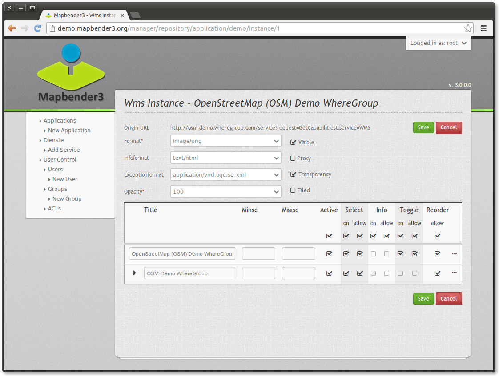
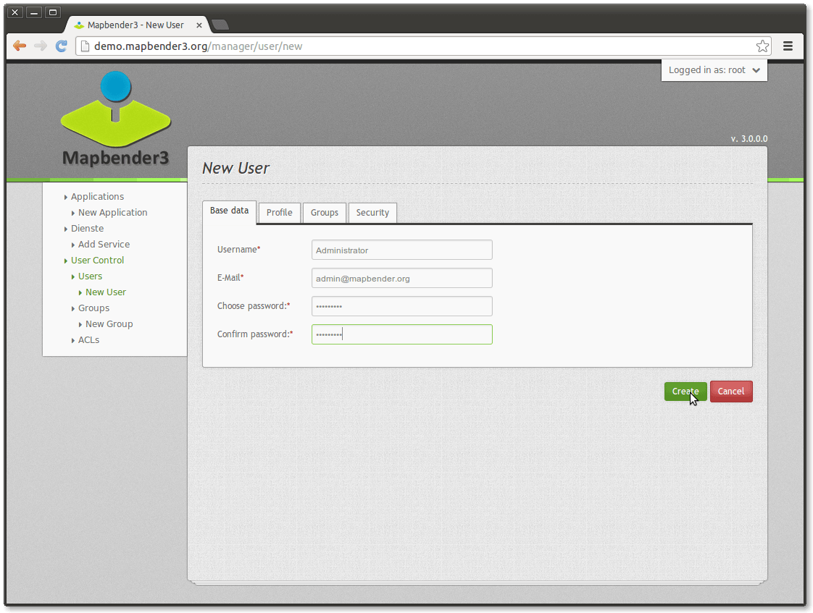

:Author: OSGeo-Live
:Author: Astrid Emde
:Translator: Diego Migliavacca
:Version: osgeo-live7.0
:License: Creative Commons Attribution-ShareAlike 3.0 Unported  (CC BY-SA 3.0)
:Thanks: mapbender-user list

.. image:: ../../images/project_logos/logo-Mapbender3.png
  :scale: 100 %
  :alt: project logo
  :align: right

********************************************************************************
Guida rapida su Mapbender3
********************************************************************************

Mapbender é un framework web per pubblicare, registrare, vedere, navigare, monitorare e consentire l'accesso sicuro a servizi SDI (spatial data infrastructures - infrastrutture di dati spaziali). 

Le interfacce di gestione permettono agli amministratori di sistema di mantenere e classificare servizi relativi a mappe (map services) e ad oggetti geografici (feature services), e consentire l'accesso a persone, gruppi e ad altri servizi.

Mapbender3 é la versione più recente del framework Mapbender. Mapbender é stato interamente riscritto utilizzando le più moderne tecnologie web. Alla base del software c'è Symfony 2, l'ultima versione dell'affermato framework PHP.

Il lato client si basa invece su OpenLayers e jQuery (UI), legati assieme da MapQuery.

Con questo nuovo codice di base, portiamo avanti l'idea di Mapbender come framework per la produzione di geoportali:
	* le applicazioni possono essere prodotte e configurate direttamente all'interno del browser;
	* i servizi, come ad es. WMS, possono essere amministrati all'interno di un repository di supporto, per essere poi inseriti nelle applicazioni;
	* i diritti di accesso sono facili da mantenere, sia per utenti individuali che per gruppi, sia che vengano memorizzati dentro un database o dentro un LDAP.

Per svolgere questa breve introduzione all'uso di Mapbender3 necessiti solo di un browser.

Questa guida rapida descrive come:

	* avviare Mapbender
	* creare una nuova applicazione
	* aggiungere un servizio Web Map Service (OGC WMS)
	* configurare un servizio WMS
	* sviluppare una applicazione indipendente
	* creare un user e un gruppo ed assegnargli delle applicazioni

L'immagine che segue mostra come può apparire l'interfaccia di una applicazione creata con Mapbender:

  .. image:: ../../images/screenshots/800x600/mapbender3_basic_application.png
     :scale: 80

Installazione
================================================================================
Per l'installazione di Mapbender, leggi la documentazione disponibile alla pagina http://doc.mapbender3.org/en/book/installation.html della documentazione di Mapbender3.

Avviare Mapbender
================================================================================

#. Scegli  :menuselection:`Mapbender` dal menu start oppure utilizza il link http://localhost/mapbender3/app.php

Se incontri delle difficoltà ad avviare Mapbender, prova a controllare se il tuo web server Apache e PostgreSQL sono in funzione.

Avviare Mapbender in modalità debug (app_dev.php)
================================================================================
Symfony mette a disposizione degli sviluppatori una modalità di debug che mostra varie informazioni riguardanti la tua applicazione (logs, eccezioni, database queries, uso della memoria, tempi di esecuzione e altro). Questa modalità é disponibile solo da localhost.

  .. image:: ../../images/screenshots/800x600/mapbender3_app_dev.png
     :scale: 80

#. Avvia in modalità debug: http://localhost/mapbender3/app_dev.php

#. Dai un'occhiata alle informazioni offerte da questa modalità.

  .. image:: ../../images/screenshots/800x600/mapbender3_symfony_profiler.png
     :scale: 80

Pagina di benvenuto
================================================================================

#. La Welcome page elenca le applicazioni che sono pubbliche e che possono essere utilizzate da tutti gli utenti. Le applicazioni vengono elencate attraverso un piccolo screenshot, un titolo e una descrizione.

#. Puoi avviare una applicazione cliccando sul titolo oppure sul pulsante start.

#. Per iniziare a gestire applicazioni con Mapbender, devi prima effettuare il login per accedere alla schermata di amministrazione.

#. Clicca su Login in alto a destra per aprire la pagina di login.

#. Puoi effettuare il login utilizzando il nome utente generato durante l'installazione. Questo potrà essere :guilabel:`root` e password :guilabel:`root` (questi sono username e password predefiniti, ottenuti durante l'installazione di Mapbender con OSGeo-Live. Puoi cambiare la password se vuoi lavorare in un ambiente di produzione. Non cancellare, però, la user :guilabel:`root`.).
  
  .. image:: ../../images/screenshots/800x600/mapbender3_welcome.png
     :scale: 80

Effettuato il login sarai indirizzato alla pagina di :guilabel:`amministrazione di Mapbender`.

Panoramica sull'applicazione
================================================================================
Dopo il login, sarai indirizzato alla pagina :guilabel:`Applications`, che presenta una lista di applicazioni alle quali ti é permesso accedere.

La panoramica di riepilogo dell'applicazione fornisce le seguenti informazioni e funzionalità:

	* titolo e descrizione
 	* link all'applicazione
 	* pulsante per modificare l'applicazione
 	* pulsante per la pubblicazione e l'annullamento della pubblicazione dell'applicazione
 	* pulsante per eliminare l'applicazione
 	* pulsante per creare una nuova applicazione
 	* il filtro sul campo di testo permette di cercare applicazioni per nome

  .. NON ANCORA IMPLEMENTATO: In Mapbender hai a disposizione dei template di applicazioni, che puoi usare per creare le tue nuove applicazioni.

  .. image:: ../../images/screenshots/800x600/mapbender3_application_overview.png
     :scale: 80

Creare una nuova applicazione
================================================================================
Ora puoi creare una nuova applicazione fornendo alcune informazioni di base su di essa. Utilizza poi la modalità di modifica per aggiungere elementi, layers e informazioni relative alla sicurezza.

#. scegli :menuselection:`Applications --> New Application`

#. definisci un titolo e una descrizione per la tua applicazione

#. definisci un titolo per l'URL. Questo titolo sarà utilizzato nell'URL per aprire l'applicazione. Può essere lo stesso del titolo dell'applicazione.

#. clicca sul pulsante **Create** per creare l'applicazione

#. clicca sul :menuselection:`pulsante Edit` sulla nuova applicazione per modificare l'applicazione

#. la tua applicazione é stata creata. Adesso hai bisogno di una mappa WMS da visualizzare nella tua applicazione. Questo sarà descritto nella sezione **Amministrazione di fonti di dati**.

  .. image:: ../../images/screenshots/800x600/mapbender3_create_application.png
     :scale: 80

..
  NON ANCORA IMPLEMENTATO
  Copia o rinomina una applicazione
  ================================================================================
 Puoi anche creare una nuova applicazione facendo la copia di una applicazione esistente. Vai a :menuselection:`Application Management --> Rename/copy application`, scegli l'applicazione che vuoi copiare e definisci un nome per la nuova applicazione. Questa funzionalità non solo copia l'applicazione, ma copia anche i servizi relativi all'applicazione e gli utenti/gruppi (opzionale). Questo significa che la nuova applicazione avrà già dei map services, e gli utenti e i gruppi che hanno accesso all'applicazione copiata avranno accesso anche alla nuova applicazione.

Eliminare una applicazione
================================================================================
Puoi eliminare una applicazione dalla pagina :menuselection:`Applications`, cliccando sul :menuselection:`pulsante X`.

..
  NON ANCORA IMPLEMENTATO
  Esportare una applicazione
  ================================================================================
  Puoi esportare una applicazione come SQL attraverso :menuselection:`Applications --> Export  application (SQL)`. L'SQL contiene tutte le definizioni degli elementi dell'applicazione e può anche essere importato in un'altra installazione di Mapbender.

  .. tip:: L'esportazione di una applicazione non contiene le informazioni relative ai servizi e le informazioni riguardanti l'accesso di utenti e gruppi.

Amministrazione di fonti di dati (Data sources)
================================================================================
Mapbender può gestire differenti servizi, come OGC WMS, OGC WMTS oppure OGC WFS. Ogni servizio deve essere gestito in modo differente. Gli strumenti di amministrazione forniscono una interfaccia per l'amministrazione di ogni fonte di dati (per il momento solo WMS).

Panoramica sul repository di supporto
================================================================================

#. Scegli :guilabel:`Services` e dai un'occhiata al repository di supporto.

#. Questa pagina dà una panoramica sulle fonti di dati che sono caricate su Mapbender.

#. Tipo (es. WMS, WMTS), Titolo, Descrizione offrono una prima informazione sui servizi.

#. Premendo sul :menuselection:`pulsante View` puoi ottenere ulteriori informazioni sulla fonte di dati.

#. Con il :menuselection:`pulsante Delete` puoi eliminare la fonte di dati dal tuo repository.

Aggiungere Web Map Services
================================================================================
Ora puoi aggiungere OGC Web Map Services (WMS) alla tua applicazione.

Un servizio WMS restituisce un file XML quando viene effettuata una richiesta getCapabilities. Mapbender esegue il parsing di questa informazione e ottiene così, dal file XML, tutte le informazioni necessarie sul servizio.

.. tip:: Dovresti controllare il documento Capabilities prima di caricarlo in Mapbender

#. Scegli il menu :menuselection:`Services --> Add Service` oppure usa il :menuselection:`pulsante+`. Collegati al servizio WMS inserendo l'URL della richiesta getCapabilities nel campo testo :menuselection:`Serviceurl`. 

#. Inserisci username e password se il servizio richiede una autenticazione.

#. Clicca su **Load** per caricare il servizio nel repository.

#. Dopo la registrazione del servizio, Mapbender visualizzerà una panoramica sulle informazioni fornite dal servizio stesso.

  .. image:: ../../images/screenshots/800x600/mapbender3_wms_load.png
     :scale: 80

Quelli che seguono sono alcuni esempi di indirizzi WMS:

Germany workshop demo 

http://wms.wheregroup.com/cgi-bin/germany_workshop.xml?VERSION=1.1.1&REQUEST=GetCapabilities&SERVICE=WMS 

WhereGroup OSM WMS

http://osm-demo.wheregroup.com/service

Omniscale OSM WMS (vedi anche http://osm.omniscale.de/)
http://osm.omniscale.net/proxy/service?
 

.. NON ANCORA IMPLEMENTATO
  .. tip:: Create a container application and upload every WMS just once to this container application. You can transfer the WMS from this container to other aplications. When you update the WMS the possible changes will appear in all applications that contain this WMS. You easily can copy a WMS from one to another application with the menu entry *Link WMS to application*.

Aggiungere un servizio a una applicazione
================================================================================
Dopo avere caricato il servizio WMS, puoi aggiungere il WMS alla tua applicazione.

#. Scegli :menuselection:`Applications --> edit-Button --> Layers --> Edit-Button`. 

#. Clicca sul :menuselection:`pulsante+` per aggiungere un layerset, che rappresenta un gruppo di layers (un possibile nome potrebbe essere "main")

#. Ora puoi aggiungere il layer al layerset

#. Clicca sul :menuselection:`pulsante+` sul tuo nuovo layerset per aggiungere un servizio.

#. Puoi cambiare l'ordine dei servizi nella tua applicazione con un drag & drop.
	
  .. image:: ../../images/screenshots/800x600/mapbender3_add_source_to_application.png
     :scale: 80

Configurare il servizio WMS
================================================================================
Puoi configurare il servizio WMS secondo le necessità della tua specifica applicazione. Magari non hai bisogno di fornire tutti i layers, oppure vorresti cambiare l'ordine o il nome dei layers, o disabilitare la richiesta feature info, oppure cambiare la scala massima di un layer.

#. Scegli :menuselection:`Applications --> edit-Button --> Layers --> edit-Button` per configurare l'istanza del servizio.

#. A questo punto apparirà una tabella con tutti i layers relativi al servizio.

#. Puoi cambiare l'ordine dei layers con un drag & drop

Configurazione del servizio

* format - scegli il formato per le richieste getMap
* infoformat - scegli il formato per le richieste getFeatureInfo
* exceptionformat - scegli il formato per le eccezioni
* opacity - scegli l'opacità in percentuale
* visible
* proxy
* transparency
* tiled - puoi richiedere un WMS con tiles, in quanto per default non é tiled

Configurazione dei layers

* title - il titolo del layer, proveniente dalle informazioni sul servizio
* active (on/off) - abilita/disabilita un layer per questa applicazione
* select on - selezionabile in geodata explorer
* select allow - il layer é attivo quando l'applicazione viene avviata
* info on - il layer può supportare una richiesta feature info, per cui é possibile attivare questa funzionalità
* info allow 
* minscale / maxscale - I limiti di scala nel quale il layer deve essere visualizzato; 0 significa nessuna restrizione di scala
* toggle
* reorder
* ... -> apre una finestra di dialogo contenente ulteriori informazioni
* name
* style - se un servizio WMS fornisce più di uno stile, puoi scegliere uno stile differente da quello predefinito

Aggiungere elementi a una applicazione
================================================================================
Mapbender mette a disposizione un insieme di elementi. Puoi aggiungere questi elementi alla tua applicazione. Esistono differenti regioni (Toolbar, Sidepane, Content, Footer) nelle quali puoi inserire gli elementi.

  .. image:: ../../images/screenshots/800x600/mapbender3_application_add_element.png
     :scale: 80

#. Scegli :menuselection:`Applications --> edit-Button --> Layers --> Button+` per avere una panoramica sugli elementi forniti da Mapbender3.

#. Scegli un elemento dalla lista.

#. Puoi notare che ci sono differenti aree nella tua applicazione. Assicurati di aggiungere l'elemento a una regione che sia coerente con l'elemento.

#. Dai uno sguardo alla tua applicazione. Apri la tua applicazione da :menuselection:`Applications --> Applications Overview`

A questo punto dovresti avere un'idea di quanto sia semplice modificare una applicazione creata con Mapbender senza dover effettuare modifiche al codice.

  .. image:: ../../images/screenshots/800x600/mapbender3_application_elements.png
     :scale: 80

.. NON ANCORA IMPLEMENTATO 
 Quando selezioni un elemento, per esempio **map**, puoi vedere che l'elemento possiede un insieme di attributi. Questi sono attributi HTML. Definendo un elemento in Mapbender, definisci un elemento HTML. All'avvio della tua applicazione, Mapbender crea una pagina HTML partendo da tutti gli elementi definiti.

Alcuni degli elementi messi a disposizione da Mapbender3 sono:

* About Dialog
* Activity Indicator
* Button
* Coordinates Display
* Copyright
* Feature Info
* GPS-Position
* Legend
* Layertree - Table of Content
* Map
* Overview
* PrintClient
* Ruler Line/Area
* Scale Selector
* ScaleBar
* Search Router
* SRS Selector
* Spatial Reference System Selector (SRS Selector)
* Navigation Toolbar (Zoombar)
* WMS Loader

Puoi trovare informazioni dettagliate su ogni elemento nella documentazione riguardante il `bundle MapbenderCoreBundle <http://doc.mapbender3.org/en/bundles/Mapbender/CoreBundle/index.html>`_.

Ora prova da solo
================================================================================

* aggiungi un elemento Map al contenuto della tua applicazione
* aggiungi un elemento Layertree al contenuto della tua applicazione
* aggiungi un pulsante che apre il Layertree nella parte superiore della tua applicazione
* aggiungi una Navigation Toolbar al contenuto
* aggiungi un elemento Copyright e modifica il testo al suo interno
* aggiungi un SRS Selector nel footer

Amministrazione di utenti e gruppi
================================================================================
L'accesso a Mapbender richiede una procedura di autenticazione. Solo le applicazioni pubbliche possono essere utilizzate da chiunque.

Ogni utente può avere il permesso di accedere a una oppure ad un insieme di applicazioni e servizi.

.. NOT IMPLEMENTED YET
  Non c'é differenza intrinseca tra ruoli come :guilabel:`guest`, :guilabel:`operator` o :guilabel:`administrator`. Il :guilabel:`role` di un utente dipende dalle funzionalità e dai servizi a cui l'utente ha accesso attraverso la sua applicazione.

Creare un profilo utente
================================================================================

#. Per creare un profilo utente clicca su :guilabel:`New User` oppure sul :menuselection:`pulsante+`.

#. Scegli un nome e una password per il tuo profilo utente. 

#. Fornisci un indirizzo email per l'utente.

#. Salva il tuo nuovo profilo utente.

Creare un gruppo di utenti
================================================================================
#. Crea un gruppo di utenti cliccando su :guilabel:`New Group`. 

#. Definisci un nome e una descrizione per il tuo gruppo.

#. Salva il tuo nuovo gruppo.

Assegnare utenti a un gruppo
================================================================================

#. Assegna utenti a un gruppo cliccando su :guilabel:`Users --> Groups`.

#. Scegli uno o più utenti da aggiungere al gruppo attraverso il tab :menuselection:`Users`.

#. Assegna un utente a un gruppo cliccando sul pulsante :menuselection:`Users --> Edit-Button--> Groups`.

  .. image:: ../../images/screenshots/800x600/mapbender3_assign_user_to_group.png
     :scale: 80
 

Ruoli
=====
Mapbender3 fornisce differenti ruoli per l'assegnazione a un gruppo.

* Può amministrare tutto (super admin) 
* Può amministrare utenti e gruppi
* Può amministrare applicazioni

Assegna ruoli a un utente attraverso il tab :menuselection:`Users --> Edit your User --> Security`.

  .. image:: ../../images/screenshots/800x600/mapbender3_roles.png
     :scale: 80 

Assegnare una applicazione a un Utente/Gruppo
================================================================================
#. Modifica la tua applicazione cliccando su :menuselection:`Application --> Edit-Button`.

#. Scegli :menuselection:`Security`

#. Stabilisci permessi come view edit delete operator master owner 

#. Assegna un utente/gruppo all'applicazione

#. Testa la tua configurazione!

#. Effettua il logout da Mapbender cliccando su :menuselection:`Logout`.

#. Effettua il login con il nuovo profilo utente

  .. image:: ../../images/screenshots/800x600/mapbender3_security.png
     :scale: 80

Altre cose da provare
================================================================================

Quelle che seguono sono altre prove che potresti effettuare:

#. Prova ad aggiungere alcuni servizi WMS alla tua applicazione. Prova a configurare i tuoi WMS.

#. Prova a creare una applicazione indipendente.

E poi?
================================================================================

Questo é solo il primo passo verso la piena conoscenza nell'uso di Mapbender. Ci sono molte altre funzionalità che puoi provare a utilizzare.

Mapbender Project home:

  http://mapbender.org

Mapbender3 Website:

  http://mapbender3.org/

Puoi trovare alcuni tutorials ai seguenti indirizzi:

  http://doc.mapbender3.org

  http://api.mapbender3.org

Collabora con il progetto:

  http://www.mapbender3.org/Community
