:Author: OSGeo-Live
:Author: Javier Sanchez
:Version: osgeo-live6.5d
:License: Creative Commons Attribution-ShareAlike 3.0 Unported  (CC BY-SA 3.0)
:Thanks: tutorial from Ivan Sánchez Ortega and Pedro Ferrer Matoses from Spanish OSGeo Chapter
:Translator: Luca Delucchi

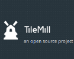

Guida rapida su TileMill
********************************************************************************

TileMill è uno strumento per creare velocemente e facilmente mappe per il web usando
dati propri. È creato sulla potente libreria open-source per vestizione grafica Mapnik
( lo stesso software utilizzato da OpenStreetMap e MapQuest per creare le proprie mappe)
e usa CartoCSS come linguaggio per lo stile.

Questa guida rapida descrive come:

  * Aggiunge un layer da una connessione PostGIS
  * Modificare gli stile
  * Configurare i suggerimenti
  * Scrivere una legenda
  * Esportare mappe

.. contents:: Contenuti

Creare un progetto
================================================================================

1. Avviare TileMill e cliccare sul bottone “New project” nella schermata principale.

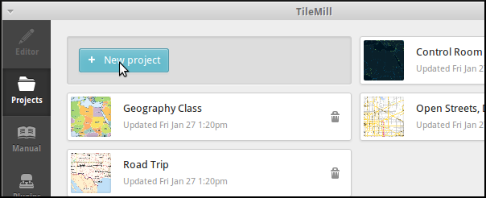

.. Writing Tip:
  For images, use a scale of 50% from a 1024x768 display (preferred) or
  70% from a 800x600 display.
  Images should be stored here:
    https://svn.osgeo.org/osgeo/livedvd/gisvm/trunk/doc/images/screenshots/1024x768/

2- Inserire i seguenti dati nel form, e cliccare “Add”:

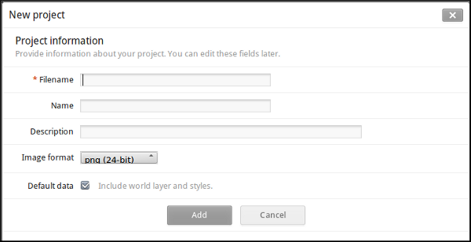

**Filename:**	tilemill_quickstart

**Name:**	TileMill Quickstart OSGeo Live

**Description:**	Quickstart from OSGeo Live

**Default Data:**	Leave selected

3. Cliccare sul nuovo progetto per aprirlo. Il progetto contiene un layer predefinito
chiamato #countries con un esempio di stile con codice CartoCSS.

Aggiungere un nuovo layer al progetto
================================================================================
È possibile aggiungere nuovi layer da File, SQLite o PostGIS. Si vuole aggiungere layers
da dati OSM salvati in PostGIS. In questo tutorial si assume che si conoscano già le
tabelle, i campi e i tipi dei dati che si vogliono rappresentare nella mappa. È possibile
fare ciò analizzando precedentemente o interrogando direttamente PostGIS usando pgAdminIII,
o con gli strumenti di ogni desktop GIS con la connessione PostGIS, come QGIS o Open Jump.

1. Ora si aggiungerà un layer da dati PostGis. Primo, si clicchi sul bottone layer
( |LAYER|) e premere sul bottone '+ Add layer'. Nel form 'Add layer', per prima cosa si
seleziona la tipologia dei dati, PostGIS:

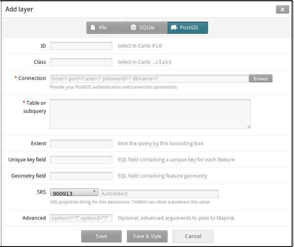

2. Aggiungere il layer strade da PostGIS, inseriti i seguenti dati, e cliccare su 'Save & Style':

**ID:**	osm_roads

**Class:**	osmroads

**Connection:**	host=localhost port=5432 user=user password=user dbname=osm_local

**Table or subquery:**	planet_osm_roads

**Unique key field:**	osm_id

**Geometry field:**	way

**SRS:**	Select WGS84

3. Aggiungere un layer di linee da PostGIS, inseriti i seguenti dati, e cliccare su 'Save & Style':

**ID:**	osm_line

**Class:**	osmline

**Connection:**	host=localhost port=5432 user=user password=user dbname=osm_local

**Table or subquery:**	planet_osm_line

**Unique key field:**	osm_id

**Geometry field:**	way

**SRS:**	Select WGS84

4. Aggiungere un layer puntuale da PostGIS, inseriti i seguenti dati, e cliccare su 'Save & Style':

**ID:**	osm_points

**Class:**	osmpoints

**Connection:**	host=localhost port=5432 user=user password=user dbname=osm_local

**Table or subquery:**	(select osm_id, amenity, way from planet_osm_point where amenity is not null) AS amen

**Unique key field:**	osm_id

**Geometry field:**	way

**SRS:**	Select WGS84

Nel layer osm_points si stanno importando un sottoinsieme di punti della tabella planet_osm_point
nel set di dati osm_local, considerando solo quei punti che non hanno un valore amenity non nullo.

Impostare la visualizzazione predefinita per la proiezione
================================================================================
Al fine di impostare i valori predefiniti per l'area di lavoro, si clicchi il bottone |TOOLS|.
Ora è possibile centrare l'area di lavoro, e impostare il punto centrale. È anche possibile digitare
i valori del centro e i del perimetro direttamente nel form.

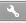

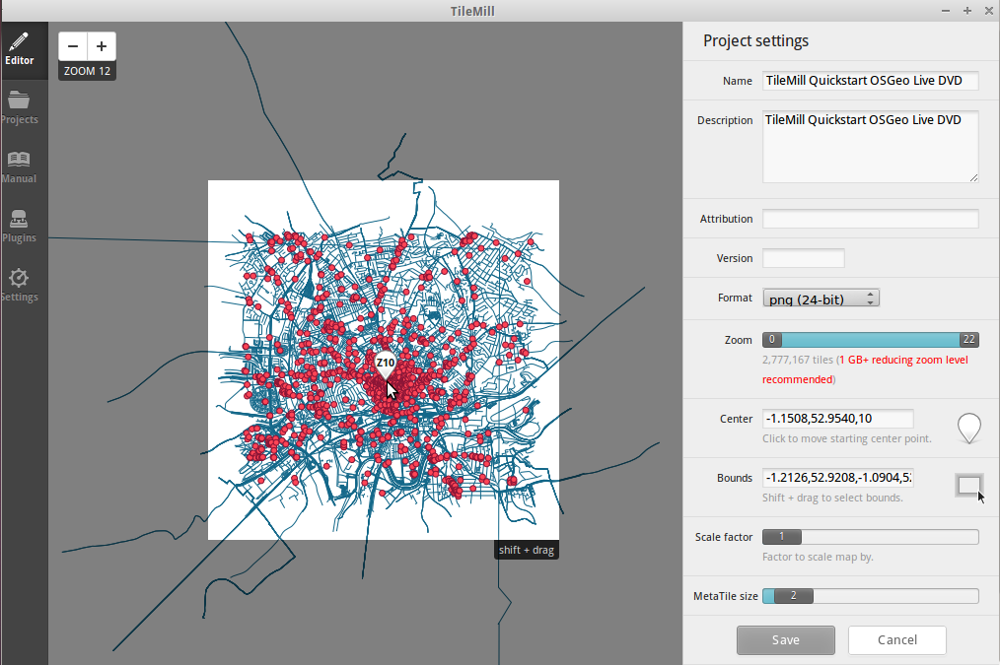

Impostare lo stile dei dati
================================================================================
TileMill usa un linguaggio chiamato CartoCSS per determinare lo stile di una mappa. Colori,
dimensioni, e forme possono essere tutte manipolate applicando loro i relativi paramentri di
CartoCS nel pannello dello stile a destra della mappa. Leggere il manuale di CartoCSS per una
introduzione dettagliate al linguaggio.
Quando un nuovo layer PostGIS è stato importato usando il bottone “Save&Style”, vengono
automaticamente aggiunti diversi paramentri dello stile al foglio delli stili e dargli un
valore iniziale:

1. #osm_point
	Questo è il layer a cui è associato lo stile.
2. marker-width
	Questo determina la dimensione del marker, in pixels. È possibile provare a cambiarlo
	digitando numeri diversi.
3. marker-fill
	Questo è il colore interno del marker. Ci sono due metodi per cambiare i valori del colore.
	È possibile sia digitare un nuovo valore, o si può usare the color swatches at the bottom
	of the CartoCSS panel

4. marker-line-color
	Questo è il colore del bordo del marker.

5.- marker-allow-overlap
	Questo permette ai markers di essere sovrapposti l'un l'altro. Se non è specificato o
	impostato a falso, potenzialmente i markers sovrapposti non saranno visualizzati.

Qualsiasi di questi valori possono essere cambiati e visualizzati dopo aver salvato il progetto.

Stile condizionali
================================================================================
Gli stili condizionali di CartoCSS permettono di cambiare l'aspetto degli elementi nella mappa,
basandosi sugli attributi dei dati. Qui verranno cambiati osm_points e osm_roads, al fini di
evidenziare alcuni tipi di elementi, dati alcuni valori.
Si applicheranno differenti stili ai punti a secondo di quello che loro rappresentano 'post_box',
'pub' o 'bicyle_parking', siccome già conosciamo che questi valori si trovano nel campo 'amenity'
della tabella.
Si definirà uno stile differente alle linee che rappresentano 'cycleway', siccome conosciamo che
'cycleway' è un valore del campo 'highway' della tabella.
Questo è il nostro codice dopo aver cambiato alcuni i valori di alcuni stili e codificando alcuni stili condizionali:

::

	Map {
	  background-color: #b8dee6;
	}

	#countries {
	  ::outline {
	    line-color: #8b9091;
	    line-width: 2;
	    line-join: round;
	  }
	  polygon-fill: #fff;
	}

	#osm_roads {
	  line-width:1;
	  line-color:#8b9091; //168
	}

	#osm_line {
	  line-width:1;
	  line-color:#8b9091;
	  [highway='cycleway'] { //red
	    line-color:#ff2525; //ff2525
	    line-width:3;
	    }
	}

	#osm_poinst {
	  marker-width:6;
	  marker-fill:#8b9091; //f45
	  marker-line-color:#813;
	  marker-allow-overlap:true;
	  [amenity='post_box'] { //orange
	    marker-fill:#ffc425;
	    marker-line-color:#a67c0c;
	    }
	  [amenity='pub'] { //green
	    marker-fill:#39e639;
	    marker-line-color:#008500;
	    }
	  [amenity='bicycle_parking'] { //blue
	    marker-fill:#85c5d3;
	    marker-line-color:#180773;
	    }
	}

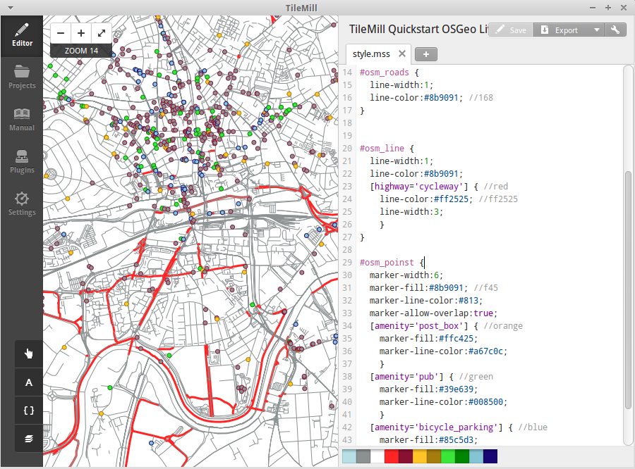

Tooltips
================================================================================

Tooltips vi permettono di rendere le mappa interattive con contenuto dinamico che appare quando
un utente passa sopra o clicca sulla mappa. Questi possono contenere HTML e sono utili per
revealing dati, immagini, e altri contenuti addizionali.

1. Aprire il pannello Templates cliccando sul bottone pointer in basso a sinistra ( |POINTER| )

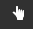

2. Cliccare sul pannello “Teaser”. Il contenuto Teaser appare quando si passa con il mouse su
   un elemento e il contenuto completo appare quando si clicca su un elemento. È possibile utilizzare
   il campo Posizione per definire un URL da caricare quando si fa clic un elemento.

3. Selezionare il layer 'osm_point' da usarlo per l'interazione. TileMill supporta solo un layer interattivo alla volta.

4. I campi dei dati per il layer sono visualizzati wrapped in curly Mustache tags. Questi tags
   saranno rimpiazzati dai dati quando si interagirà con la mappa. Trovare i campi che si vuole usare.

5. Scrivere il template usando i tags Mustache. Incollare il codice che segue nel campo Teaser e usare
   l'anteprima per essere sicure che funzioni bene:

::

	Type:{{{amenity}}} 
	Name:{{{name}}}

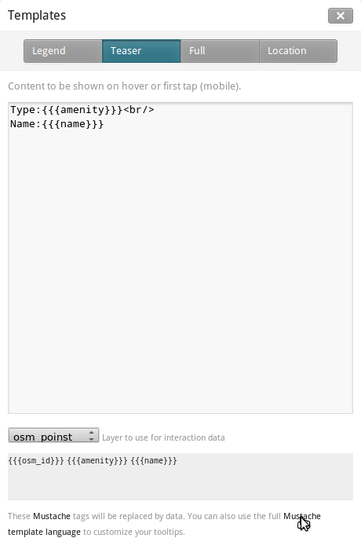

6. Cliccare “Save” per salvare le impostazioni e ricaricare la mappa. Chiudere il pannello cliccando
   sul bottone chiudi (X) o premendo il tasto ESC. Muovere il mouse sopra alcuni punti per vedere il tooltips.

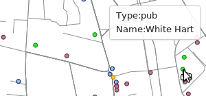

Legende
================================================================================

Una legenda è permanentemente sulla mappa ed è utili per visualizzare titoli, descrizioni, è chiavi per
cosa sarà mappato. Può essere stilizzata usando HTML, o semplicemente contenere un'immagine.

Aggiungere una legenda che descrive il tema della mappa.

#. Aprire il pannello Templates cliccando sul bottone pointer in basso a sinistra
#. Il pannello Legenda è ora aperto di default.
#. Inserire il testo text/html nel campo Legend:

::

	<strong>OSGeo Live TileMill Quick Start</strong> Points locate different amenities in Nottingham 

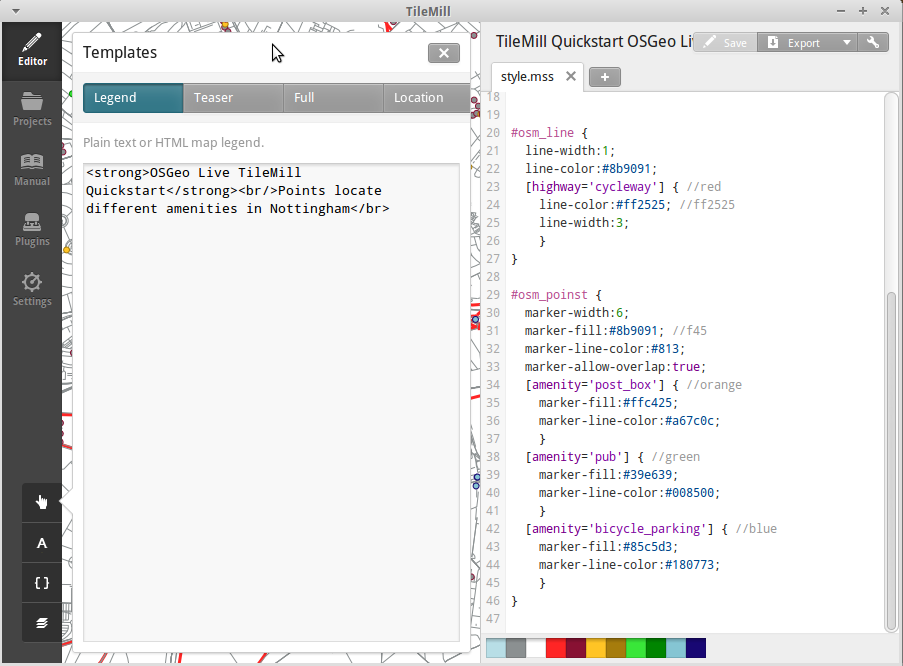

#. Cliccare salva e chiudere il pannello. Ora vedrete la legenda nell'angolo in basso a destra della mappa.

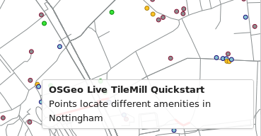

Esportare la mappa
================================================================================
TileMill può esportare mappe nei formati MBTiles, PNG, PDF, SVG, o Mapnik XML. Una liste a panoramica
completa si può trovare nella `documentazione di esportazione <http://mapbox.com/tilemill/docs/manual/exporting/>`_

Se si vuole esportare in MBTiles:

#. Cliccare il bottone “Export”. Un menu a tendina apparirà.
#. Cliccare “MBTiles”. La finestra si sposterò allo strumento di esportazione.
#. Sceglire un “Filename”“. Di default verrà proposto il nome del progetto.
#. Selezionare i livelli di Zoom.  levels. Impostare lo zoom più distante a 1 trascinando l'estremità
   sinistra verso destra. Impostare lo zoom più vicino a 6 trascinando l'estremità destra verso sinistra.
#. Selezionare il “Center” della mappa. Questo determina il centro iniziale e il livello di zoom della mappa
   quando è caricato all'inizio. È possibile inserire manualmente questi valori o cliccare un punto
   nell'anteprima della mappa. Fare zoom al livello tre e cliccare il centro degli Stati Uniti.
#. Selezionare la mappa “Bounds”. Questa è l'area della mappa da esportare. Di default l'intero mondo è
   selezionato. Se la mappa occupa una regione più piccola del globo, è possibile salvare tempo e spazione
   ritagliando all'area utile. Questo può essere fatto manualmente inserendo i valori nei campi Bounds,
   o premendo il tasto SHIFT e cliccando e spostandosi nella map. Lasciare il valore di default.
#. cliccare “Export”.
#. Quando il processo di esportazione è completo, la barra di progresso sarà rimpiazzata dal bottone Save.
   Questo salverà un copia del file localmente in una directory selezionata

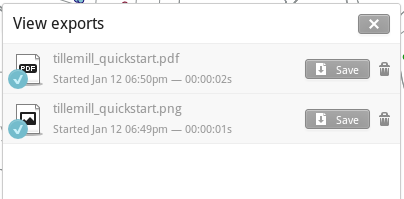

È possibile ritornare alla pagina di benvenuto in qualsiasi momemto selezionando
:menuselection:`Help --> Welcome` dalla barra del menu.

Cosa da provare
================================================================================

Qui alcune sfide addizionale da provare:

#. Prova a cambiare gli stili fissi o condizionali da te
#. Prova a importare dati da altre sorgenti, come file .CSV o sqlite ( È possibile seguire
`la documentazione on-line di TileMill <http://mapbox.com/tilemill/docs/crashcourse/introduction/>`_)

Ed ora?
================================================================================

.. Writing tip
  Provide links to further tutorials and other documentation.

Questo è solo il primo step sulla strada per l'utilizzo di TileMill. C'è molto altro materaile
(e possibilità) lasciate da scoprire a te:

* Ottenere maggiore aiuto dall'ambiente, cliccare sul bottone help (|HELP|)

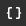

* Imparare di più sul linguaggio cartocss nella `Documentazione delle API <http://mapbox.com/carto/api/2.1.0/>`_

* Imparare come eseguire `TileMill con un servizio di Ubuntu <http://mapbox.com/tilemill/docs/guides/ubuntu-service/>`_
