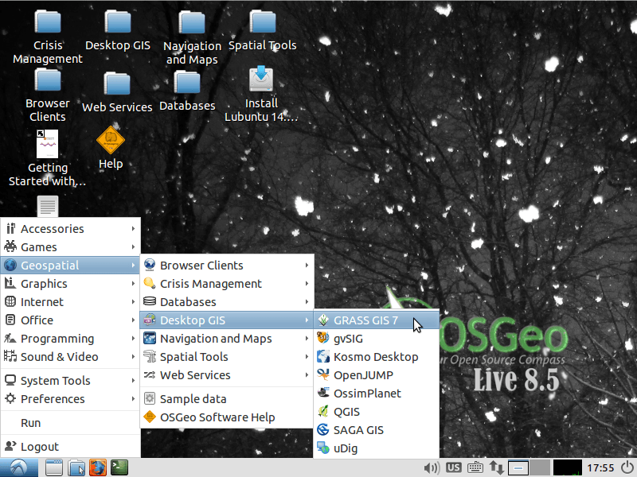

|osgeo-live-version| −Ｌｉｖｅへようこそ
================================================================================
`OSGeo-Live <http://live.osgeo.org>`_ は仮想マシン `Xubuntu <http://www.xubuntu.org/>`_ をベースとした起動可能なブータブルDVD／USBメディアです。これを利用することで、幅広く多様なオープンソースの地理空間ソフトウェアを、インストールなどの必要無しに試すことができます。OSGeo-Liveは全てフリーソフトで構成されており、自由に複製、配布することができます。

OSGeo-Liveは様々な地理空間関連の保管、配布、表示、分析、データメンテナンスなどの
ユースケースに応じた設定済みのアプリケーションを提供しています。また、サンプル
データセットやドキュメントも含んででいます。

アプリケーションを試すには、単に

#. DVDまたはUSBドライブをコンピュータもしくは仮想マシンにマウントする 
#. コンピュータを再起動する（ブートデバイスローダを確認してください）
#. Enter ボタンを押しスタート、ログインを行う
#. Geospatial メニューからアプリケーションを試す

多くのアプリケーションは、 `Apple OSX <../MacInstallers/>`_ や  `Microsoft Windows <../WindowsInstallers/>`_
フォルダ内のインストーラ形式でも提供されています。

クイックスタート
--------------------------------------------------------------------------------

.. toctree::
   :maxdepth: 1

   OSGeo-Live DVD を始める <quickstart/osgeolive_quickstart>
   キーボードや言語を変更する <quickstart/internationalisation_quickstart>
   OSGeo-Live をハードディスク上にインストールする <quickstart/osgeolive_install_quickstart>
   OSGeo-Live を仮想マシンで動作させる <quickstart/virtualbox_quickstart>
   OSGeo-Live のブータブルUSBドライブを作成する <quickstart/usb_quickstart>

.. toctree::
   :maxdepth: 1
   :hidden:
   :glob:

   overview/overview
   quickstart/*quickstart
   standards/standards
   contact
   copyright
   disclaimer
   download
   sponsors
   sponsors_osgeo
   presentation

プレゼンテーション
--------------------------------------------------------------------------------

全てのOSGeoLiveアプリケーションを取り上げた30分間のプレゼンテーションがビデオとして閲覧できます。加えて、基になったスライドや原稿が利用可能です。

詳細はこちら :doc:`presentation`.

