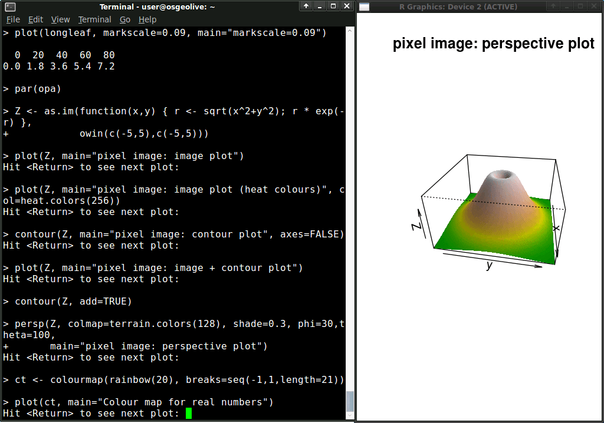

:Author: OSGeo Live
:Version: osgeo-live4.0
:License: Creative Commons

.. _r-overview:

.. image:: ../../images/project_logos/logo-R.jpg
  :scale: 100 %
  :alt: project logo
  :align: right
  :target: http://cran.r-project.org

R 空間解析機能
===================

統計プログラミング
~~~~~~~~~~~~~~~~~~~~~~~

Rは高性能で，広く使われている統計計算および図化環境で，地理的データセットの分析と演算に優れています。Rの地理空間分析はRパッケージ（Rの機能を拡張するモジュール）を使用すると可能になり，このモジュールにより伝統的なものから最新のものまで膨大な量のアルゴリズムの利用を提供しており，これらのアルゴリズムは，しばしば他のオープンソースまたはプロプライエタリ・ソフトウェアよりも早く利用可能になることがあります。Rとそのパッケージは点，線，ポリゴン，グリッドデータの処理が可能です。ユーザーは，例えば画像分類，空間的関係を推定するための統計解析，地物の分布パターン，そして以下の基本機能で列挙されるものなどの，大規模配列の処理を実行できます。Rによって利用可能になる機能は，GISや画像処理ソフトに使われている高性能で先進的なものです。

Rの基本インターフェイスは高い自由度と操作性を提供するコマンドライン型ですが，一方で，グラフィカル・ユーザー・インターフェイス（GUI）と比べて習熟した利用者になるまでに長い時間を必要とする傾向があります。幸いなことに，Rを学習プロセスを容易にするWebサイトがよく整備されています。スクリプトは処理過程を自動化するために頻繁に利用され，RのオープンソースGUIを開発するためのプロジェクトもあります（http://rwiki.sciviews.org/doku.php?id=guis:guis）。

RはS言語を実装しており，Rと過去のS，S-Plusコード，同様に最近の商用バージョンのS，TIBCO Spotfire S+との高い互換性を有しています。この互換性により，大きくコードを変更することなく異なるバージョンのSをRで実行できるように変換することが出来ます。

基本的機能
-------------

* 統計そして同様に強度な数学的アプリケーションのための完全なオブジェクト指向プログラミング言語デザイン
* 数百のコミュニティにより作成された空間統計のためのパッケージ
* 空間データのためのクラス
* 空間データの取り扱い
* 空間データの読み込みと書き出し
* 点パターン分析
* 地球統計学
* 疾病の地図化および地域データ分析
* 空間回帰分析
* 生態学的分析

詳細
-------

**Webサイト：** http://cran.r-project.org

**ライセンス：** GPL

**ソフトウェア・バージョン：** 2.11.1

**ソフトウェア・プラットフォーム：** Windows, Linux, Mac, Unix

**コミュニティのサポート：** http://cran.r-project.org/web/views/Spatial.html

