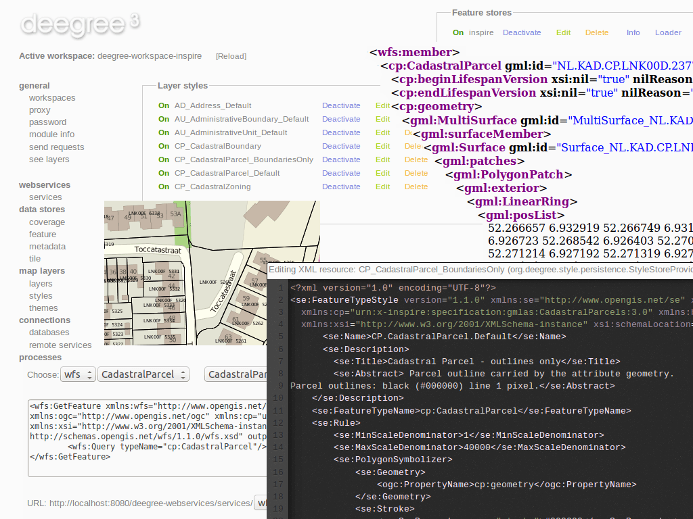

:Author: Johannes Wilden, Markus Schneider, Danilo Bretschneider
:Reviewer: Cameron Shorter, Jirotech
:Version: osgeo-live7.0
:License: Creative Commons Attribution 3.0 Unported (CC BY 3.0)

.. image:: ../../images/project_logos/logo-deegree.png
  :alt: project logo
  :align: right
  :target: http://www.deegree.org

.. image:: ../../images/logos/OSGeo_project.png
  :scale: 100
  :alt: OSGeo Project
  :align: right
  :target: http://www.osgeo.org

deegree
================================================================================

ウェブサービス
~~~~~~~~~~~~~~~~~~~~~~~~~~~~~~~~~~~~~~~~~~~~~~~~~~~~~~~~~~~~~~~~~~~~~~~~~~~~~~~~

deegreeはフリーで、安定して、多機能でかつ簡単に利用できます。deegreeは、フリー・オープンソースソフトウェアの中で、Open Geospatial Consortium (OGC)標準を準拠の最も包括的な組み合わせであり、Web Feature ServiceのトランザクションからWeb Terrain Serviceを利用した三次元データの表示まで対応しており、そのほかにも利用できます！

deegreeはウェブおよびデスクトップの地理情報システム（GIS）と空間情報基盤（SDI）のソリューションです。包括的で、一方で多機能なJava APIと、加えて簡単または複雑な空間スキームのための多機能なオブジェクト関係マッピングで構成されています。deegreeは同様に、ウェッブマッピング、フィーチャー、カタログ、さらにはセンサーや処理のための、標準に準拠したウェッブサービスの組み合わせを提供します。

deegreeは貴方のSDIの価値を高め、貴方自身のデータを実行、利用させ、要求を十分に満たします。

Core Features
--------------------------------------------------------------------------------

**WFS**

* Implements WFS standards 1.0.0, 1.1.0 and 2.0.0
* Fully transactional (even for rich data models)
* Supports KVP, XML and SOAP requests
* GML 2/3.0/3.1/3.2 output/input
* Support for GetGmlObject requests and XLinks
* High performance and excellent scalability
* On-the-fly coordinate transformation
* Designed for rich data models from the bottom up
* Backends support flexible mapping of GML application schemas to relational models
* ISO 19107-compliant geometry model: Complex geometries (e.g. non-linear curves)
* Advanced filter expression support based on XPath 1.0
* Supports numerous backends, such as PostGIS, Oracle Spatial, MS SQL Server, Shapefiles or GML instance documents

**WMS**

* Implements WMS standards 1.1.1 and 1.3.0
* Extensive support for styling languages SLD/SE versions 1.0.0 and 1.1.0
* High performance and excellent scalability
* High quality rendering
* Scale dependent styling
* Support for SE removes the need for a lot of proprietary extensions
* Easy configuration of HTML and other output formats for GetFeatureInfo responses
* Uses stream-based data access, minimal memory footprint
* Nearly complete support for raster symbolizing as defined in SE (with some extensions)
* Complete support for TIME/ELEVATION and other dimensions for both feature and raster data
* Supports numerous backends, such as PostGIS, Oracle Spatial, Shapefiles or GML instance documents
* Can render rich data models directly

**WMTS**

* Implements Basic WMTS standard 1.0.0 (KVP)
* High performance and excellent scalability
* Supports different backends, such as GeoTIFF, remote WMS or file system tile image hierarchies
* Supports on-the-fly caching (using EHCache)
* Supports GetFeatureInfo for remote WMS backends

**CSW**

* Implements CSW standard 2.0.2
* Fully transactional
* Supports KVP, XML and SOAP requests
* High performance and excellent scalability
* ISO Metadata Application Profile 1.0.0
* Pluggable and modular dataaccess layer allows to add support for new APs and backends
* Modular inspector architecture allows to validate records to be inserted against various criteria
* Standard inspectors: schema validity, identifier integrity, INSPIRE requirements
* Handles all defined queryable properties (for Dublin Core as well as ISO profile) 
* Complex filter expressions

**WPS**

* Implements WPS standard 1.0.0
* Supports KVP, XML and SOAP requests
* Pluggable process provider layer
* Easy-to-use API for implementing Java processes
* Supports all variants of input/output parameters: literal, bbox, complex (binary and xml)
* Streaming access for complex input/output parameters
* Processing of huge amounts of data with minimal memory footprint
* Supports storing of response documents/output parameters
* Supports input parameters given inline and by reference
* Supports RawDataOutput/ResponseDocument responses
* Supports asynchronous execution (with polling of process status)

..
  機能の例
  --------------------------------------------------------------------------------

  * Web Map Service

    * レイヤコンテンツに関する高いフレキシブル性
    * スタイル定義(SLD 1.0)の準拠と利用
    * 点シンボルとしてのグラフ（円、棒、線）を利用した主題図作成機能
    * データソース：すべての一般的なOGCウェッブサービス（WMS、WFS、WCS）、PostgreSQL/PostGIS、Oracle Spatial、WMSレイヤコンテンツを作成するために利用できる任意のSQL宣言。
    * 大規模であっても、非常に安定
    * HTTP GET, HTTP POSTおよび地物情報リクエストのサポート
    * OGC準拠の証明

  * Web Feature Service

    * 単純および複雑なフィーチャーのサポート
    * 3000以上の座標参照系の動的な座標変換
    * 柔軟な出力フォーマットのサポート
    * INSPIRE指示書サポートの容易な向上

  * Web Coverage Service

    * HTTP GETおよびHTTP POSTのサポート
    * データソース: 画像(tif, png, jpeg, gif, bmp); GeoTIFF; ECWファイル; Oracle GeoRaster
    * 大規模カバレッジへの高速アクセス

  * Catalogue Service-Web

    * datasources: PostgreSQLデータベース; Oracleデータベース
    * サポートするリクエスト: GetCapabilities; DescribeRecord; GetRecordById; GetRecords; Transaction - Insert, Update, Delete; Harvesting

  * Web Map Print Service

    * 異なるプリントフォーマットのサポート (HTML, PDF, PNG)
    * 長時間のジョブの実行
    * 大判プロットを可能にする非同期リクエストのサポート
    * リクエストはデータベース内に格納され、WMPSが管理者によって停止されたりマシンが動作不良を起こした場合であっても、利用可能である。

  * Web Perspective View Service

     * データソース: remote/local-WMS, remote/local-WFS, local-WCS, Postgres/PostGIS, Oracle Spatial
     * ベクタまたらラスタデータによる環境モデル
     * リクエスト: Get3DFeatureInfo, GetView

標準への準拠
--------------------------------------------------------------------------------

* OGC Web Feature Service (WFS) 1.0.0, 1.1.0 and 2.0.0
* OGC Web Map Service (WMS) 1.1.1 and 1.3.0
* OGC Web Map Tile Service (WMTS) 1.1.0
* OGC Catalogue Service-Web (CSW) 2.0.2
* OGC Web Processing Service (WPS) 1.0.0
* OGC GML 2.12, 3.0.1, 3.1.1 and 3.2.1

詳細
--------------------------------------------------------------------------------

**ウェブサイト:** http://www.deegree.org

**ライセンス:** LGPL

**ソフトウェアバージョン:** |version-deegree|

**対応プラットフォーム:** Windows, Linux

**API インターフェイス:** Java

**サポート:** http://wiki.deegree.org/deegreeWiki/GettingSupport

クイックスタート
--------------------------------------------------------------------------------

* :doc:`クイックスタート文書 <../quickstart/deegree_quickstart>`
