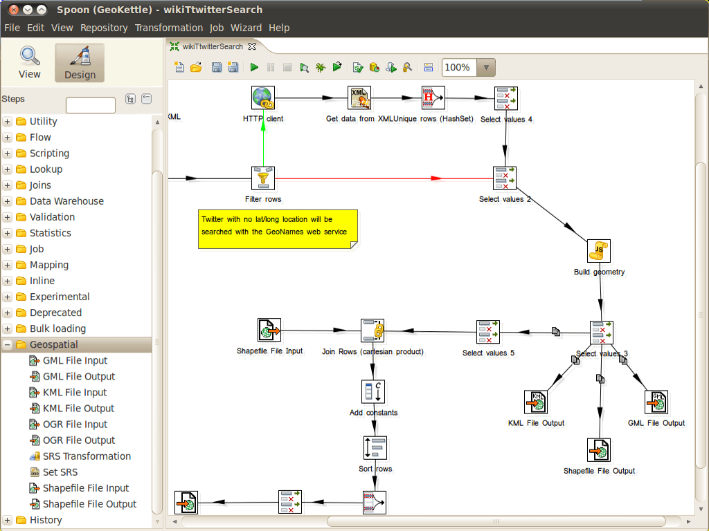

:Author: Thierry Badard 
:Reviewer: Cameron Shorter, LISAsoft
:Version: osgeo-live5.5draft
:License: Creative Commons Attribution 3.0 Unported (CC BY 3.0)

.. image:: ../../images/project_logos/logo-geokettle.png
  :scale: 80 %
  :alt: project logo
  :align: right
  :target: http://www.geokettle.org/

GeoKettle
================================================================================

ETL （抽出、加工、読み込み）
~~~~~~~~~~~~~~~~~~~~~~~~~~~~~~~~~~~~~~~~~~~~~~~~~~~~~~~~~~~~~~~~~~~~~~~~~~~~~~~~

GeoKettle は以前 Kettle と呼ばれていた `Pentaho Data Integration <http://kettle.pentaho.com>`_ で地理空間情報を扱えるようにしたものです。これはデータウェアハウスやウェブサービスのための地理空間情報データベースを、複数の異なるソースから生成、更新するための強力なメタデータ駆動型 ETL (Extract, Transform and Load) ツールです。

GeoKettle はソースからデータを抽出し、誤り修正のために変形，整理、構造変更、標準規格への変換、DBMS/GIS ファイル/地理空間情報 Web サービス へのロードが行えます。GeoKettle はフォーマット変換、異なるデータベースへの取り込み、feed データのデータヘースへの取り込みなど、繰り返し作業が必要になる複雑な変換の自動化に特に威力を発揮します。

地理空間情報分野の商用の空間 ETL ツールである FME と Geokettle を比較すると、GeoKettle は安定、高速に動作し、標準規格に準拠、何百ものファイルフォーマット、サービス、 DBMS の読み書きに対応しています。GeoKettle は政府関連機関、銀行、保険、地理空間サービス作成企業など、世界中の様々な組織で利用されています。

主な機能
--------------------------------------------------------------------------------

* データの展開:

  * 35 以上のデータベース: MySQL, PostgreSQL/PostGIS, Oracle, ...
  * XML ファイル
  * XLS ファイル
  * Xbase ファイル （dBase、Foxpro、 他）
  * ファイルシステム情報
  * 自動生成データ
  * MS Access
  * LDAP
  * SOLAP (Spatial OLAP) システム: GeoMondrian
  * 地理空間情報データフォーマット: シェープファイル、 GML 3.1.1、 KML 2.2、 OGR がサポートしている全てのフォーマット
  * OGc Web サービス: WFS、SOS、CSW

* データの変換:

  * エンジンベースのデータ変換（コード生成なし）
  * データベース、ファイル、メモリからのデータ探索
  * 演算
  * スクリプト: Javascript、SQL、RegExp
  * トリム
  * マップ
  * 選択
  * 分割
  * フィルタ
  * マージ
  * 結合
  * 複製
  * クラスタリング (MPP)
  * 回転
  * 地理空間情報解析:  buffer, centroid, distance, intersection, union, ...
  * 高度な地理学的処理: clipping, delaunay, simplify/smooth geometry, split features, ...
  * 空間集約
  * 作成地図のプレビュー

* 対象フォーマットへのデータの読み込み:

  * データベース: MySQL, PostgreSQL/PostGIS, Oracle, ...
  * データウェアハウスの母集団
  * 地理空間情報データフォーマット: Shapefile, GML 3.1.1, KML 2.2, OGR がサポートする全てのフォーマット
  * OGC ウェブサービス: CSW ...
  * 分散ローディング
  * バルク読み込み
  * クラスタリング

* 環境:

  * 全ての変換オプションを編集できる GUI インターフェース "Spoon"
  * コマンドラインツール: ジョブと変換の実行
  * Webサーバ: リモート実行、巨大なデータベース処理にクラウドコンピューティングでのクラスタリング環境
  * Java API
  * プラグインエコシステム

準拠している標準規格
--------------------------------------------------------------------------------

* OGC 標準 (SFS, CSW, SOS)

詳細
--------------------------------------------------------------------------------

**ウェブサイト:** http://www.geokettle.org/

**ライセンス:** GNU Lesser General Public License (LGPL) version 2.1

**バージョン:** 2.0

**動作環境:** Windows, Linux, Mac, Solaris

**API:** Java, Javascript

**サポート:** http://www.spatialytics.org & http://www.spatialytics.com

クイックスタート
--------------------------------------------------------------------------------
    
* :doc:`Quickstart documentation <../quickstart/geokettle_quickstart>`
