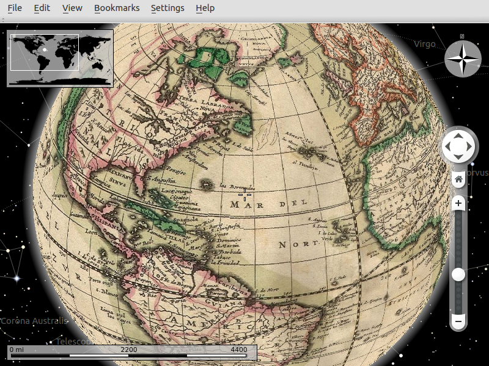

:Author: Hamish Bowman, Sergey Popov
:Reviewer: Cameron Shorter, LISAsoft
:Version: osgeo-live8.5
:License: Creative Commons Attribution 3.0 Unported (CC BY 3.0)

.. image:: ../../images/project_logos/logo-marble.png
  :alt: project logo
  :align: right
  :target: http://marble.kde.org/

.. image:: ../../images/logos/OSGeo_project.png
  :scale: 100 %
  :alt: OSGeo Project
  :align: right
  :target: http://www.osgeo.org

Marble
================================================================================

3D デスクトップ地球儀
~~~~~~~~~~~~~~~~~~~~~~~~~~~~~~~~~~~~~~~~~~~~~~~~~~~~~~~~~~~~~~~~~~~~~~~~~~~~~~~~

Marbleは `NASA World Wind <http://worldwind.arc.nasa.gov/java/>`_ や GoogleEarth の様なオープンソースのKDE教育プロジェクトプログラムです。
PC上の地球儀に `OpenStreetMaps <http://www.osm.org>`_ を含む様々な地図表示することができます。また、あなたの作成したアプリケーションに KDE Marble ウィジェットを追加すこともできます。

主な機能
--------------------------------------------------------------------------------

* 仮想地球儀、世界地図の表示
* Easy to use
* A great solution for the geography lessons
* Map Presentation (Atlas View, Street Maps, Satellite Maps, Topographic Maps, Educational Maps)
* 3Dでの地球儀のナビゲート
.. * マウスクリックした位置に関するウィキペディアの記事を表示
.. * 行き先に関するウィキペディアの情報をマウスクリックで表示
.. * 複数の選択可能な地図(惑星や月など)
.. * 昼夜の太陽オーバーレイ
.. * 距離計測
.. * スペース空間からのビューおよび2Dマップビューとの切り替え
* 3 different projections are available (3D Globe, Flat Map, Mercator)
* Information layers (Weather, Real-time clouds, Day/Night View, Real-time Satellites, Wikipedia Articles, Photos, Postal Codes, Earthquakes)
* Search (Online address search, Online POI search)
* Positioning & Tracking (GPS and WLAN localization, Track export in KML)
* Routing & Navigation (Voice navigation, Online motorcar routing, Online bike routing, Online pedestrian routing, Offline routing optional download, Turn-by-turn navigation)
* Interactive KML tours (Creating, editing, viewing)
* Integration with many online services (Amateur Radio Aprs, OpenCaching.com, etc.)
* WMS & TMS support
* Tools (Distance Measurement, Bookmarks, Time Simulation, Offline Mode)
* `OpenStreetMap <http://www.osm.org>`_ との統合

詳細
--------------------------------------------------------------------------------

**ウェブサイト:** http://marble.kde.org

**ライセンス:** GNU Lesser General Public License (LGPL) version 2.1

**ソフトウェアバージョン:** |version-marble|

**対応プラットフォーム:** GNU/Linux, Mac OSX, MS Windows, Maemo 5

**API インターフェース:** Qt designer, C++, Python, D-BUS, Shell script

**サポート:** http://techbase.kde.org/Projects/Marble

**More Info:** http://www.slideshare.net/marbleglobe/marble-1-6en

クイックスタート
--------------------------------------------------------------------------------

* :doc:`クイックスタート文書 <../quickstart/marble_quickstart>`

