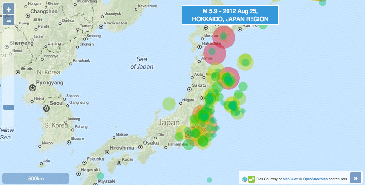

:Author: Chris Schmidt
:Author: OSGeo-Live
:Author: Roald de Wit
:Author: Antonio Santiago
:Reviewer: Cameron Shorter, LISAsoft
:Version: osgeo-live9.5
:License: Creative Commons Attribution 3.0 Unported (CC BY 3.0)

.. image:: ../../images/project_logos/logo-OpenLayers.png
  :scale: 80 %
  :alt: project logo
  :align: right
  :target: http://openlayers.org/

.. image:: ../../images/logos/OSGeo_project.png
  :scale: 100 %
  :alt: OSGeo Project
  :align: right
  :target: http://www.osgeo.org

OpenLayers3
================================================================================

ブラウザ/モバイル向けの地図ライブラリと GIS クライアント
~~~~~~~~~~~~~~~~~~~~~~~~~~~~~~~~~~~~~~~~~~~~~~~~~~~~~~~~~~~~~~~~~~~~~~~~~~~~~~~~

OpenLayers3 は Web とモバイルクライアント向けの軽量なマッピングライブラリで、HTML5 や WebGL、CSS3 といったモダンブラウザ技術を使用しています。

OpenLayers3 は以前の堅牢で広く利用されていた OpenLayers2 ライブラリを完全に書き直したものです。
いずれも、Web マッピングと GIS の要件を基本から応用までカバーする、広範な機能セットを提供します。

主な機能
--------------------------------------------------------------------------------

* レイヤ

  * ラスタ: WMS/WMTS、OpenStreetMap、MapQuest、Stamen、Bing、静止画像など。
  * ベクタ: WFS、KML、GeoJSON、TopoJSON、GPX、および IGC。
  * ヒートマップ。
  * ベクタレイヤをラスタとして描画。

* コントロールとインタラクション

  * 地図オーバービュー、ズームスライダー、ズームイン/アウト ボタン、縮尺バー、回転など。
  * 地図の移動、ズームと回転、地物の選択、編集など。

* スタイリングとカスタマイズ

  * 強力な地物のスタイリング機能: ポイント、ライン、ポリゴンとアイコン。
  * CSS3 を利用したコントロールのルック&フィールのカスタマイズ。

* オーバーレイ

  * 地図上の任意の位置への任意の DOM 要素描画。
  * ツールチップとマーカーの作成の高柔軟性。
  * HTML5 の能力を地図アプリケーションに混合。

* イベント

  * リスナー関数を地図イベントに対する反応としてアタッチ。
  * カスタムコントロールやインタラクションの作成。

* その他

  * モバイルブラウザのサポート。
  * 軽量ライブラリ。サイズを減らすため、カスタマイズパッケージとしてビルド。
  * 地図を異なる技術で描画: Canvas、WebGL、DOM。
  * ラスタ解析 (色調/彩度の変更)。

詳細
--------------------------------------------------------------------------------

**ウェブサイト:** http://openlayers.org

**ライセンス:** 2-clause BSD License (aka FreeBSD License)

**ソフトウェアバージョン:** |version-openlayers|

**API インタフェース:** JavaScript

**サポート:** https://groups.google.com/forum/#!forum/ol3-dev

クイックスタート
--------------------------------------------------------------------------------

* :doc:`クイックスタート文書 <../quickstart/openlayers_quickstart>`
