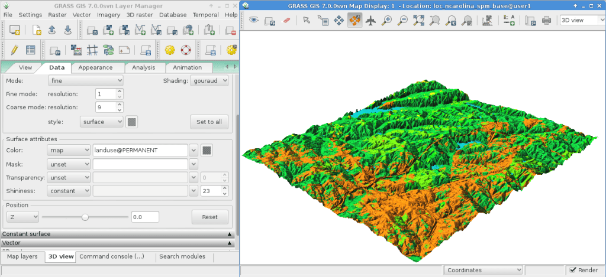

:Author: Hamish Bowman
:Version: osgeo-live6.5
:License: Creative Commons Attribution-ShareAlike 3.0 Unported  (CC BY-SA 3.0)
:Copyright: 2011 by The OSGeo Foundation

.. image:: ../../images/project_logos/logo-GRASS.png
  :scale: 100 %
  :alt: project logo
  :align: right
  :target: http://grass.osgeo.org

********************************************************************************
GRASS GISクィックスタート
********************************************************************************

起動のしかた
================================================================================

.. author's note: Location now focusing on Spearfish as there wasn't
 enough disc space for the full NC dataset.

Live DVDでGRASSを起動するには, :menuselection:`Geospatial --> デスクトップ　GIS` メニューをクリックして下さい.
"GRASSへようこそ" と書かれた起動画面にて, ロケーションにSpearfishデータセット, マップセットに "user1" を選択し,
[*Start Grass*] をクリックしてください.

.. image:: ../../images/screenshots/800x600/grass-startup.png
  :scale: 60 %
  :alt: screenshot
  :align: right

このようにすると, `wxPythonで書かれた新しいGUI <../../grass/wxGUI.html>`_ のGRASSが起動します.

.. tip::  画面の小さい (800 x 600 解像度) ネットブックの場合は起動画面がくずれて
[*Start GRASS*] ボタンがロケーションやマップセットのリストに隠れてしまうかもしれません.
その場合はウィンドウの端をドラッグしてウィンドウを大きくしてください.
ウィンドウを画面の上にずらす必要があるかもしれません
(Altキーを押しながら左クリックでドラッグするとウィンドウを動かせます).

ディスクにはノースカロライナ (nc_basic_spm) の簡易版データも収録されています, このクィックチュートリアルは
Spearfish データセット用に作成されているので使用データごとに読み替えて下さい.
また, 使用するデータに関わらず作業には PERMANENT マップセットではなく `user` マップセットの使用をお勧めします.

マップの表示
~~~~~~~~~~~~~~~~~~~~~~~~~~~~~~~~~~~~~~~~~~~~~~~~~~~~~~~~~~~~~~~~~~~~~~~~~~~~~~~~

.. image:: ../../images/screenshots/800x600/grass-layerman.png
  :scale: 50 %
  :alt: screenshot
  :align: left

PERMANENT マップセットから "`elevation.10m`" といったラスターレイヤーを加えます.
`GIS レイヤマネージャ` ウィンドウにて "+" 記号のついたツールバーボタンをクリックして下さい.
そして "*表示するマップ*" リストからマップ名を選択して, :guilabel:`Ok` をクリックして下さい.

同様に "`roads`" ベクターレイヤーも PERMANENT マップセットから
"+" 記号のついたV字に見える線のツールバーボタンをクリックして追加して下さい.

必要なら, ラスターマップ名を右クリックして "選択したマップのズーム" を選択して下さい.

マップが表示されていますよね.

標高プロファイルの表示
~~~~~~~~~~~~~~~~~~~~~~~~~~~~~~~~~~~~~~~~~~~~~~~~~~~~~~~~~~~~~~~~~~~~~~~~~~~~~~~~

.. image:: ../../images/screenshots/800x600/grass-profile.png
  :scale: 50 %
  :alt: screenshot
  :align: right

`GIS レイヤマネージャ` ウィンドウに戻って`elevation.10m`ラスターを選択するために名前をクリックして下さい.
`マップディスプレイ` ウィンドウで `マップ表示` ツールバーのズームボタンの右にある線と縞目模様のあるアイコンを見て下さい.
**Profile surface map** をクリックして選択して下さい.
`@PERMANENT` マップセットは自動的に検索されて, ファイル名で絞り込むことができます.
もし自動的にリストに表示がされない場合は, 再び `elevation.10m` マップをラスターレイヤーとして選択して
:guilabel:`Ok` をクリックして下さい.
左から2番目のボタンをクリックして, `Map Display` キャンバスのの複数点をクリックすることでプロファイルを取ることができます.
何点かクリックしたのちプロファイルウィンドウの目玉ボタンをクリックするとプロファイルを表示することができます.
終了するには右端にあるスイッチボタンをクリックして下さい.

ランダムサーフェスの作成
~~~~~~~~~~~~~~~~~~~~~~~~~~~~~~~~~~~~~~~~~~~~~~~~~~~~~~~~~~~~~~~~~~~~~~~~~~~~~~~~

.. HB comment: this quickstart is getting kinda long, maybe retire this section.

Now let's create a new map. First set the *computational region* to the default
bounds with :menuselection:`Settings --> Region --> Set region`, ticking
"*Set from default region*", and clicking [*Run*].
Next select :menuselection:`Raster --> Generate surfaces --> Fractal surface` from
the menu (it's near the bottom);
give your new map a name; and adjust any options you like in the "Optional"
tab (the defaults are fine); and click [*Run*]. You can then [*Close*] the
*r.surf.fractal* module's dialog window.

.. image:: ../../images/screenshots/800x600/grass-fractal.png
  :scale: 50 %
  :alt: screenshot
  :align: right

色の調整
~~~~~~~~~~~~~~~~~~~~~~~~~~~~~~~~~~~~~~~~~~~~~~~~~~~~~~~~~~~~~~~~~~~~~~~~~~~~~~~~

新しいラスターマップが標高マップとともにレイヤーリストないしは "user1" マップセットに加わっているとのが見えると思います.
`elevation.10m` レイヤの表示チェックボックスをオフにすることで表示を制御することができます.
自動的に表示されない場合は目玉をクリックすると表示がされるようになります.
The colors might not be as you'd like so let's change them. With the
fractal DEM selected in the layer list, in the
`Raster` menu select :menuselection:`Manage colors --> Color tables`.
In the "Colors" tab click on the pull-down list for the "Type of color
table" option, and pick one from the list. "srtm" is a nice choice. Once
done click the [*Run*] button and close the *r.colors* dialog window.
The colors should then update automatically.

陰影図の作成
~~~~~~~~~~~~~~~~~~~~~~~~~~~~~~~~~~~~~~~~~~~~~~~~~~~~~~~~~~~~~~~~~~~~~~~~~~~~~~~~

.. image:: ../../images/screenshots/800x600/grass-shadedrelief.png
  :scale: 50 %
  :alt: screenshot
  :align: right

Next we'll create a shaded relief map of the elevation layer we saw
earlier. Start by verifying that the *computational region* is set match
the raster map of interest, "`elevation.10m`" in the PERMANENT mapset. To
do this, make sure it is loaded into the layer list of the main `GIS Layer
Manager` window, right click on its name and select "Set computation region
from selected map(s)". You will notice the Layer Manage tab will switch to
a text console to display the new settings. Click on the "*Map layers*" tab
at the bottom to get back to the layer list.

In the `Raster` menu select :menuselection:`Terrain analysis --> Shaded
relief` (Terrain analysis is about half way down), and the module control
dialog will appear. With the elevation map name selected as the input map
click [*Run*]. Now add the new `elevation.shade` *@user1* map into your
layer list as you did for the `elevation.10m` map earlier, and un-tick the
other raster layers.

集水域と水系
~~~~~~~~~~~~~~~~~~~~~~~~~~~~~~~~~~~~~~~~~~~~~~~~~~~~~~~~~~~~~~~~~~~~~~~~~~~~~~~~

Once again select the `elevation.10m` *@PERMANENT* map. If you changed the
region since the last step, again right click on the layer name and click
on :menuselection:`Set computational region from selected map(s)` from the
context menu.

.. note:: The wxGUI map display's view and zoom is independent and does not affect processing calculations. Check the computational region at any time with :menuselection:`Settings --> Region --> Display Region`; this is of fundamental importance to any raster grid operations. Raster maps of differing bounds and resolution will be resampled to the current computational region on-the-fly.

Next, in the `Raster` menu
choose :menuselection:`Hydrologic modeling --> Watershed analysis`. This
will open the ``r.watershed`` module. Select the `elevation.10m` layer as your
input map, in the 'Input options' tab set the minimum size of the exterior
watershed basin *threshold* to
10000 cells, then in the 'Output options' tab enter "elev.basins" for the
watershed basin option and "elev.streams" for the stream segments option
just below it. Then click [*Run*].

Back in the `GIS Layer Manager` window check that those two new raster maps are 
in the layer list and make sure that the basins map is ticked for display in
the box to the left of the layer name. You might untick the streams map for now.
Next, right click on the "`elev.basins`" raster map layer name and
select "`Change opacity level`". Set it to about 50% which will re-render the
Map Display. Drag a map layer (such as the earlier shaded relief map) to
lower down in the layer list if you wish for it to be drawn behind the watershed
basins map layer, and make sure to tick its visibility box to view it as a backdrop.

.. image:: ../../images/screenshots/800x600/grass-watersheds.png
  :scale: 50 %
  :alt: screenshot
  :align: left

In the `GIS Layer Manager` window click on the second button in from the right
on the top row and `Add a grid layer`. For size of grid put 0:03 for 0 degrees and
3 minutes (format is D:M:S), then in the "Optional" tab tick Draw geographic
grid and press :guilabel:`Ok` and re-render. You may need to drag the new grid layer
higher up on the layer list to see it.

To add a scalebar go to the `Map Display` window and press the "Add
map elements" button to the right of where you selected the Profile tool
earlier and select "Add scalebar and north arrow" then click :guilabel:`Ok`.
A scalebar will appear in the top left of the map canvas.
Drag it down to the bottom left. From the same toolbar menu select
"Add legend" and in the instructions window click the `Set Options`
button to set the raster map name to create the legend for. If you
pick the `elev.basins` map you will want to set the *Thinning factor* to
10 in the `Advanced` tab, and the *Placement* position to `5,95,2,5` in
the `Optional` tab. After you are done click :guilabel:`Ok` and :guilabel:`Ok` again.
Drag your new legend over to the right side of the map canvas.

Now you may be thinking to yourself that these fonts are a bit bare.
That's easily fixed in the `GIS Layer Manager` menus
open :menuselection:`Settings --> Preferences` and in the Map Display
tab click the [*Set font*] button, choose
one (for example DroidSans), and then [*Apply*] in the Preferences window. You will
have to do a full re-render to see the change so click on the re-render button
next to the eyeball in the `Map Display` window. The fonts will now be much prettier.

ベクターモジュール
~~~~~~~~~~~~~~~~~~~~~~~~~~~~~~~~~~~~~~~~~~~~~~~~~~~~~~~~~~~~~~~~~~~~~~~~~~~~~~~~
 
The above tasks have only covered a few raster modules. Don't let this
give you the idea that GRASS is just for raster maps -- the vector engine
and modules are every bit as full-featured as the raster ones. GRASS
maintains a fully topological vector engine which allows all sorts
of very powerful analyses.

.. image:: ../../images/screenshots/1024x768/grass-vectattrib.png
  :scale: 30 %
  :alt: screenshot
  :align: right

Continuing with the watershed basins created above, next we'll convert
them into vector polygons. In the Raster menu select :menuselection:`Map type conversions --> Raster to vector`.
In the `r.to.vect` dialog that opens make sure that ``elev.basins @user1`` is
selected for the input map, give a name for the output map like ``basins_areas``
(vector map names must be SQL compliant), and change feature type to `area`.
In the `Attributes` tab tick the box to use raster values as category numbers,
since these will match the values in our stream segment raster map created
earlier. Then click on [*Run*]. Once the new vector map is displayed, you
might right click on it in the `Layer Manager` list and change its opacity
level. Also if you right click on the ``basins_areas`` vector map in the
`Layer List` you can turn off rendering of area centroids by going into
`Properties` and un-ticking it in the `Selection` tab.

Next we'll add some attributes to those new areas, containing the average
elevation in each basin. In the Vector menu select :menuselection:`Update attributes --> Update area attributes from raster`
to launch the *v.rast.stats* module. Use ``basin_areas`` as the vector
polygon map, the ``elevation.10m`` raster to calculate the statistics from,
make the column prefix ``ele``, and click [*Run*] then close the dialog when
it is finished. You can query the values in the `Map Display` window using
the fifth icon from the left and after verifying that the vector-areas map
is selected in the `Layer List`, clicking on a vector area in the map canvas.

You can colorize the areas based on the average elevation values using the
``v.colors`` module. In the Vector menu select :menuselection:`Manage colors --> Color tables`.
Select ``basin_areas`` for the input vector map, the ``ele_mean`` attribute
column for the column containing the numeric range, and in the `Colors` tab
have it copy the colors from the `elevation.10m` raster map. After running that
right-click on the ``basin_areas`` map in the `Layer List` and select `Properties`.
In the `Colors` tab tick the box for getting colors from the map table column.
Once you click [*Apply*] you should see the colors change in the `Map Display`
window.

Now let's look at the attribute table and SQL builder in more detail. In the
`Layer Manager` click the table icon, it's second from the left on the bottom
row. This will open a view of the attached database table. For now we'll just
do a *Simple* database query to find watershed basins without a lot of variation
in them. Where it says ``SELECT * FROM basin_areas WHERE`` pick ``ele_stddev``
from the pull down list for the standard deviation statistic, then in the
text box to its right enter ``< 50`` and click [*Apply*]. You'll notice the
number of loaded records in the information bar along the bottom of the window
has shrunk, and that all of the rows with large values for std. dev. are now
gone from the displayed table. Right-click on the table data and choose
``Select all``. Again right-click on the table data and this time choose
``Highlight selected features``. You should see e.g. alluvial flood basins
and mesas show up in the ``Map Display``.

3D 可視化
~~~~~~~~~~~~~~~~~~~~~~~~~~~~~~~~~~~~~~~~~~~~~~~~~~~~~~~~~~~~~~~~~~~~~~~~~~~~~~~~

Start the 3D visualization suite from the :menuselection:`File --> NVIZ`
menu item. Select the `elevation.10m` map as the raster elevation and
click [*Run*].
Once the 3D display interface loads, maximize the window.
Next select :menuselection:`Visualize --> Raster Surfaces` from the top menu,
and set the fine resolution to "1", then move the positioning puck and height
slider around to get different views.

To drape satellite or aerial imagery over the top of the DEM, in the
**Raster Surfaces** controls click on the **Surface Attributes**
drop down menu and select "color". Select "New Map" to pick the overlay
image; "`spot.image`" in the PERMANENT mapset is a good choice.
Finally, click "*Accept*" and then once back at the main window click on
the "*Draw*" button in the top-left, just under the File menu.

その他
~~~~~~~~~~~~~~~~~~~~~~~~~~~~~~~~~~~~~~~~~~~~~~~~~~~~~~~~~~~~~~~~~~~~~~~~~~~~~~~~

While not covered here, you may like to experiment with the new
Cartographic Composer and object-oriented Graphical Modeling Tool;
you'll find icons to launch them on the lower row of icons in the
`Layer Manager` window. Further details can be found in
the `wxGUI <../../grass/wxGUI.html>`_ help pages.

The new GUI is written in Python, and if you're a fan of Python programming
there are a number of great tools available to you. In the bottom of the
`Layer Manager` window click on the `Python shell` tab and
type ``help(grass.core)`` to see a listing of the many functions available
in the core GIS python library. Besides the core GIS functions there is
also `array` (NumPy), `db` (database), `raster`, and `vector` libraries
available. For advanced use `Pythons CTypes` is supported allowing the
Python programmer direct access to GRASS's extensive C libraries.

終了のしかたとコマンドライン
~~~~~~~~~~~~~~~~~~~~~~~~~~~~~~~~~~~~~~~~~~~~~~~~~~~~~~~~~~~~~~~~~~~~~~~~~~~~~~~~

When finished, exit the GRASS GUI with :menuselection:`File --> Exit GUI`.
Before you close the GRASS terminal session as well, try a GRASS
module by typing "``g.manual --help``" which will give you a list
of module options. The GRASS command line is where the true power of
the GIS comes into its own. GRASS is designed to allow all commands
to be tied together in scripts for large bulk processing jobs. Popular
scripting languages are Bourne Shell and Python, and many neat tricks
to help make scripting easier are included for both. With these tools
you can make a new GRASS module with only about 5 minutes of coding,
complete with powerful parser, GUI, and help page template.

"``g.manual -i``" will launch a web browser with the module help pages.
When you are done close the browser and type "exit" at the GRASS terminal
prompt to leave the GIS environment.

参照情報
================================================================================
* GRASS ホームページは `http://grass.osgeo.org <http://grass.osgeo.org>`_
* GRASS Wiki ヘルプサイトは `http://grass.osgeo.org/wiki <http://grass.osgeo.org/wiki>`_
* チュートリアルや概要は `こちら <http://grass.osgeo.org/wiki/GRASS_Help#Getting_Started>`_.
* GUIメニューと`GRASS モジュール概要 <http://grass.osgeo.org/gdp/grassmanuals/grass64_module_list.pdf>`_. (`HTML 版 <http://grass.osgeo.org/gdp/grassmanuals/grass64_module_list.html>`_)
* もし 400 個の GRASS モジュールでも物足りない場合は第三者により開発されたアドオンもあります
  `http://grass.osgeo.org/wiki/AddOns <http://grass.osgeo.org/wiki/AddOns>`_
