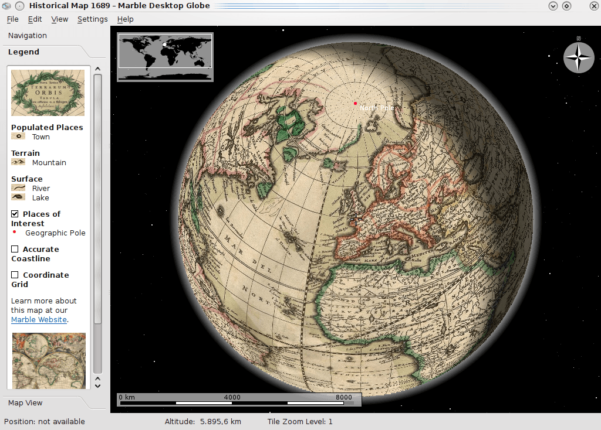

:Author: Hamish Bowman
:Reviewer: Cameron Shorter, LISAsoft
:Version: osgeo-live5.5
:License: Creative Commons Attribution 3.0 Unported (CC BY 3.0)

Marble
================================================================================

3D desktop globe
~~~~~~~~~~~~~~~~~~~~~~~~~~~~~~~~~~~~~~~~~~~~~~~~~~~~~~~~~~~~~~~~~~~~~~~~~~~~~~~~

Marble is an open source KDE Education Project program similar
to `NASA World Wind <http://worldwind.arc.nasa.gov/java/>`_ or
Google Earth. Besides choosing any number of maps to view on your
globe (including `OpenStreetMaps <http://www.osm.org>`_), you are
encouraged to include a KDE Marble widget in your application.

Core Features
--------------------------------------------------------------------------------

* Virtual globe and world atlas
* Navigate globe in 3D
* Mouse-click reveals Wikipedia article for destination
* Multiple maps (and planets, moons) to choose from
* Solar day/night overlay
* Measure distances
* Switch between view-from-space and 2D projected map views
* `OpenStreetMap <http://www.osm.org>`_ integration

Details
--------------------------------------------------------------------------------

**Website:** http://edu.kde.org/marble/

**Licence:** GNU Lesser General Public License (LGPL) version 2.1

**Software Version:** 1.3.4

**Supported Platforms:** GNU/Linux, Mac OSX, MS Windows

**API Interfaces:** Qt designer, C++, Python, D-BUS, Shell script

**Support:** http://techbase.kde.org/Projects/Marble

Quickstart
--------------------------------------------------------------------------------

* :doc:`Quickstart documentation <../quickstart/marble_quickstart>`

