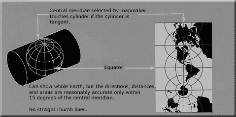

:Author: OSGeo-Live
:Author: Mike Adair
:Reviewer: Cameron Shorter, LISAsoft
:Version: osgeo-live5.5
:License: Creative Commons Attribution 3.0 Unported (CC BY 3.0)

.. (no logo) .. image:: ../../images/project_logos/logo-GDAL.png
..  :scale: 60 %
..  :alt: project logo
..  :align: right
..  :target: http://trac.osgeo.org/metacrs/wiki

.. image:: ../../images/logos/OSGeo_incubation.png
  :scale: 100 %
  :alt: OSGeo Project
  :align: right
  :target: http://www.osgeo.org/incubator/process/principles.html

MetaCRS
================================================================================

Coordinate Reference System Transformations
~~~~~~~~~~~~~~~~~~~~~~~~~~~~~~~~~~~~~~~~~~~~~~~~~~~~~~~~~~~~~~~~~~~~~~~~~~~~~~~~

`The group of MetaCRS projects <http://trac.osgeo.org/metacrs/wiki>`_ provide
libraries of methods to transform between different coordinate reference
systems. A geographic coordinate reference systems allows all points on the
earth to be described as set of coordinates (such as latitude, longitude and
elevation). Different systems are used to represent the 3 dimensional earth
on a flat, 2 dimensional map.

The MetaCRS libraries are included in other projects and some are also
available via a command line interface.

The sub-projects that make up MetaCRS include:

* PROJ.4 (C++) - used in MapServer, GRASS GIS, PostGIS, Mapnik, Thuban, OGDI, TopoCad, OGRCoordinateTransformation and various others.
* Proj4js (JavaScript) - used in OpenLayers.
* CS-Map (C++) - used in MapGuide.
* GeoTIFF/libgeotiff (C++).
* Proj4J (Java).
* `SpatialReference.org <http://spatialreference.org/>`_  - website to retrieve coordinate system definitions.

Core Features
--------------------------------------------------------------------------------

* Provides point transformation from one coordinate reference system to another.
* Includes transformation between datums.
* Large number of projection classes supported.

Implemented Standards
--------------------------------------------------------------------------------

The projects typically use coordinate system definitions as defined by the 
`European Petroleum Survey Group (EPSG) <http://www.epsg.org/>`_ and defined in
Well Known Text (WKT) format.

PROJ.4
--------------------------------------------------------------------------------

  **Website:**  http://trac.osgeo.org/proj/
  
  **Licence:** `X/MIT style Open Source license <http://trac.osgeo.org/proj/wiki/WikiStart#License>`_
  
  **Software Version:** 4.7.0
  
  **Supported Platforms:** Windows, Linux, Mac
  
  **API Interfaces:** C, C++, Python, Java, Ruby
  
  **Support:** http://lists.maptools.org/mailman/listinfo/proj

Proj4js
--------------------------------------------------------------------------------

  **Website:**  http://proj4js.org
  
  **Licence:** `X/MIT style Open Source license <http://trac.osgeo.org/proj/wiki/WikiStart#License>`_
  
  **Software Version:** 1.1.0
  
  **Supported Platforms:** Windows, Linux, Mac
  
  **API Interfaces:** JavaScript
  
  **Support:** http://lists.osgeo.org/mailman/listinfo/MetaCRS

CS-Map
--------------------------------------------------------------------------------

  **Website:**  http://trac.osgeo.org/csmap/
  
  **Licence:** `custom <http://svn.osgeo.org/metacrs/csmap/trunk/CsMapDev/license.txt>`_
  
  **Software Version:** 13.0
  
  **Supported Platforms:** Windows, Linux, Mac
  
  **API Interfaces:** C, C++

  **Support:** http://lists.osgeo.org/mailman/listinfo/MetaCRS

GeoTIFF/libgeotiff
--------------------------------------------------------------------------------

  **Website:**  http://trac.osgeo.org/geotiff/
  
  **Licence:** `X/MIT style Open Source license <http://trac.osgeo.org/proj/wiki/WikiStart#License>`_
  
  **Software Version:** 1.4.0
  
  **Support:** http://lists.maptools.org/mailman/listinfo/geotiff
  
Proj4J
--------------------------------------------------------------------------------

  **Website:**  http://trac.osgeo.org/proj4j/
  
  **Licence:** `Apache License, Version 2.0 <http://www.apache.org/licenses/LICENSE-2.0>`_
  
  **Software Version:** 
  
  **Supported Platforms:** Windows, Linux, Mac
  
  **API Interfaces:** Java
  
  **Support:** http://lists.osgeo.org/mailman/listinfo/proj4j
  
