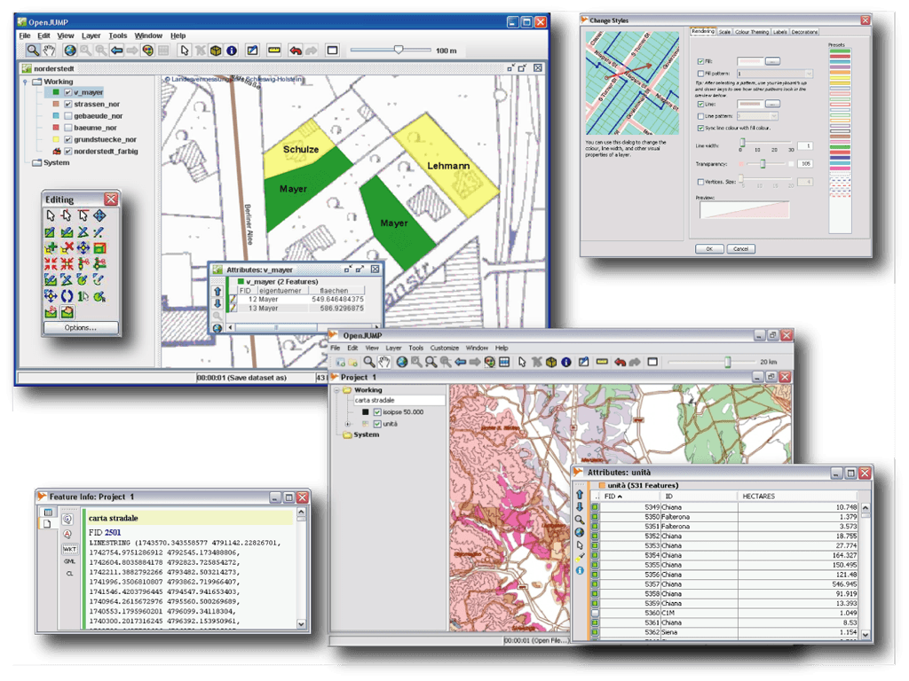

:Author: OSGeo-Live
:Reviewer: Cameron Shorter, LISAsoft
:Version: osgeo-live6.0
:License: Creative Commons Attribution 3.0 Unported (CC BY 3.0)

OpenJUMP GIS
================================================================================

Desktop GIS
~~~~~~~~~~~~~~~~~~~~~~~~~~~~~~~~~~~~~~~~~~~~~~~~~~~~~~~~~~~~~~~~~~~~~~~~~~~~~~~~
 
OpenJUMP is an easy to use and powerful desktop GIS that enables users
to display, edit, analyse and conflate geographic data.
It comes in a CORE and a PLUS edition, with the latter adding lots of useful plugins. 
OpenJUMP is excellent for data editing and rapid prototyping of GIS functions.

Features (Core Features and PlugIns*)
--------------------------------------------------------------------------------

* Data Formats

    * reads (files): GML, SHP, DXF*, MIF*, CSV* & TIFF, JPG, PNG, JPEG2000*, MrSID*, ECW*
    * reads (DB): PostGIS, ArcSDE*, Oracle*, MySQL* and SpatiaLite*
    * reads (OGC standards): WKT, WMS
    * writes: GML, SHP, WKT, DXF*, PostGIS* & JPG, TIFF and SVG*
    * note that formats marked with a (*) come with an extra plugin

* Editing & Conflation

    * drawing points, lines, polygons, multigeometries, geometry collections and circles (eventually mixed in a single layer)
    * adding, moving, deleting vertices
    * rotating, scaling, auto-complete polygon
    * cut, merge, simplify polygons and lines
    * warping, quality assurance tools

* Analysis & Query

    * spatial and attribute query functions
    * analysis : buffer, union, overlay, centroid, convex hull...
    * statistics : length, area, layer statistics, attribute statistics, graphs...
    * editing tools : converter, noder, polygonizer, planar graph, topology cleaning in PLUS edition, ...
    * attribute transfer tools : join, matching*
    * SEXTANTE raster analysis toolbox included in PLUS edition

* Customization

    * internationalization (cz, de, en, es, fi, fr, hu, it, ja, pt, ta, zh)
    * provides an API, scripting via BeanShell and Java Python
    * (Java) plugin-system
   

Implemented Standards
--------------------------------------------------------------------------------

.. Writing Tip: List OGC or related standards supported.

* OGC standards supported: GML2, SFS, WMS and SLD; (WFS for deegree)

Details
--------------------------------------------------------------------------------

**Website:** http://www.openjump.org

**Licence:** GPL

**Software Version:** 1.5.2 (Core Edition)

**Supported Platforms:** Windows, Linux, Mac, Unix

**Community Support:** http://www.openjump.org/support.html

**Commercial Support:** http://sourceforge.net/apps/mediawiki/jump-pilot/index.php?title=Professional_Support_Page

**Download Page:** http://sourceforge.net/projects/jump-pilot/files/ 

Quickstart
--------------------------------------------------------------------------------
    
* :doc:`Quickstart documentation <../quickstart/openjump_quickstart>`
