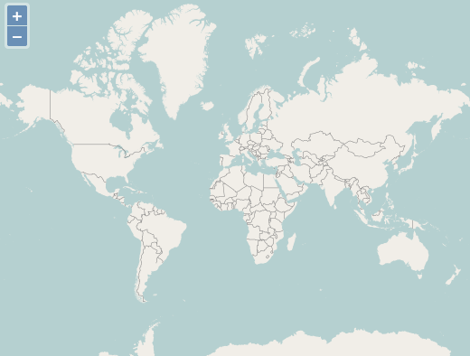

:Author: Chris Schmidt
:Author: OSGeo-Live
:Author: Roald de Wit 
:Reviewer: Cameron Shorter, LISAsoft
:Version: osgeo-live5.5
:License: Creative Commons Attribution 3.0 Unported (CC BY 3.0)

.. image:: ../../images/logos/OSGeo_project.png
  :scale: 100 %
  :alt: OSGeo Project
  :align: right
  :target: http://www.osgeo.org

OpenLayers
================================================================================

Browser GIS Client
~~~~~~~~~~~~~~~~~~~~~~~~~~~~~~~~~~~~~~~~~~~~~~~~~~~~~~~~~~~~~~~~~~~~~~~~~~~~~~~~

OpenLayers makes it easy for web developers to embed dynamic maps, from a
multitude of sources, in any web page. OpenLayers provides an extensive set of
mapping tools and widgets, similar to the Google Maps API. All functionally
runs inside the web browser, which makes OpenLayers easy to install, without
any server side dependencies.

Core Features
--------------------------------------------------------------------------------

* Simple to use Javascript API, designed to make development easy
* Support for standard and customized protocols for interacting with servers
* Tools to create custom user interfaces simply
* Support for in-browser data rendering (using SVG, VML, or Canvas technologies), supporting the development of advanced in-browser maps
* Support for mobile devices (with a focus on touch devices)
* Ability to load map layers from many sources:
  
  * Commercial Layers: Google, Bing
  
  * OGC Standards: WMS, WMTS, WFS, WFS-T, GeoRS, GML
  
  * Others: OpenStreetMap (OSM), ArcGIS, Images, MapGuide, MapServer, TileCache

* Ability to parse vector data and metadata in many formats:
  
  * Atom, ArcXML, GeoJSON, GeoRSS, KML, OSM, SLD, WMTS

Details
--------------------------------------------------------------------------------

**Website:** http://openlayers.org

**License:** 2-clause BSD License (aka FreeBSD License) 

**Software Version:** 2.12

**API Interface:** JavaScript

**Support:** https://github.com/openlayers/openlayers 

Quickstart
--------------------------------------------------------------------------------

* :doc:`Quickstart documentation <../quickstart/openlayers_quickstart>`
