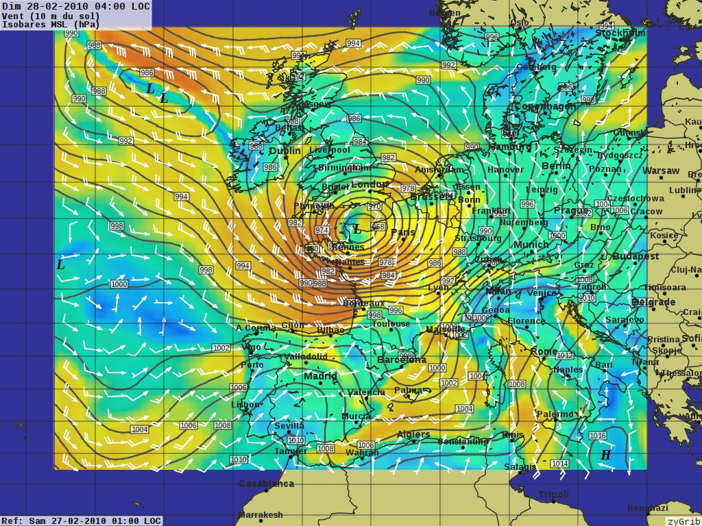

:Author: Hamish Bowman
:Reviewer: Cameron Shorter, LISAsoft
:Version: osgeo-live5.5
:License: Creative Commons Attribution 3.0 Unported  (CC BY 3.0)

zyGrib
================================================================================

Weather forecasting 
~~~~~~~~~~~~~~~~~~~~~~~~~~~~~~~~~~~~~~~~~~~~~~~~~~~~~~~~~~~~~~~~~~~~~~~~~~~~~~~~

zyGrib is a program to download and visualize weather forecast data in
the standard GRIB distribution format.

Core Features
--------------------------------------------------------------------------------

* Visualization of meteorologic data from files in GRIB format
* Automatic download of weather and wave forecasts
* Automatic download from IAC (fleetcode) data
* Play animations of 5-day forecasts
* Create your own regional weather maps (worldwide), or view a detailed quantitative forecast for a particular location.
* Plot wind, pressure, temperature, humidity, rain, snow, cloud cover, dew point, and high altitude data.

Details
--------------------------------------------------------------------------------

**Website:** http://www.zygrib.org

**Licence:** GNU General Public License (GPL) version 3

**Software Version:** 3.9.2

**Supported Platforms:** GNU/Linux, Mac OSX, MS Windows

**Support:** http://zygrib.org/forum/

Quickstart
--------------------------------------------------------------------------------

* :doc:`Quickstart documentation <../quickstart/zygrib_quickstart>`

