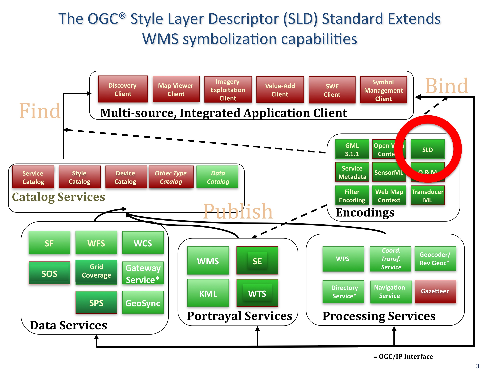

.. Writing Tip:
  Writing tips describe what content should be in the following section.

.. Writing Tip:
  Metadata about this document

:Author: OGC
:License: Creative Commons

.. Writing Tip: 
  Project logos are stored here:
    https://svn.osgeo.org/osgeo/livedvd/gisvm/trunk/doc/images/project_logos/
  and accessed here:
    ../../images/project_logos/<filename>
  A symbolic link to the images directory is created during the build process.

.. image:: ../../images/project_logos/logo-OGC-left.png
  :scale: 100 %
  :alt: OGC logo
  :align: right

.. image:: ../../images/project_logos/logo-OGC-right.png
  :scale: 100 %
  :alt: OGC logo
  :align: right

.. Writing Tip: Name of application

Style Layer Descriptor (SLD)
================================================================================

.. Writing Tip:
  1 paragraph or 2 defining what the standard is.

The OGC® Styled Layer Descriptor (SLD)
provides constructs for the symbolization and coloring of geographic features and coverages. It is typically used to apply styles to Web Map Services, or style GML from Web Feature Services.  (http://www.opengeospatial.org/standards/sld) 

Fine-grained control of the graphical representation of data is a fundamental requirement for  many mapping applications. The ability to define styling rules requires a styling language that the client and server can both understand. 

The current OGC Web Map Service (WMS) Standard enables an information provider to specify styling options by advertising a preset collection of visual portrayals for each available data set. However, while a WMS implementation currently can provide the user with a choice of style options, the WMS implementation can only tell the user the name of each style. It cannot tell the user what portrayal will look like on the map. More importantly, the user has no way of defining their own styling rules. 

The ability for a human or machine client to define these rules requires a styling language that client and server can both understand. The OGC Symbology  Encoding (SE) Standard  (http://www.opengeospatial.org/standards/symbol) specifies the format for such a map-styling language. The SLD profile of WMS enables application of SE to WMS layers using extensions of WMS operations. Additionally, SLD defines an operation for standardized access to legend symbols that may be stored remotely on a server for use in multiple applications. 

Note that in addition to portraying the output of WMS implementations, SE can also be used to portray the output of WFS implementations and implementation of the OGC Web Coverage Service (WCS) Interface Standard.

See Also
--------------------------------------------------------------------------------

.. Writing Tip:
  Describe Similar standard

* :doc:`fe_overview`
* :doc:`kml_overview`
* Symbology Encoding
* :doc:`gml_overview`
* :doc:`wms_overview`
* :doc:`wfs_overview`

