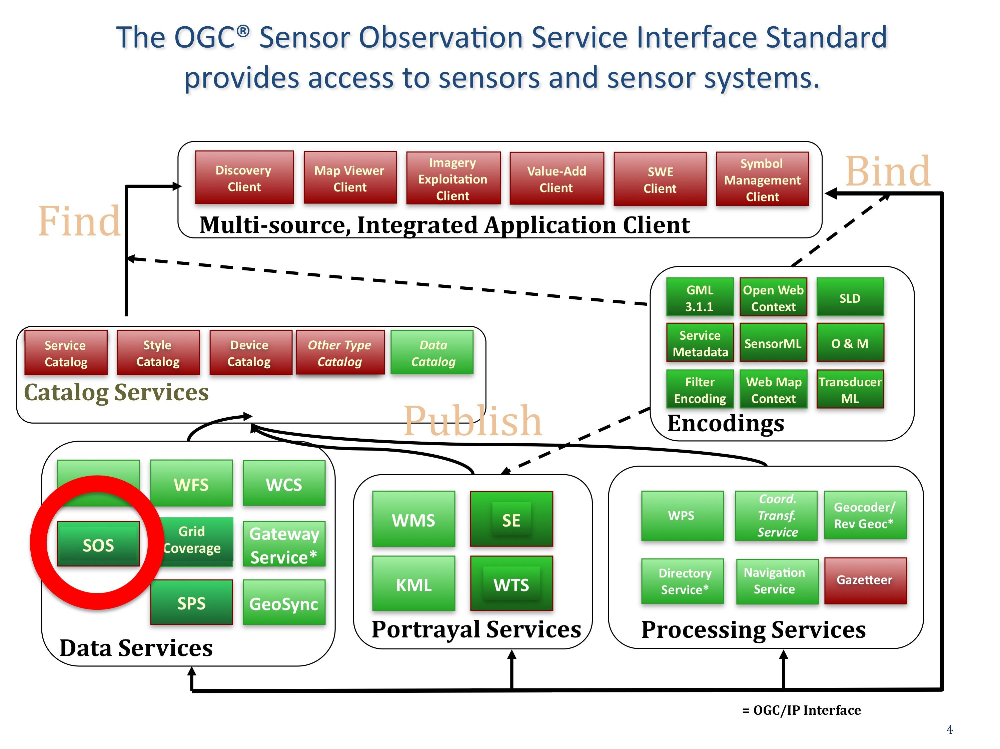

.. Writing Tip:
  Writing tips describe what content should be in the following section.

.. Writing Tip:
  Metadata about this document

:Author: OGC
:License: Creative Commons

.. Writing Tip: 
  Project logos are stored here:
    https://svn.osgeo.org/osgeo/livedvd/gisvm/trunk/doc/images/project_logos/
  and accessed here:
    ../../images/project_logos/<filename>
  A symbolic link to the images directory is created during the build process.

.. image:: ../../images/project_logos/logo-OGC-left.png
  :scale: 100 %
  :alt: OGC logo
  :align: right

.. image:: ../../images/project_logos/logo-OGC-right.png
  :scale: 100 %
  :alt: OGC logo
  :align: right

.. Writing Tip: Name of application

Sensor Observation Service (SOS)
================================================================================

.. Writing Tip:
  1 paragraph or 2 defining what the standard is.

The OGC Sensor Observation Service (SOS) Interface Standard is a data service. The OGC SOS standard defines a standardized interface and operations for access to observations from sensors and sensor systems that is consistent for all sensor systems including remote, in-situ, fixed and mobile sensors. SOS provides query results in the Observation and Measurements (O&M) standard format for modeling sensor observations and the SensorML specification for modeling sensors and sensor systems. (http://www.opengeospatial.org/standards/sos)

The SOS standard defines a common model for sensors and sensor systems that is not domain-specific and can be used without a-priori knowledge of domain-specific application schemas.

An observation is an event whose result is an estimate of the value of some property of the feature-of-interest, obtained using a specified procedure. Observations are defined by

* eventTime – when was the measurement made
* featureOfInterest – what entity is being measured
* observedProperty - what characteristic was measured
* procedure  - how was it measured

Mandatory SOS operations include:
* GetObservation - access to sensor observations and measurement data via a spatio-temporal query that can be filtered by phenomena 
* GetCapabilities - SOS service metadata
* DescribeSensor - information about the sensors, their processes and platforms in SensorML

Optional operations include: GetResult, GetFeatureOfInterest, GetFeatureOfInterestTime, DescribeFeatureofInterest, DescribeObservationType, DescribeResultModel, Register Sensor, and InsertObservation.

.. Link below is a dead link, so we have commented out this paragraph
.. There are numerous excellent implementations of SOS. The OpenIOOS.org has thirteen organizations providing SOS service instances providing access to over 1400 oceans sensors (http://www.openioos.org/real_time_data/gm_sos.html). This operational demonstration “represents an effort to develop a Web Services Architecture for Ocean Observing”.

See Also
--------------------------------------------------------------------------------

.. Writing Tip:
  Describe Similar standard

* :doc:`wcs_overview`
* :doc:`wfs_overview`
* Grid Coverage Service
* Sensor Planning Service
* Coordinate Transformation Service

