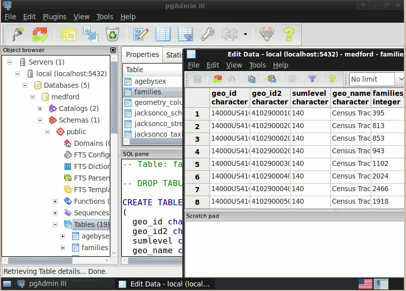

:Author: OSGeo Live
:Version: 
:License: Create Commons with attribution

.. _postigs-overview:

PostGIS
========

.. sidebar:: Core Features
   
   * Hundreds of spatial functions
     
     * Buffers, unions, overlays, distance and more
   
   * ACID transactional integrity
   * R-Tree spatial index
   * Multi-user support
   * Row-level locking
   * Replication
   * Partitioning
   * Role-based security
   * Table-spaces, schemas

PostGIS “spatially enables” the popular PostgreSQL object-relational database, allowing it to be used as a back-end database for geographic information systems (GIS) and web-mapping applications in the same manner as Oracle Spatial enables the Oracle database.

PostGIS is stable, fast, standards compliant, with hundreds of spatial functions and is currently the most widely used Open Source spatial database. PostGIS is used by diverse organisations from around the world, including risk adverse government agencies and organisations storing terrabytes of data serving millions of web requests per day.

Database administration is available via pgAdmin, phpPgAdmin, among others. Importing and exporting data is provided by various converter tools (shp2pgsql, pgsql2shp, ogr2ogr, dxf2postgis). And there are numerous desktop and browser GIS clients for viewing PostGIS data.

Implemented Standards
=====================

.. sidebar:: Details
   
   Home
     http://postgis.refractions.net/ 
   
   Licence
     GPL
   
   Maturity
     3 stars (stable)
   
   Supported Platforms
     Windows, Linux, Mac
   
   API Interfaces for
     SQL
   
   Commercial Support
      http://www.osgeo.org/search_profile

* OGC standards compliant (SFSQL)

