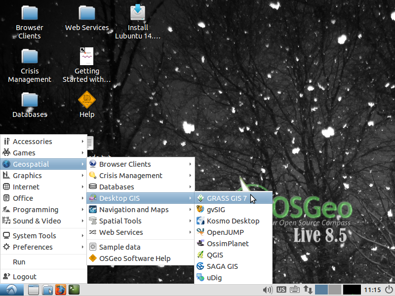

Witaj w OSGeo-Live
=====================

`OSGeo-Live <http://live.osgeo.org>`_  jest to startowe DVD, PenDrive USB lub wirtualna maszyna z systemem
`Xubuntu <http://www.xubuntu.org/>`_. Pozwala na wypróbowanie szerokiego wachlarza oprogramowania open source do zastosowań geoprzestrzennych, bez konieczności ich instalowania. Na płycie znajduje się wyłącznie oprogramowanie opatrzone wolnymi licencjami, uprawniającymi do powielania i rozpowszechniania go.

OSGeo-Live zawiera wstępnie skonfigurowane aplikacje przydatne w wielu zadaniach geoprzestrzennych, takich jak przechowywanie, publikowanie, przeglądanie, analizy i przetwarzanie danych. Płyta zawiera również zestawy danych do ćwiczeń i dokumentację.

Aby wypróbować aplikacje zgromadzone na OSGeo-Live, po prostu:

#. Włóż DVD lub pendrive USB do komputera lub maszyny wirtualnej.
#. Zrestartuj komputer (ewentualnie sprawdź kolejność bootowania).
#. Naciśnij "Enter" aby się zalogować.
#. Wypróbuj aplikacje znajdujące się w menu "Geospatial".

Dla wielu aplikacji znajdziesz pakiety instalacyjne dla `Apple OSX <../MacInstallers/>`_ oraz
`Microsoft Windows <../WindowsInstallers/>`_.

Szybkie wprowadzenia
------------

-   `Jak zacząć z OSGeo-Live DVD <quickstart/osgeolive_quickstart.html>`_
-   `Zmiana języka i ustawiń klawiatury <quickstart/internationalisation_quickstart.html>`_
-   `Instalacja OSGeo-Live na twardym dysku <quickstart/osgeolive_install_quickstart.html>`_
-   `Instalacja OSGeo-Live na Virtualnej Maszynie <quickstart/virtualbox_quickstart.html>`_
-   `Tworzenie rozruchowego USB PenDrive z OSGeo-Live <quickstart/usb_quickstart.html>`_
-   `Więcej samouczków... <quickstart/quickstart.html>`_

Prezentacja
------------
Dwudziestopięciominutowa prezentacja omawiająca wszystkie zawarte na OSGeoLive programy, dostępna jest w postaci `wideo <http://cameronshorter.blip.tv/file/4078371/>`_ oraz `slajdów i notatek <https://svn.osgeo.org/osgeo/livedvd/promo/en/presentations/OSGeoLive4_0Taster/>`_.

