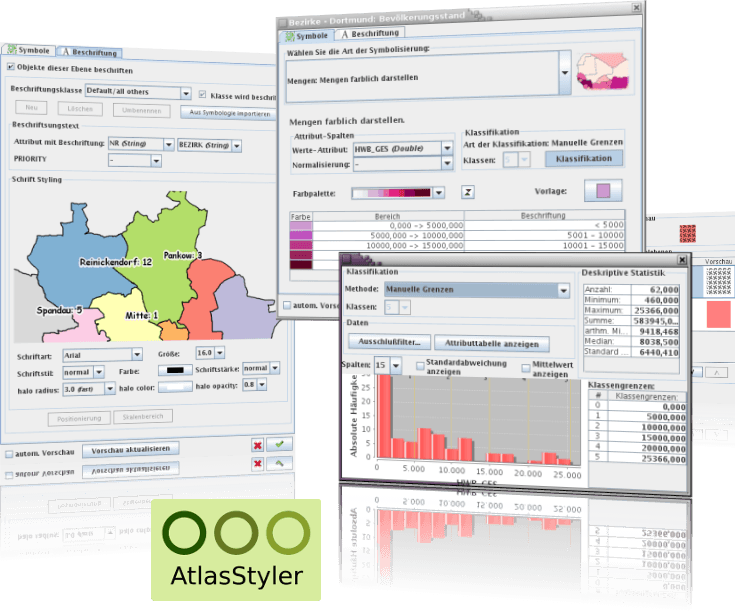

:Author: Stefan Tzeggai
:Translator: Milena Nowotarska, OSGeo
:Reviewer: Milena Nowotarska, OSGeo
:Version: osgeo-live4.0
:License: Creative Commons Attribution 3.0 Unported (CC BY 3.0)

.. _atlasstyler-overview:

.. image:: ../../images/project_logos/logo-AtlasStyler.png
  :scale: 100 %
  :alt: project logo
  :align: right
  :target: http://en.geopublishing.org/AtlasStyler

AtlasStyler
================================================================================

Edytor stylów obiektów
~~~~~~~~~~~~~~~~~~~~~~~~~~~~~~~~~~~~~~~~~~~~~~~~~~~~~~~~~~~~~~~~~~~~~~~~~~~~~~~~

`AtlasStyler <http://en.geopublishing.org/AtlasStyler>`_ jest przyjazną dla użytkownika aplikacją desktopową do tworzenia i nadawania stylów danym przestrzennym. Stworzone style mogą być zapisane w formie zgodnej ze standardami OGC, jako pliki SLD/SE.

Utworzone pliki SLD kompatybilne są ze wszystkimi programami, które używają standardu OGC SLD, przykładem może być GeoServer, uDig i inne. Aplikacja zbudowana jest z intuicyjnych okien dialogowych, w których łatwo buduje się style. Urzytkownicy mogą zastosować metody klasyfikacji, np. unikalne wartości, kwantyle lub równą odległość. Dodatkowo, użytkownicy zyskują zintegrowany dostęp do bazy danych symboli online. Użytkownicy mogą tworzyć i zapisywać symbole w SymbolEditor oraz używać ich ponownie w klasyfikacji lub innych projektach.

Główne funkcje
--------------------------------------------------------------------------------

* Budowa stylów przy pomocy okien dialogowych.
* Bazujący na standardzie OGC SLD.
* Działa na Windows, Linux i Mac.
* Import ESRI Shapefiles, OGC WFS i z baz danych PostGIS.
* Całkowicie przetłumaczony na niemiecki, angielski, włoski, turecki, rosyjski i francuski.

Zaimplementowane standardy
--------------------------------------------------------------------------------

* OGC Style Layer Descriptor (SLD) 1.0
* OGC Symbology Encoding (SE)

Szczegóły
--------------------------------------------------------------------------------

**Strona internetowa:** http://en.geopublishing.org/AtlasStyler

**Wersja programu:** 1.7

**Licencja:** GNU Lesser General Public License (LGPL) version 3.0

**Systemy operacyjne:** Windows, Linux, Mac

**Interfejsy API:** Java, Swing, Geotools

**Wsparcie:** `www.wikisquare.de <http://www.wikisquare.de>`_ 

Wprowadzenie
--------------------------------------------------------------------------------

* :doc:`Przejdź do wprowadzenia <../quickstart/atlasstyler_quickstart>`

