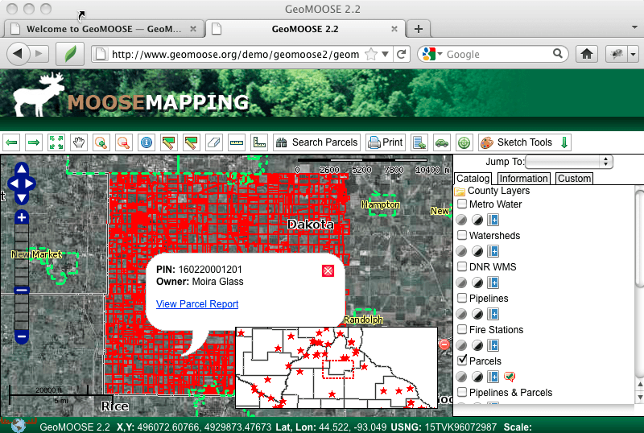

:Author: OSGeo-Live
:Author: Bob Basques
:Translator: Milena Nowotarska, OSGeo
:Reviewer: Milena Nowotarska, OSGeo
:Version: osgeo-live5.5
:License: Creative Commons Attribution 3.0 Unported (CC BY 3.0)

.. image:: ../../images/project_logos/logo-geomoose.png
  :scale: 30 %
  :alt: project logo
  :align: right
  :target: http://www.geomoose.org/

.. image:: ../../images/logos/OSGeo_incubation.png
  :scale: 100 %
  :alt: OSGeo Project in Incubation
  :align: right
  :target: http://www.osgeo.org/incubator/process/principles.html

GeoMoose
================================================================================

Portal Web GIS
~~~~~~~~~~~~~~~~~~~~~~~~~~~~~~~~~~~~~~~~~~~~~~~~~~~~~~~~~~~~~~~~~~~~~~~~~~~~~~~~

GeoMOOSE frameworkiem s³u¿¹cym do wyœwietlania rozproszonych danych kartograficznych bazuj¹cym na przegl¹darce internetowej. Jest szczególnie u¿yteczny do zarz¹dzania danymi przestrzennymi i nie- przestrzennymi na poziomie krajowym, miejskim oraz urzêdów gmin (st¹d siê wywodzi). Rozszerza funkcjonalnoœæ MapServera i OpenLayers aby dostarczyæ us³ugi takie jak operacje przeszukiwania danych s³u¿¹ce przegl¹daniu i zarz¹dzaniu wieloma warstwami, operacje selekcji i przeszukiwania danych.

GeoMOOSE jest szybki, potrafi jednoczeœnie obs³u¿yæ tysi¹ce warstw i/lub us³ug. Dane od ró¿nych dostawców mog¹ byæ zarz¹dzane za pomoc¹ ró¿nych narzêdzi oraz wed³ug odmiennych zasad, poniewa¿ka¿da warstwa mapy posiada swój plik konfiguracyjny do publikacj, symbole, szablon oraz Ÿród³o.

Interfejs u¿ytkownika mo¿e byæ konfigurowany w prosty sposób a dodatkowe us³ugi dodawane z wykorzystaniem architektury modu³owej.

G³ówne funkcje
--------------------------------------------------------------------------------

* Distributed data maintenance amongst multiple owners.
* Dostêp do map z: MapServera, Google, VirtualEarth, YahooMaps, Tilecache, ArcGIS REST, WMS.
* Configure multiple views of data sources.
* Discover and filter from data catalogs.
* Narzêdzia: pomiar, rysowanie, zapytania, fading, re-order, reprojekcja, skocz do zoomu, coordinate readouts, ...
* Displays: MapViewer, Bird's Eye, Side Menu, Navigation, Tabbed User Controls.
* XML based MapBook configuration file for User Interface, Source Layers and Tools.
* Integracja z MapServerem.
* Modular design facilitates integration with non-spatial systems (such as asset management).
* Publikacja prawie nieograniczonej liczby warstw.
* Drukowanie do PDF.

Zaimplementowane standardy
--------------------------------------------------------------------------------
* WMS

Szczegó³y
--------------------------------------------------------------------------------

**Strona internetowa:** http://www.geomoose.org/

**Licencja:** Licencja oparta na MIT. http://www.geomoose.org/info/license.html

**Wersja programu:** 2.4

**Systemy operacyjne:** Windows, Linux, Mac

**Wsparcie komercyjne:** http://www.geomoose.org/info/commercial_support.html

**Wsparcie spo³ecznoœci:** http://www.geomoose.org/info/mailing_lists.html

Wprowadzenie
--------------------------------------------------------------------------------
    
* :doc:`PrzejdŸ do wprowadzenia <../quickstart/geomoose_quickstart>`
