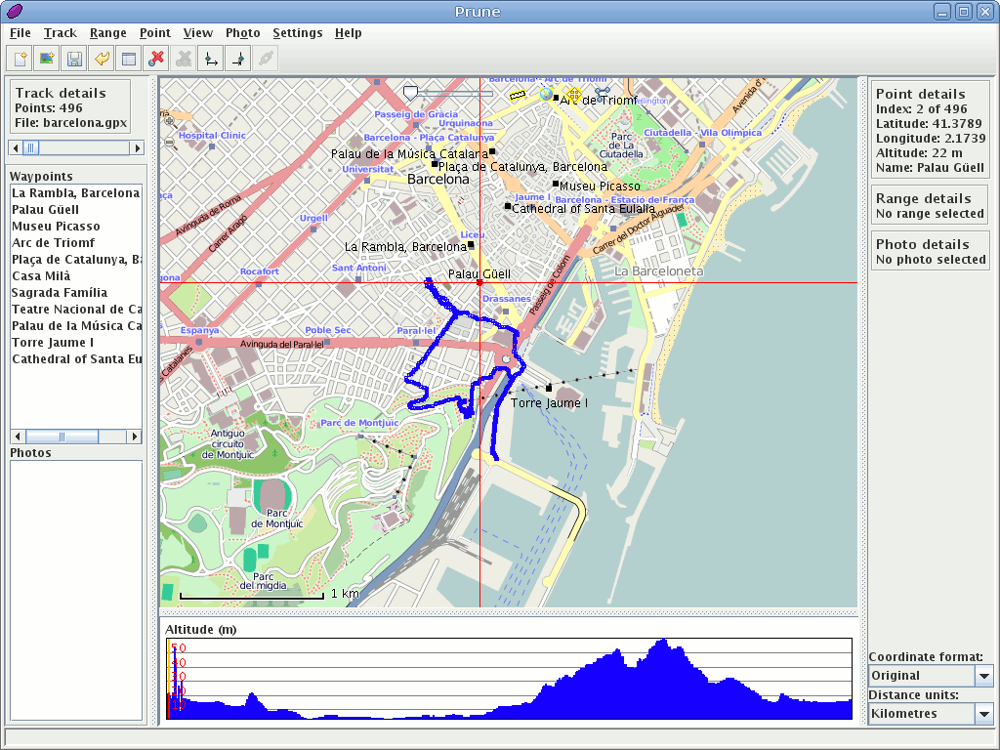

:Author: activityworkshop
:Version: osgeo-live4.5
:License: Creative Commons

.. _prune-overview:

.. image:: ../../images/project_logos/logo-prune.png
  :alt: project logo
  :align: right
  :target: http://activityworkshop.net/software/prune/

Prune
=====

Narzedzia do edycji śladów GPS
~~~~~~~~~~~~~~~~~~~~~~~~~~~~~~

`Prune <http://activityworkshop.net/software/prune/>`_ jest narzędziem do przeglądania,
edycji i konwertowania danych posiadających georeferencje, z systemów GPS. Do wyświetlania
zapisanych śladów i punktów tras używa podkładów z OpenStreetMap. Dostarcza również wielu
narzędzi do edycji i wycinania danych punktowych. Posiada funkcje do korelowania 
zdjęć ze współrzędnymi za pomocą znaczników czasowych zdjęcia.

Jeśli jest dostępna biblioteka Gpsbabel, Prune korzysta z niej do czytania danych bezpośrednio z odbiornika GPS,
a także umożliwia wysłanie wyedytownych danych z powrotem do urządzenia GPS.

Prune działa na Mac OSX, Windows i Linux, i jest dostępne w dziesięciu różnych językach.

Główne funkcje
--------------

* Wczytywanie danych z plików tekstowych, plików gpx, kml/kmz lub bezpośrednio z urządzenia GPS
* Skalowalny podkład mapy z OpenStreetMap lub jakiegokolwiek kompatybilnego serwera (OpenCycleMap, CloudMade etc.)
* Widok profilu wysokośi lub prędkości
* Narzędzia edycyjne do usuwania, cofania i pakowania śladów
* Interaktywny widok 3D danych lub eksport do formatu POV w celu późniejszego renderowania 3D
* Zapis danych do plików tekstowych, kml/kmz, lub bezpośrednio do odbiornika GPS
* Automatyczna korelacja zdjęć z wczytanymi danymi, za pomocą znaczników czasowych
* Tworzenie wykresów, np. wysokość do odległości, prędkość do czasu

Szczegóły
---------

**Strona internetowa:** http://activityworkshop.net/software/prune/

**Licencja:** Powszechna Licencja Publiczna GNU (GPL) wersja 2

**Wersja programu:** 12

**Systemy operacyjne:** GNU/Linux, Mac OSX, Windows

Wprowadzenie
------------

* `Przejdź do wprowadzenia <../quickstart/prune_quickstart.html>`_

