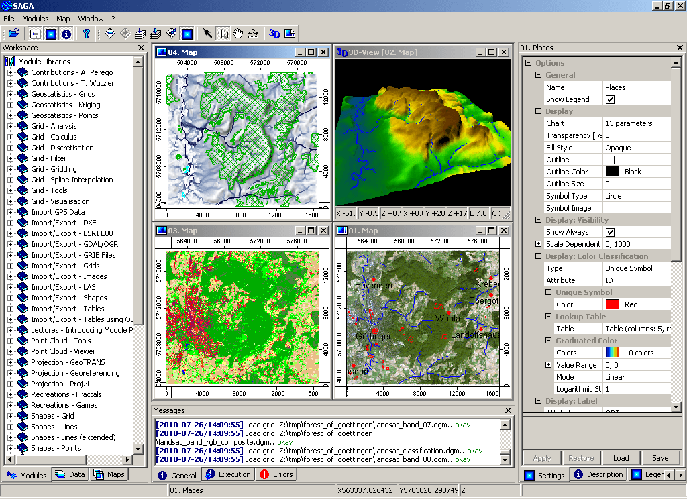

:Author: OSGeo-Live
:Version: osgeo-live4.0
:License: Creative Commons Attribution 3.0 Unported (CC BY 3.0)

.. _saga-overview:

.. image:: ../../images/project_logos/logo-saga.png
  :scale: 100 %
  :alt: project logo
  :align: right
  :target: http://www.saga-gis.org

SAGA
================================================================================

Desktop GIS
~~~~~~~~~~~~~~~~~~~~~~~~~~~~~~~~~~~~~~~~~~~~~~~~~~~~~~~~~~~~~~~~~~~~~~~~~~~~~~~~

SAGA (System for Automated Geoscientific Analyses) jest systemem informacji geograficznej (GIS)
o otwartym kodzie źródłowym, używanym do edycji i analiz danych przestrzennych.
Zawiera bogaty zestaw modułów do analiz danych wektorowych (punktów, linii, poligonów),
tabel, siatek i zobrazowań. Między innymi, pakiet zawiera moduły geostatystyczne, do klasyfikacji obrazów,
zmiany odwzorowań, symulacji dynamicznych procesów (hydrologicznych, kształtowania
krajobrazu) i analiz terenu. Funkcje programu mogą być dostępne przez GUI, wiersz poleceń
lub z poziomu API C++.

SAGA jest tworzona od 2000r., a centrum jej rozwoju znajduje się 
w Instytucie Geografii na Uniwersytecie w Hamburgu, z udziałem 
rosnącej światowej społeczności.

Główne funkcje
--------------------------------------------------------------------------------

* Dostęp do wielu naukowych modułów poprzez graficzny interfejs użytkownika i wiersz poleceń

 * Import/eksport do różnych formatów
 * Reprojekcja/resampling danych
 * Manipulacja danymi wektorowymi (merdżowanie/przecinanie/atrybuty)
 * Manipulacja chmur punktów z danych LiDAR
 * Dane rastrowe: interpolacja, analizy kosztów...
 * Analizy zobrazowań: filtrowanie, wykrywanie granic, analizy skupień, segmentacja
 * Numeryczne analizy terenu: generowanie indeksów morfometrycznych, sieci kanałów, profili, linii konturowych...
 * Geostatystyka: moduły do dopasowywania wariogramów i krigingu

* Szybki interfejs użytkownika do zarządzania i wizualizacji danych

 * Wizualizacja 3D

* Przystępne API C++ do tworzenia nowych modułów
* Skryptowanie w wierszu poleceń, możliwość użycia Pythona
* SAGA może być dostępna z języka statystycznego R poprzez moduł RSAGA

Szczegóły
--------------------------------------------------------------------------------

**Strona internetowa:** http://www.saga-gis.org

**Licencja:** LGPL v2.1 (api); GPLv2 (GUI and modules)

**Wersja programu:** 2.0.6

**Systemy operacyjne:** Linux, Windows

**Interfejsy API:** C++

**Wsparcie:** http://www.saga-gis.org

Wprowadzenie
--------------------------------------------------------------------------------

* `Przejdź do wprowadzenia <../quickstart/saga_quickstart.html>`_

