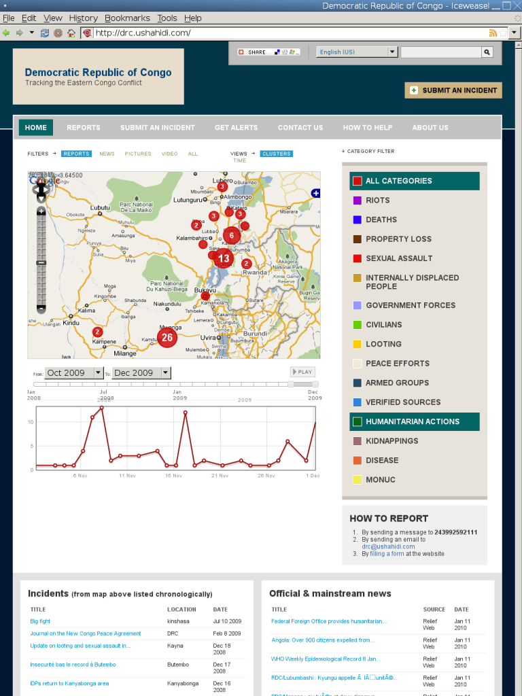

:Author: Henry Addo
:Version: osgeo-live4.0
:License: Creative Commons

.. _ushahidi-overview:

.. image:: ../../images/project_logos/logo-ushahidi.png
  :scale: 80 %
  :alt: project logo
  :align: right
  :target: http://www.ushahidi.com

Ushahidi
========

Incident Timeline & Mapping
~~~~~~~~~~~~~~~~~~~~~~~~~~~

The `Ushahidi <http://www.ushahidi.com/>`_ Engine is a free and open source
platform that allows anyone to gather distributed data via SMS, email or 
web and visualize it on a map or a timeline. Ushahidi's goal is to create tools for 
democratizing information, increasing transparency and lowering the barriers 
for individuals to share their stories.

Ushahidi, which means "testimony" in Swahili, was initially developed to
map reports of violence in Kenya after the post-election fallout at the
beginning of 2008. Ushahidi's roots are in the collaboration of Kenyan
citizen journalists during a time of crisis. The website was used to map
incidents of violence and peace efforts throughout the country based on
reports submitted via the web and mobile phone. This initial deployment of
Ushahidi had 45,000 users in Kenya, and was the catalyst for us realizing
there was a need for a platform based on it, which could be use by others
around the world.

Główne funkcje
-------------
* Interactive map.
* Timeline.
* Ability to subscribe to report alerts based on proximity.
* CSS based theming.
* 5 minute web installer.
* Ability to upload and download mass reports.
* Ability to layer KML/KMZ files on the map.
* Supports custom pages and tabs.
* Site statitics and analytics.
* Plugin system.
* One click upgrade.
* Supports multiple SMS providers.
* Trusted Reporter functionality.
* Themes.
* Scheduler.
* Cache.

Demo
----

* `Ushahidi Demo instance <http://demo.ushahidi.com/>`_

Szczegóły
-------

**Strona internetowa:** http://www.ushahidi.com

**Licencja:** Powszechna Licencja Publiczna GNU (GPL) wersja 3

**Wersja programu:** 2.0.1

**Interfejsy API:** PHP

**Systemy operacyjne:** Linux, Mac, Windows

**Wsparcie:** http://forums.ushahidi.com

Wprowadzenie
----------

* `Przejdź do wprowadzenia <../quickstart/ushahidi_quickstart.html>`_

