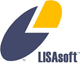

Наши контакты
================================================================================

Создание OSGeo-Live координируется через электронную почту и интернет-чат (IRC), как описано на странице
`OSGeo вики <http://wiki.osgeo.org/wiki/Live_GIS_Disc#Contact_Us>`_.

Поддержка сообществом
================================================================================

Если у вас есть какие-либо вопросы, комментарии, или вы столкнулись с любыми проблемами,
пожалуйста, напишите в наш `mail-лист <http://lists.osgeo.org/mailman/listinfo/live-demo>`_.

Архивы mail-листа с возможностью поиска располагаются на 
`Gmane <http://news.gmane.org/gmane.comp.gis.osgeo.livedemo>`_ and
`Nabble <http://osgeo-org.1803224.n2.nabble.com/OSGeo-FOSS4G-LiveDVD-f3623430.html>`_.

Пользователи IRC могут использовать каналы #osgeolive or #osgeo на Freenode.net
для онлайн-консультаций.

Много полезной информации доступно на нашей `Вики <http://wiki.osgeo.org/wiki/Live_GIS_Disc>`_, 
также есть `баг-трекер <https://trac.osgeo.org/osgeo/report/10>`_.

Коммерческая поддержка
================================================================================

Компания LISAsoft предоставляет коммерческую поддержку для создания Live DVD, многие 
приложения были подготовлены с её помощью.
Детали на сайте http://lisasoft.com

Большая часть приложений имеет как поддержку сообщества, так и предложения по их 
коммерческой поддержке. Детали можно найти в :doc:`описаниях <./overview/overview>` 
приложений.     

В дополнение к этому, существует много консалтинговых компаний, которые оказывают
поддержку для проектов OSGeo (ищите на странице http://www.osgeo.org/search_profile).

