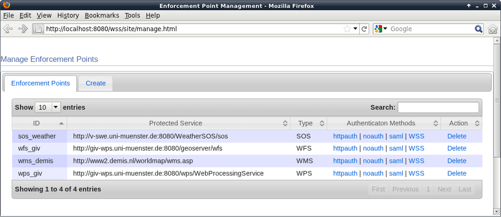

:Author: Jan Drewnak (j.drewnak@52north.org)
:Reviewer: Cameron Shorter, LISAsoft
:Version: osgeo-live5.5
:License: Creative Commons Attribution 3.0 Unported (CC BY 3.0)

.. image:: ../../images/project_logos/logo_52North_160.png
  :scale: 100 %
  :alt: логотип проекта 
  :align: right
  :target: http://52north.org/security

52°North WSS
================================================================================

WSS
--------------------------------------------------------------------------------

Сервис веб-безопасности (Web Security Service (WSS)) компании 52North
позволяет простым образом ограничивать доступ
к пространственным сервисам и их ресурсам посредством системы ролевого
разграничения доступа.

С помощью 52North WSS вы можете определять политики доступа, такие как, например:

  *Все пользователи с ролью 'external' могут получать доступ только к слоям A и
  B сервиса WMS посредством GetMap.*

или

  *GetFeatureInfo допустим только относительно слоя A в особой области, 
  заданной ограничивающим прямоугольником.*

52North WSS является веб-приложением на языке Java, которое запускается в контейнере сервлетов Apache
Tomcat.
Оно играет роль посредника для любого числа веб-сервисов OGC Web Services, получая
все запросы и обрабатывая их согласно заданным политикам. 
Таким образом, уже работающие сервисы изменять не нужно.
Политики и пользователи задаются в конфигурационном файле XML, управление ими
осуществляется через общий интерфейс управления.

Функции
--------------------------------------------------------------------------------

**Авторизация**

Включает защиту:

* Web Mapping Service (WMS): слои, охваты
* Web Feature Service (WFS): типы объектов, объекты и их атрибуты, охваты
* Sensor Observation Service (SOS): предложения, процедуры, пространственные и временные охваты
* Web Processing Service (WPS): процессы

**Аутентификация**

Поддерживается несколько методов аутентификации пользователя, такие как:

* HTTP Basic Authentication
* SAML Assertions (Security Assertions Markup Language)
* ... и другие

Дополнительная информация
--------------------------------------------------------------------------------

**Веб-сайт:** http://52north.org/communities/security

**Лицензия:** `GPL версия 2 <http://www.gnu.org/licenses/gpl-2.0.html>`_

**Версия ПО:** WSS 2.2.0

**Поддерживаемые платформы:** Windows, Linux, Mac

**Интерфейсы API:** Java

**Коммерческая поддержка:** http://52north.org/

Начало работы
--------------------------------------------------------------------------------

* :doc:`Введение <../quickstart/52nWSS_quickstart>`
