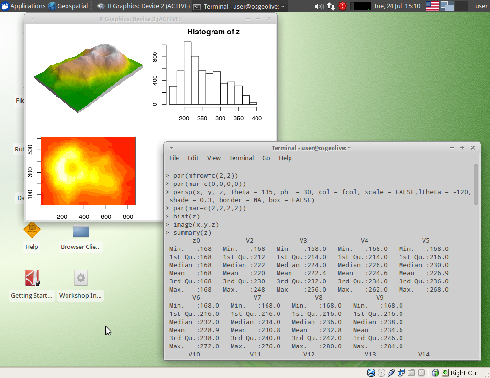

:Author: OSGeo-Live
:Reviewer: Cameron Shorter, LISAsoft
:Version: osgeo-live5.5
:License: Creative Commons Attribution 3.0 Unported (CC BY 3.0)

.. image:: ../../images/project_logos/logo-R.jpg
  :scale: 100 %
  :alt: project logo
  :align: right
  :target: http://cran.r-project.org

R для пространственных данных
================================================================================

Статистическое программирование
~~~~~~~~~~~~~~~~~~~~~~~~~~~~~~~~~~~~~~~~~~~~~~~~~~~~~~~~~~~~~~~~~~~~~~~~~~~~~~~~

R — мощная и широко распространённая программная среда для
статистических вычислений и графики, которая отлично подходит
для анализа и обработки геопространственных данных.      
Возможности геопространственного анализа с помощью R доступны
через т.н. *пакеты* (модули, которые расширяют возможности R). 
Различные пакеты обеспечивают доступ как к большому числу
традиционных алгоритмов, так и к самым новым из них, причём часто
до того, как они появятся в другом открытом или проприетарном ПО.

С помощью R можно обрабатывать точечные, линейные и полигональные 
векторные данные, и также растры. Пользователи могут решать широкий 
спектр задач: классификация изображений, статистический анализ для
выявления пространственных связей и структуры свойств и многое другое,
перечисленное в разделе "Базовые функции" ниже. Функции, доступные в 
R, дополняют и развивают возможности ГИС-пакетов и программ для работы
с данными дистанционного зондирования Земли (ДЗЗ).                  

Основной интерфейс R — командная строка, которая даёт отличную гибкость
и контроль, но требует большего времени, чтобы стать опытным пользователем, 
по сравнению с программами с графическим интерфейсом. С другой стороны, 
R хорошо документирован (имеется в т.ч. и онлайн-документация), что облегчает
процесс обучения. Существует несколько проектов по созданию графического 
интерфейса к R (http://rwiki.sciviews.org/doku.php?id=guis:guis).  
Для автоматизации работы используются скрипты.
  
**R** представляет собой свободную реализацию языка программирования **S**. 
Между R и S/S-Plus (а также современной коммерческой версией S, TIBCO Spotfire 
S+) достигнута значительная кодовая совместимость. Это позволяет переносить
разные версии S-кода в R без больших модификаций.  

Базовые функции
--------------------------------------------------------------------------------

* Полностью объектно-ориентированный язык программирования, спроектированный для статистики и прочих подобных математических приложений
* Сотни распространяемых сообществом дополнительных пакетов для пространственной статистики
* Классы для пространственных данных
* Обработка пространственных данных
* Чтение и запись пространственных данных
* Анализ структур точечных данных
* Геостатистика 
* Картирование заболеваний и площадной анализ данных
* Пространственная регрессия 
* Экологический анализ

Дополнительная информация 
--------------------------------------------------------------------------------

**Веб-сайт:** http://cran.r-project.org

**Лицензия:** `GPL <http://www.gnu.org/licenses/gpl.html>`_

**Версия ПО:** 2.15.1

**Поддерживаемые платформы:** Windows, Linux, Mac, Unix

**Поддержка сообществом:** http://cran.r-project.org/web/views/Spatial.html

Начало работы
--------------------------------------------------------------------------------
    
* :doc:`Введение <../quickstart/R_quickstart>`
