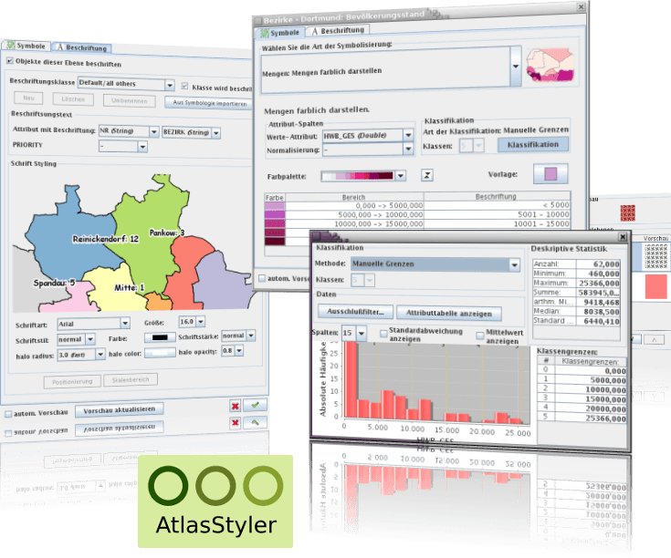

:Author: Stefan Tzeggai
:Reviewer: Cameron Shorter, LISAsoft
:Version: osgeo-live5.5
:License: Creative Commons Attribution 3.0 Unported (CC BY 3.0)

.. image:: ../../images/project_logos/logo-AtlasStyler.png
  :scale: 100 %
  :alt: логотип проекта
  :align: right
  :target: http://en.geopublishing.org/AtlasStyler

AtlasStyler
================================================================================

Редактор стилей объектов
~~~~~~~~~~~~~~~~~~~~~~~~~~~~~~~~~~~~~~~~~~~~~~~~~~~~~~~~~~~~~~~~~~~~~~~~~~~~~~~~

`AtlasStyler <http://en.geopublishing.org/AtlasStyler>`_ — это удобное
настольное приложение для создания стилей для геоданных. Созданные
стили могут быть сохранены в форматах, соответствующих стандартам OGC
SLD/SE.

Создаваемые файлы SLD поддерживаются всеми программами, которые 
поддерживают стандарт OGC SLD, включая :doc:`GeoServer <geoserver_overview>`,
:doc:`uDig <udig_overview>` и другие. Это приложение предоставляет 
большое количество интуитивно понятных диалогов, позволяющих упростить
процесс создания стилей.
Пользователь может применять классификации, такие как уникальные
значения, квантильная или равнопромежуточная. 
Пользователь также может обращаться к онлайн-базе данных с
символами. Пользователи могут создавать и сохранять стили в редакторе
стилей и использовать их в классификациях и других проектах.

Базовые функции
--------------------------------------------------------------------------------

* Создание стилей с помощью диалогов.
* Поддержка стандарта OGC SLD.
* Работает в ОС Windows и Linux (поддержка Mac нуждается в небольшом
  финансировании).
* Импорт данных в формате ESRI Shapefile, OGC WFS и баз данных PostGIS
  (векторные данные), а также файлов GeoTIFF и Arc/Info ASCII Grid
  (растровые данные).
  * Переведено на немецкий, английский, итальянский, турецкий, русский
и французский языки.
   
Поддерживаемые стандарты
--------------------------------------------------------------------------------

* OGC Style Layer Descriptor (SLD) 1.0
* OGC Symbology Encoding (SE)

Дополнительная информация
--------------------------------------------------------------------------------

**Веб-сайт:** http://en.geopublishing.org/AtlasStyler

**Версия ПО:** 1.9

**Лицензия:** `LGPL <http://www.gnu.org/copyleft/lesser.html>`_

**Поддерживаемые платформы:** Windows, Linux

**Интерфейсы API:** Java, Swing, Geotools

**Поддержка:** `www.wikisquare.de <http://www.wikisquare.de>`_

Начало работы
--------------------------------------------------------------------------------

* :doc:`Введение <../quickstart/atlasstyler_quickstart>`
