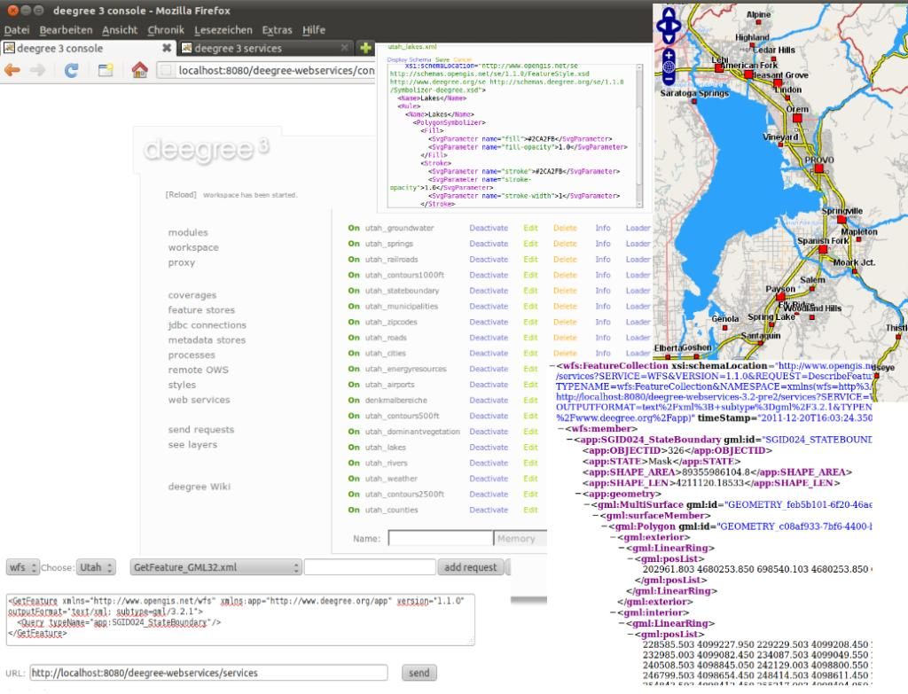

:Author: Johannes Wilden
:Reviewer: Cameron Shorter, LISAsoft
:Version: osgeo-live5.5
:License: Creative Commons Attribution 3.0 Unported (CC BY 3.0)

.. image:: ../../images/project_logos/logo-deegree.png
  :scale: 80 %
  :alt: логотип проекта
  :align: right
  :target: http://deegree.org

.. image:: ../../images/logos/OSGeo_project.png
  :scale: 100
  :alt: Проект OSGeo
  :align: right
  :target: http://www.osgeo.org

deegree
================================================================================

Веб-сервисы
~~~~~~~~~~~~~~~~~~~~~~~~~~~~~~~~~~~~~~~~~~~~~~~~~~~~~~~~~~~~~~~~~~~~~~~~~~~~~~~~

**deegree** свободен, стабилен, многофункционален и прост в
  использовании. Среди свободного геопространственного ПО deegree
  поддерживает самый большой набор стандартов Open Geospatial
  Consortium (OGC), от транзакционного Web Feature Service до
  отображения трехмерных данных с помощью Web Terrain Service и многие
  другие!

**deegree** является решением для настольных и веб-ГИС и Инфраструктур
  пространственных данных (ИПД, Spatial Data Infrastructures
  (SDI). Он состоит из многофункционального мощного API (Application
  Programming Interface) для Java и реляционно-объектовой картографии
  для простых и сложных пространственных схем. deegree также
  предоставляет стандартизованный набор веб-сервисов для
  веб-картографии, объектовых и каталоговых сервисов, а также сервисов
  для работы с сенсорами и процессами.

deegree запустит вашу ИПД, используя ваши собственные данные и согласно вашим требованиям.

Примеры некоторых функций
--------------------------------------------------------------------------------

* Web Map Service

  * Гибкая поддержка содержания слоя
  * Поддерживает и использует стилизацию SLD 1.0
  * Возможности тематического картографирования с помощью графиков
    (круговые, столбчатые, линейные диаграммы) как точечной символики
  * Источники данных: все обычные веб-сервисы OGC (WMS, WFS, WCS),
  PostgreSQL/PostGIS, Oracle Spatial, любые пользовательские SQL
  запросы, используемые для создания содержания слоя WMS
  * Очень стабилен, даже на больших масштабах 
  * Поддержка HTTP GET, HTTP POST и объектовых запросов
  * Сертифицированное соответствие OGC

* Web Feature Service

  * Поддержка простых и сложных объектов
  * Трансформирование на лету в более чем 3000 систем координат
  * Гибкая поддержка выходных форматов
  * Лёгкое расширение для поддержки директивы INSPIRE

* Web Coverage Service

  * Поддержка запросов HTTP GET и HTTP POST
  * Источники данных: images (tif, png, jpeg, gif, bmp); GeoTIFF; ECW;
  Oracle GeoRaster
  * Высокоскоростной доступ к большим покрытиям.

* Catalogue Service

  * Источники данных: базы данных PostgreSQL; Oracle
  * Поддерживаемые запросы: GetCapabilities; DescribeRecord;
    GetRecordById; GetRecords; Transaction - Insert, Update, Delete; Harvesting

* Web Map Print Service

  * Поддержка разных форматов для печати (HTML, PDF, PNG)
  * Длительные по времени задачи
  * Поддержка асинхронных запросов для крупноформатной печати
  * Сохранение запросов в базе и их доступность даже после остановки 
  WMPS администратором или аппаратного сбоя.

* Web Perspective View Service

   * Источники данных: удаленный/локальный-WMS,
     удаленный/локальный-WFS, локальный-WCS, Postgres/PostGIS, Oracle
     Spatial
   * Модели рельефа могут быть представлены векторными или растровыми
     данными
   * Запросы: Get3DFeatureInfo, GetView.

Поддерживаемые стандарты
--------------------------------------------------------------------------------

* OGC Web Map Service (WMS) 1.1.0*, 1.1.1, 1.3.0*
* OGC Web Feature Service (WFS) 1.0.0, 1.1.0 (2.0 in progress)
* OGC Web Coverage Service (WCS) 1.0.0* (1.1.0 in progress)
* OGC Catalogue Service-Web (CSW) 2.0.0, 2.0.1, 2.0.2; включая OGC
ISOAP 1.0 and INSPIRE profile
* OGC Web Perspective View Service (WPVS) Draft 6
* OGC Web Coordinate Transformation Service (WCTS) 0.4.0
* OGC Web Processing Service (WPS) 0.4.0, 1.0.0
* OGC Sensor Observation Service (SOS) 1.0.0

Дополнительная информация
--------------------------------------------------------------------------------

**Веб-сайт:** http://deegree.org

**Лицензия:** LGPL

**Версия ПО:** 3.2-pre3

**Поддерживаемые платформы:** Windows, Linux

**Интерфейсы API:** Java

**Поддержка:** http://wiki.deegree.org/deegreeWiki/GettingSupport

Начало работы
--------------------------------------------------------------------------------

* :doc:`Введение <../quickstart/deegree_quickstart>`
