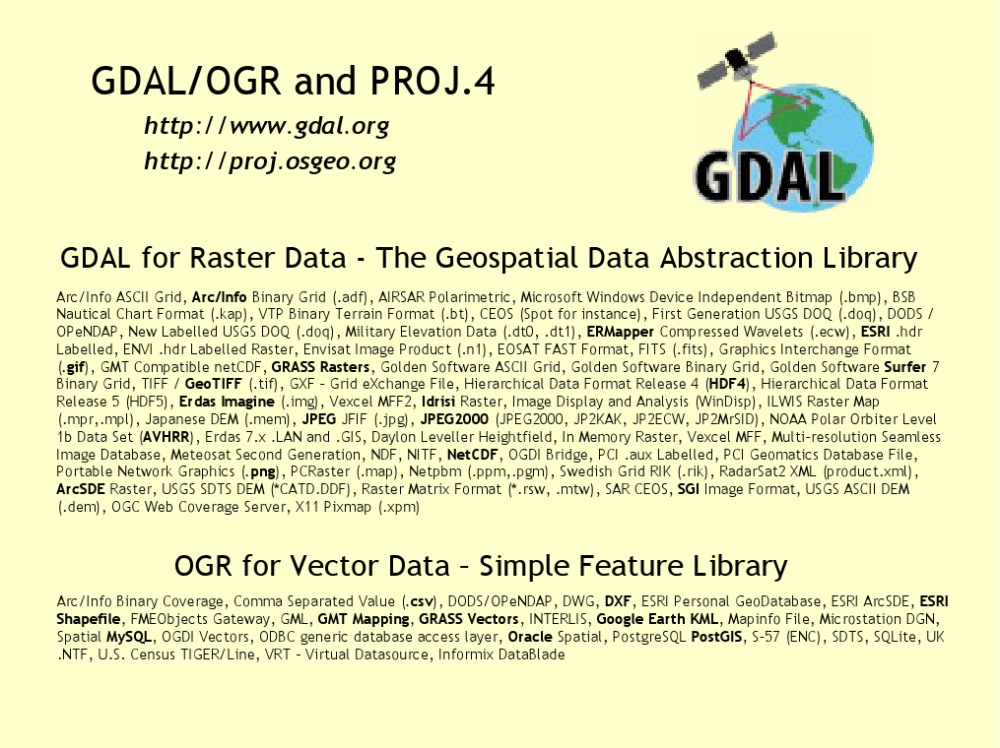

:Author: OSGeo-Live
:Reviewer: Cameron Shorter, LISAsoft
:Version: osgeo-live5.5
:License: Creative Commons Attribution 3.0 Unported (CC BY 3.0)

.. image:: ../../images/logos/OSGeo_project.png
  :scale: 100 %
  :alt: OSGeo Project
  :align: right
  :target: http://www.osgeo.org/incubator/process/principles.html

GDAL/OGR
================================================================================

Инструменты для работы с геопространственными данными
~~~~~~~~~~~~~~~~~~~~~~~~~~~~~~~~~~~~~~~~~~~~~~~~~~~~~~~~~~~~~~~~~~~~~~~~~~~~~~~~

Библиотека для работы с пространственными данными (Geospatial Data Abstraction
Library - GDAL/OGR) включает набор утилит командной строки, служащих
для преобразования и обработки широкого набора различных растровых и векторных форматов данных.

Утилиты используют кроссплатформенную библиотеку C++, доступную для множества
языков программирования. Как библиотека, GDAL предоставляет собой единую абстрактную
модель данных для вызова приложений и для всех поддерживаемых форматов.

GDAL/OGR — наиболее широко распространенная библиотека доступа к пространственным данным, она предоставляет механизм доступа к первичным данным множества приложений, таких как MapServer,
GRASS, QGIS и OpenEV и многих других. Она также используется в таких приложениях, как OSSIM,
Cadcorp SIS, FME, Google Earth, VTP, Thuban, ILWIS, MapGuide и ArcGIS.

Основные возможности
--------------------------------------------------------------------------------

* Утилиты командной строки для преобразования форматов, перепроецирования, вырезания фрагментов и многих других распространённых задач.
* Эффективный доступ к растровым данным, обеспечивающий разрезание на тайлы и обзор больших растров.
* Поддержка больших файлов (размером более 4 Гб).
* Доступ к библиотеке из Python, Java, C#, Ruby, VB6 и Perl.
* Движок координатных систем, встроенный в PROJ.4 и хорошо известные текстовые описания координатных систем OGC.

Поддержка распространенных форматов
--------------------------------------------------------------------------------

GDAL поддерживает более 50 растровых форматов, OGR — более 20 векторных. Среди них:

* **Растровые:** GeoTIFF, Erdas Imagine, SDTS, ESRI Grids, ECW, MrSID, JPEG2000, DTED, и другие ...
* **Векторные:** MapInfo (TAB и MIF/MID), ESRI Shapefile, ESRI Coverages, ESRI Personal Geodatabase, DGN, GML, PostGIS, Oracle Spatial, и другие ...

Реализованные стандарты
--------------------------------------------------------------------------------

Модель векторных данных OGR совместима со спецификацией OGC Simple Features.

Дополнительная информация
--------------------------------------------------------------------------------

**Веб-сайт:**  http://www.gdal.org

**Лицензия:** `основанная на MIT <http://trac.osgeo.org/gdal/wiki/FAQGeneral#WhatlicensedoesGDALOGRuse>`_

**Версия ПО:** 1.7.0 (1.9.1)

**Поддерживаемые платформы:** Windows, Linux, Mac

**Интерфейсы API:** C, C++, Python, Java, C#, Ruby, VB6 и Perl

**Поддержка:** http://lists.osgeo.org/mailman/listinfo/gdal-dev, http://www.osgeo.org/search_profile

Начало работы
--------------------------------------------------------------------------------
    
* :doc:`Введение <../quickstart/gdal_quickstart>`
