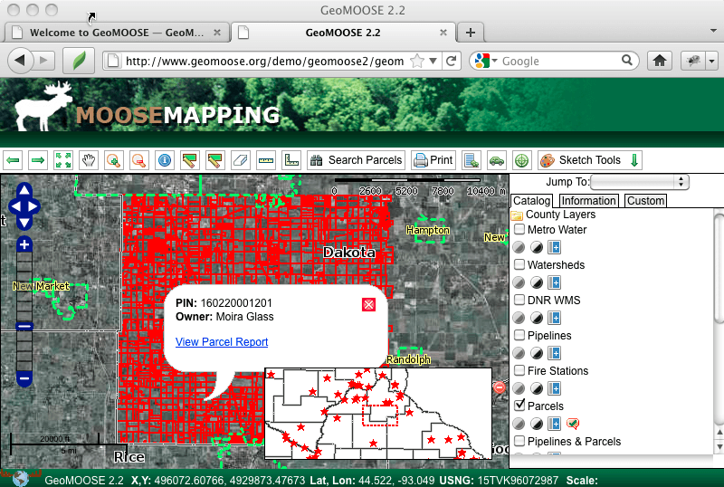

:Author: OSGeo-Live
:Author: Bob Basques
:Reviewer: Cameron Shorter, LISAsoft
:Version: osgeo-live5.5
:License: Creative Commons Attribution 3.0 Unported (CC BY 3.0)

.. image:: ../../images/project_logos/logo-geomoose.png
  :scale: 30 %
  :alt: project logo
  :align: right
  :target: http://www.geomoose.org/

.. image:: ../../images/logos/OSGeo_incubation.png
  :scale: 100 %
  :alt: OSGeo Project in Incubation
  :align: right
  :target: http://www.osgeo.org/incubator/process/principles.html

GeoMoose
================================================================================

Портал веб-ГИС 
~~~~~~~~~~~~~~~~~~~~~~~~~~~~~~~~~~~~~~~~~~~~~~~~~~~~~~~~~~~~~~~~~~~~~~~~~~~~~~~~

GeoMOOSE — это браузер для отображения распределённых геоданных. Чрезвычайно полезен для управления пространственными и непространственными данными в масштабах области, города, муниципалитетов (для которых GeoMOOSE и был изначально разработан). Приложение существенно расширяет стандартные возможности MapServer и OpenLayers с помощью уточнения запросов для отображения и организации множества слоёв.

GeoMOOSE — быстрое приложение, отлично работающее с сотнями слоёв и/или сервисов одновременно. Данные из различных источников могут независимо настраиваться с помощью различных инструментов, поскольку каждый картографический слой может иметь свой конфигурирующий файл для настройки его отображения, символики или шаблонов.

Пользовательский интерфейс легко настраивается, а модульная архитектура позволяет добавлять дополнительные сервисы.

Основные возможности
--------------------------------------------------------------------------------

* Поддержка данных, распределенных между многими владельцами.
* Доступ к данным, предоставляемым посредством MapServer, Google, VirtualEarth, YahooMaps, Tilecache, ArcGIS REST, WMS.
* Настройка нескольких представлений для источника данных.
* Ознакомление с данными из каталогов и их фильтрация.
* Инструменты: измерение, рисование, запросы, перепроецирование, скрытие слоев, переход на заданное увеличение, захват координат...
* Элементы интерфейса: карта, обзорная карта, боковые меню, панель навигации, панели с вкладками.
* Основанные на MapBook XML-файлы конфигурации пользовательского интерфейса, слоёв данных и инструментов.
* Совместимость с Mapserver.
* Модульная архитектура облегчает поддержку непространственных систем (например, управление активами).
* Публикация фактически неограниченного количества слоёв.
* Печать в PDF.

Реализованные стандарты
--------------------------------------------------------------------------------
* WMS

Дополнительная информация
--------------------------------------------------------------------------------

**Веб-сайт:** http://www.geomoose.org/

**Лицензия:** основанная на MIT, http://www.geomoose.org/info/license.html

**Версия ПО:** 2.4

**Поддерживаемые платформы:** Windows, Linux, Mac

**Коммерческая поддержка:** http://www.geomoose.org/info/commercial_support.html

**Поддержка сообщества:** http://www.geomoose.org/info/mailing_lists.html

Начало работы
--------------------------------------------------------------------------------
    
* :doc:`Введение <../quickstart/geomoose_quickstart>`
