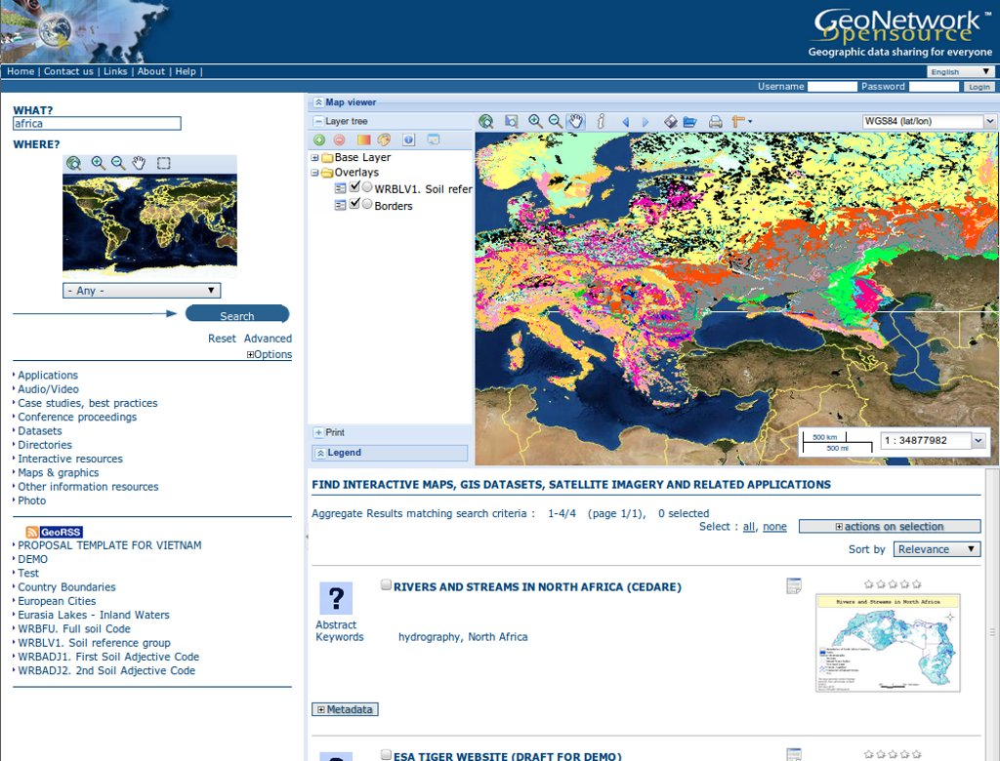

:Автор: OSGeo-Live
:Проверил: Cameron Shorter, LISAsoft
:Версия: osgeo-live5.5
:Лицензия: Creative Commons Attribution 3.0 Unported (CC BY 3.0)

.. image:: ../../images/logos/OSGeo_project.png
  :scale: 100
  :alt: OSGeo Project
  :align: right
  :target: http://www.osgeo.org

GeoNetwork
================================================================================

Каталог метаданных
~~~~~~~~~~~~~~~~~~~~~~~~~~~~~~~~~~~~~~~~~~~~~~~~~~~~~~~~~~~~~~~~~~~~~~~~~~~~~~~~

GeoNetwork — это приложение для управления геопространственными 
ресурсами, основанное на открытых стандартах. GeoNetwork предоставляет мощные 
функции поиска и редактирования метаданных, включает в себя интерактивный
просмотрщик веб-карты.

Базовые функции
--------------------------------------------------------------------------------
* Непосредственный поиск в локальных и распределённых геопространственных каталогах
* Загрузка и выгрузка данных, графики, документов, PDF-файлов и прочих видов контента
* Интерактивный просмотрщик веб-карты для комбинирования картографических веб-сервисов с различных серверов по всему миру
* Оповещение об обновлениях через RSS и GeoRSS
* Онлайн-редактирование метаданных с мощной системой шаблонов
* Встроенная поддержка ISO19115/ISO19119/ISO19139/ISO19110, FGDC и Dublin Core formatted metadata
* Расписание для сбора и синхронизации метаданных между различными каталогами (GeoNetwork, CSW, OGC WxS GetCapabilities, Z39.50, WebDav, ArcSDE, Thredds, OGC WFS Features, OAI-PMH)
* Тонкая настройка доступа
* Управление пользователями и группами
* Многоязычный интерфейс
* Произвольное выделение области карты

Реализованные стандарты
--------------------------------------------------------------------------------

* OGC Catalogue Service-Web (CSW) 2.0.2 ISO
* Open Archives Initiatives (OAI-PMH)
* Z39.50
* OpenSearch-Geo
* OAI-PMH
* Стандарты метаданных:

 * ISO19115/ISO19119/ISO19139/ISO19110 и ISO Profiles
 * Dublin Core
 * FGDC

Дополнительная информация 
--------------------------------------------------------------------------------

**Веб-сайт:** http://geonetwork-opensource.org

**Лицензия:** `GPL версия 2 <http://www.gnu.org/licenses/gpl-2.0.html>`_

**Версия ПО:** 2.6.4

**Поддерживаемые платформы:** Windows, Linux, Mac

**Интерфейсы API:** Java

**Поддержка:** http://www.osgeo.org/search_profile

Начало работы
--------------------------------------------------------------------------------

* :doc:`Введение <../quickstart/geonetwork_quickstart>`
