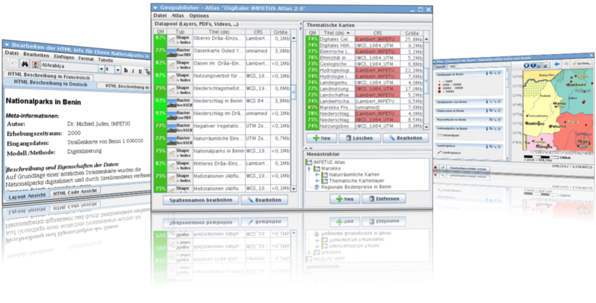

:Author: Stefan Tzeggai
:Reviewer: Cameron Shorter, LISAsoft
:Version: osgeo-live5.5
:License: Creative Commons Attribution 3.0 Unported (CC BY 3.0)

.. image:: ../../images/project_logos/logo-Geopublisher.png
  :scale: 100 %
  :alt: логотип проекта
  :align: right
  :target: http://en.geopublishing.org/Geopublisher

Geopublisher
================================================================================

Менеджер электронной библиотеки
~~~~~~~~~~~~~~~~~~~~~~~~~~~~~~~~~~~~~~~~~~~~~~~~~~~~~~~~~~~~~~~~~~~~~~~~~~~~~~~~

Geopublisher — система создания атласов, позволяющая легко и просто публиковать географические данные,
документы, изображения, видео и статистическую информацию в форме цифровых мультимедийных атласов.
Такие атласы в действительности представляют собой упрощённые ГИС, сконфигурированные под конечного
пользователя и предоставляющие избранную функциональность лишь там, где это имеет смысл.

Geopublisher предоставляет инструменты для контроля качества и управления многоязычными метаданными.
Для создания атласа не требуется обладать глубокими знаниями форматов HTML, SLD или XML. Поддерживается прямая
публикация атласов на CD, DVD, флэш-накопителях, внешних жёстких дисках или в сети Интернет.
Программное обеспечение является платформонезависимым.

Уникальные возможности Geopublisher делают его особенно подходящим для использования в
международных исследованиях, совместной разработке ГИС, наращивании потенциала и сотрудничестве
в целях развития.

Базовые функции
--------------------------------------------------------------------------------

* Созданные в Geopublisher атласы — это упрощённые ГИС для конечного пользователя с избранной функциональностью, доступной только там, где в ней есть смысл.
* Гибридные онлайн- и оффлайн-атласы обеспечивают доступ к геоданным в районах, отрезанных от цифровых коммуникаций.
* Управление метаданными на нескольких языках позволяет избежать избыточности и быстро выпускать обновления атласов.
* Встроенные WYSIWYG-редакторы SLD и HTML дают возможность публиковать метаданные без знания SLD, XML или HTML.
* Всё программное обеспечение бесплатно, имеет открытый исходный код и соответствует стандартам OGC.
* Geopublisher, Quantum GIS и OpenOffice вместе формируют свободную рабочую среду на основе открытого ПО для публикации географических данных.
* Редактор SLD :doc:`AtlasStyler <atlasstyler_overview>` встроен в Geopublisher.
* Работает под операционными системами Windows и Linux.
* Система стилей основана на стандарте OGC SLD.
* Оффлайн-атласы могут быть запущены с любого носителя — установка Java не требуется.
* Поддерживает пирамиды тайлов для больших массивов растровых данных, равно как и тайлы и обзорные изображения GeoTIFF.
* Полностью переведён на немецкий, испанский, английский, итальянский и французский языки.

Реализованные стандарты
--------------------------------------------------------------------------------
* OGC Style Layer Descriptor (SLD)

Подробности
--------------------------------------------------------------------------------

**Веб-сайт:** http://en.geopublishing.org/Geopublisher

**Версия ПО:** 1.9

**Лицензия:** `GPL 3.0 <http://www.gnu.org/licenses/gpl.html>`_; экспортированные атласы распространяются под `LGPL 3.0 <http://www.gnu.org/copyleft/lesser.html>`_

**Поддерживаемые платформы:** GNU/Linux, MS Windows

**Интерфейсы API:** Java, Swing, Geotools

**Поддержка:** http://www.wikisquare.de

Начало работы
--------------------------------------------------------------------------------

* :doc:`Введение <../quickstart/geopublisher_quickstart>`

