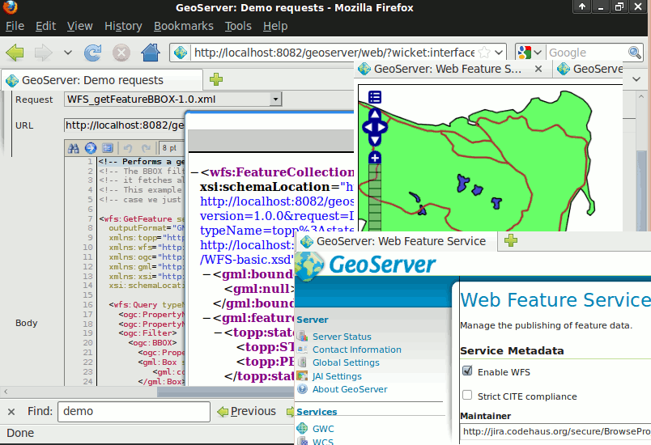

:Author: Ian Turton
:Author: Frank Gasdorf
:Reviewer: Cameron Shorter, LISAsoft
:Version: osgeo-live5.5
:License: Creative Commons Attribution 3.0 Unported (CC BY 3.0)

GeoServer
================================================================================

Веб-служба
~~~~~~~~~~~~~~~~~~~~~~~~~~~~~~~~~~~~~~~~~~~~~~~~~~~~~~~~~~~~~~~~~~~~~~~~~~~~~~~~

GeoServer представляет собой веб-сервер, обеспечивающий стандартным
клиентам, таким, как веб-браузеры и настольные ГИС, доступ
к хранящимся в различных форматах картам и данным. Это означает, что вы можете 
хранить ваши пространственные данные почти в любом предпочитаемом вами `формате
<http://docs.geoserver.org/stable/en/user/data/index.html>`_, но вашим
пользователям не требуется ничего знать о ГИС-данных. В простейшем случае всё,
что им нужно, чтобы увидеть ваши карты в точности такими, как вы хотите, —
это веб-браузер.

GeoServer — это эталонная реализация стандартов `Open Geospatial Consortium <http://www.opengeospatial.org>`_ (OGC) :doc:`../standards/wfs_overview` и :doc:`../standards/wcs_overview`,
а также высокопроизводительная сертифицированная реализация :doc:`../standards/wms_overview`. GeoServer является основным
компонентом Geospatial Web.

Базовые функции
--------------------------------------------------------------------------------

**Публикация данных из различных источников:**
    * Вектор
        - Shape-файлы, внешний WFS
        - PostGIS, ArcSDE, DB2, Oracle Spatial, MySQL, SQL Server
    * Растр
        - GeoTIFF, JPG и PNG (с world-файлом), пирамиды изображений, форматы GDAL, Image Mosaic, Oracle GeoRaster

**Данные предоставляются пользователю в виде изображений через быстрый и безопасный протокол WMS:**
    Поскольку информация передается в виде изображений, ваши данные защищены и находятся в полной безопасности.
    Единственный способ украсть ваши данные — это выполнить их повторную векторизацию.
    Внешний вид каждого слоя карты может быть настроен при помощи дескрипторов стандарта SLD, позволяющего раскрашивать
    и подписывать объекты карты. Комбинируя эти правила с фильтрами OGC, можно реализовать зависимость символики
    от масштаба, позволяющую отображать более подробную карту при увеличении масштаба пользователем.
    Также реализованы управление размещением подписей, группировка и приоритеты.

**Полноценные векторные данные можно передавать клиенту по протоколу WFS:**
    Клиент WFS может загрузить векторные данные и выполнять их отображение, пространственный анализ и другие операции.
    Авторизованный пользователь может также изменять данные и отсылать их обратно на сервер, обновляя хранящиеся там
    данные через протокол WFS. Данные могут передаваться в (сжатом) формате GML, равно как и в других стандартизированных
    форматах, например, в виде shape-файлов или JSON.

**Значения расторовых данных можно передавать клиенту по протоколу WCS:**
    Клиент ГИС может запросить актуальные растровые данные для пространственного анализа. Это даёт пользователю
    возможность создавать приложения для моделирования процесса, описываемого вашими данными.

**Перепроецирование "на лету":**
    GeoServer поддерживает большую часть проекций из базы данных EPSG и может при необходимости выполнять перепроецирование
    в любую из них, давая возможность клиентам с ограниченной поддержкой проекций перекладывать эту работу на сервер.

**Кэширование тайлов WMS**
    `GeoWebCache <http://geowebcache.org/>`_ — тайловый клиент WMS. Он работает как прокси-сервер между клиентом и сервером карт, кэшируя запрашиваемые тайлы, предотвращая избыточные запросы и экономя значительную часть времени, затрачиваемого на обработку.
    GeoWebCache интегрирован в GeoServer.

Реализованные стандарты
--------------------------------------------------------------------------------

Поддержка многочисленных стандартов Open Geospatial Consortium (OGC):

  * :doc:`../standards/wms_overview`
  * :doc:`../standards/wfs_overview`, WFS-T (transactional)
  * :doc:`../standards/wcs_overview`
  * :doc:`../standards/fe_overview`
  * :doc:`../standards/sld_overview` 
  * :doc:`../standards/gml_overview`

Подробности
--------------------------------------------------------------------------------

**Веб-сайт:** http://geoserver.org/display/GEOS/Welcome

**Лицензия:** `GPL версия 2 <http://www.gnu.org/licenses/gpl-2.0.html>`_

**Версия ПО:** 2.1.3

**Поддерживаемые платформы:** Все платформы Java 1.5: Windows, Linux, Mac

**Интерфейсы API:** WMS, WFS, WCS, REST

**Поддержка:** http://geoserver.org/display/GEOS/Commercial+Support

Начало работы
--------------------------------------------------------------------------------
    
* :doc:`Введение <../quickstart/geoserver_quickstart>`
