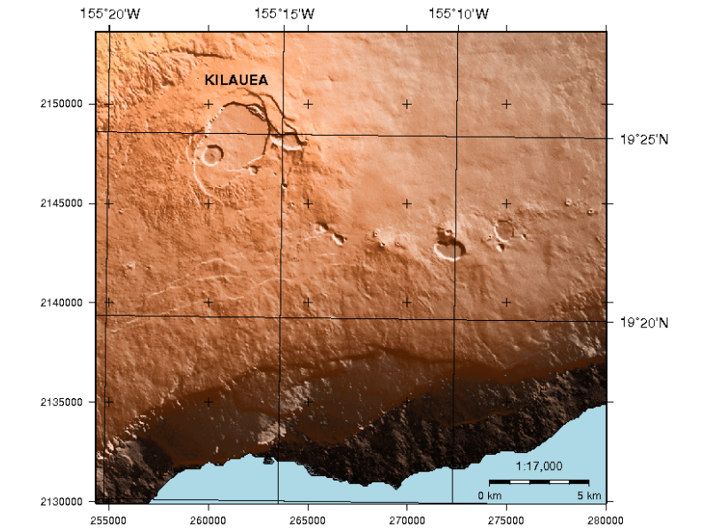

:Author: Hamish Bowman
:Author: Paul Wessel
:Reviewer: Cameron Shorter, LISAsoft
:Version: osgeo-live6.0
:License: Creative Commons Attribution 3.0 Unported  (CC BY 3.0)

.. image:: ../../images/project_logos/logo-GMT.gif
  :scale: 100 %
  :alt: project logo
  :align: right
  :target: http://gmt.soest.hawaii.edu

GMT
================================================================================

Generic Mapping Tools
~~~~~~~~~~~~~~~~~~~~~~~~~~~~~~~~~~~~~~~~~~~~~~~~~~~~~~~~~~~~~~~~~~~~~~~~~~~~~~~~

GMT — набор специализированных утилит, позволяющих манипулировать
двумерными (x,y) и трёхмерными (x,y,z) данными. Доступны следующие 
функции: интерполяция, фильтрация, перепроецирование, расчёты трендов 
и многое другое. На выходе утилиты GMT выдают высококачественную
графику в форматах PostScript (PS) и Encapsulated PostScript File (EPS) — от
простых x-y графиков и контурных карт до искусственно освещённых
поверхностей и 3D-визуализаций, и всё это либо в чёрно-белом цвете,
в градациях серого, со штриховыми заливками или в 24-битном цвете.

GMT поддерживает многие общераспространённые картографические
проекции, а также линейное, логарифмическое и степенное масштабирование.
В состав GMT входят, помимо самих утилит, наборы разномасштабных 
геоданных — политические границы, береговые линии, реки.

Базовые функции
--------------------------------------------------------------------------------

* Картография полиграфического качества
* Интерполяция данных, создание изолиний и другие манипуляции с растрами

Дополнительная информация
--------------------------------------------------------------------------------

**Веб-сайт:** http://gmt.soest.hawaii.edu

**Лицензия:** `GPL версия 2 <http://www.gnu.org/licenses/gpl-2.0.html>`_

**Версия ПО:** 4.5.6

**Поддерживаемые платформы :** GNU/Linux, Mac OSX, MS Windows

**Интерфейсы API :** С

**Поддержка:** http://gmt.soest.hawaii.edu/gmt/gmt_maillist.html

Начало работы
--------------------------------------------------------------------------------

* :doc:`Введение <../quickstart/gmt_quickstart>`

