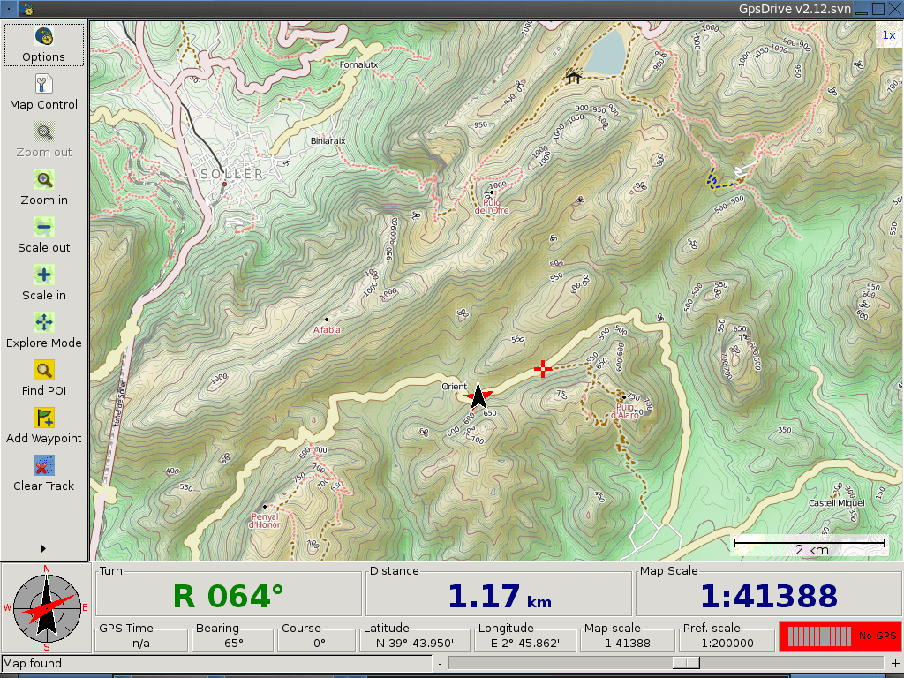

:Автор: Hamish Bowman
:Проверил: Cameron Shorter, LISAsoft
:Версия: osgeo-live5.5
:Лицензия: Creative Commons Attribution 3.0 Unported  (CC BY 3.0)

.. image:: ../../images/project_logos/logo-gpsdrive.png
  :scale: 80 %
  :alt: Логотип проекта
  :align: right
  :target: http://www.gpsdrive.de

GpsDrive
================================================================================

GPS-навигация
~~~~~~~~~~~~~~~~~~~~~~~~~~~~~~~~~~~~~~~~~~~~~~~~~~~~~~~~~~~~~~~~~~~~~~~~~~~~~~~~

`GpsDrive <http://www.gpsdrive.de>`_ — это автомобильная (велосипедная, водная, воздушная, пешеходная) навигационная система. GpsDrive отображает ваше местоположение, полученное из GPS, на масштабируемой карте. Файл карты выбирается автоматически в зависимости от вашего расположения и указанного масштаба. Все GPS-приёмники, по идее, должны быть совместимы, поскольку обычно USB-GPS используют бинарный протокол, доступный для `gpsd <http://gpsd.berlios.de>`_ — GPS-сервиса и мультиплексора.

Базовые функции
--------------------------------------------------------------------------------

* Загрузка из сети данных LANDSAT или OpenStreetMap, либо регистрация вашего собственного изображения
* Рендеринг "на лету" данных OpenStreetMap, записанных в базе данных PostGIS, с использованием Mapnik
* Рендеринг "на лету" из мозаики высокого разрешения NASA Blue Marble
* Голосовые сообщения посредством eSpeak
* Гибко настраиваемая информационная панель и графический интерфейс
* Поддержка GPX-треков и маршрутов, множество опций хранения путевых точек, включая SQLite и текстовый файл, совместимый с GpsBabel
* Поиск ближайших POI в заданном радиусе
* Планирование маршрута
* Наличие сервера, хранящего местоположения ваших друзей
* Интеграция с Kismet Wifi

Дополнительная информация
--------------------------------------------------------------------------------

**Веб-сайт:** http://www.gpsdrive.de

**Лицензия:** `GPL версия 2 <http://www.gnu.org/licenses/gpl-2.0.html>`_

**Версия ПО:** 2.12svn

**Поддерживаемые платформы:** GNU/Linux, MacOS X

**Поддержка:** http://gpsdrive.de/support.shtml

Начало работы
--------------------------------------------------------------------------------

* :doc:`Введение <../quickstart/gpsdrive_quickstart>`
