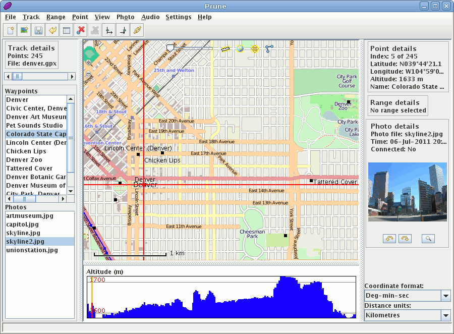

:Автор: activityworkshop
:Проверил: Cameron Shorter, LISAsoft
:Версия: osgeo-live5.5
:Лицензия: Creative Commons Attribution 3.0 Unported (CC BY 3.0)

.. image:: ../../images/project_logos/logo-prune.png
  :alt: Логотип проекта
  :align: right
  :target: http://gpsprune.activityworkshop.net/

GpsPrune
================================================================================

Просмотр, правка и конвертация GPS-треков
~~~~~~~~~~~~~~~~~~~~~~~~~~~~~~~~~~~~~~~~~~~~~~~~~~~~~~~~~~~~~~~~~~~~~~~~~~~~~~~~

`GpsPrune <http://gpsprune.activityworkshop.net/>`_ — это инструмент для просмотра, редактирования и конвертации координатных данных GPS. Он использует карты OpenStreetMap для отображения записанных треков и путевых точек и предоставляет множество средств для редактирования, обрезки и очистки треков. Также он имеет функции сопоставления фотографий и аудиофайлов с координатами, используя временные метки.

При возможности GpsPrune использует Gpsbabel для чтения данных прямо из GPS-приёмника, и может передавать отредактированные данные обратно в приёмник.

GpsPrune работает на Mac OS X, Windows и Linux, имеет поддержку более 10 различных языков.

Базовые функции
--------------------------------------------------------------------------------

* Загрузка данных из текстовых файлов, GPX, KML/KMZ или напрямую из GPS-приёмника
* Масштабируемая карта из OpenStreetMap или другого совместимого сервера (OpenCycleMap, CloudMade и др.)
* Просмотр профиля высоты или скорости
* Инструменты для удаления, реверсирования и сжатия треков
* Интерактивный 3D-просмотр данных или экспорт в формат POV для 3D рендеринга
* Сохранение данных в текстовые файлы, GPX, KML/KMZ или напрямую в GPS-приёмник
* Автоматическое сопоставление фотографий и аудиофайлов с загруженными данными с помощью временных меток
* Создание графиков высоты по пройденному пути и скорости по времени

Дополнительная информация
--------------------------------------------------------------------------------

**Веб-сайт:** http://gpsprune.activityworkshop.net/

**Лицензия:** `GPL версия 2 <http://www.gnu.org/licenses/gpl-2.0.html>`_

**Версия ПО:** 13.1

**Поддерживаемые платформы:** GNU/Linux, Mac OS X, Windows

Начало работы
--------------------------------------------------------------------------------

* :doc:`Введение <../quickstart/gpsprune_quickstart>`

