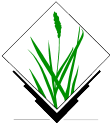
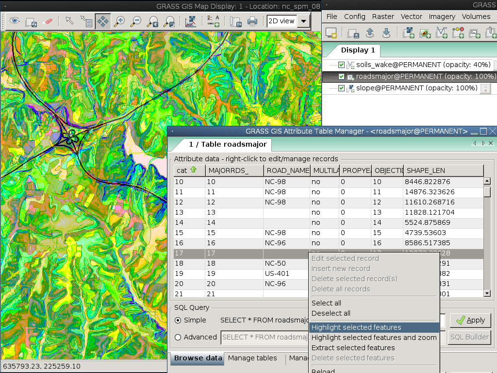

:Author: Hamish Bowman
:Reviewer: Cameron Shorter, LISAsoft
:Version: osgeo-live5.5
:License: Creative Commons Attribution 3.0 Unported  (CC BY 3.0)

GRASS
================================================================================

Полнофункциональная ГИС
~~~~~~~~~~~~~~~~~~~~~~~~~~~~~~~~~~~~~~~~~~~~~~~~~~~~~~~~~~~~~~~~~~~~~~~~~~~~~~~~

GRASS (Geographic Resources Analysis Support System) — полнофункциональная
геоинформационная система, предоставляющая большие возможности для
обработки растровых и векторных геоданных. 

GRASS включает средства для пространственного моделирования, визуализации
растровых и векторных данных, управления геоданными и их анализа, для 
обработки данных дистанционного зондирования Земли и аэрофотоснимков. 
Помимо этого, в GRASS есть инструменты для создания высококачественной 
экранной графики и макетов карт.

В настоящее время GRASS переведена на 20 языков и поддерживает множество
форматов данных.

GRASS используется по всему миру в академических институтах и коммерческих
организациях, а также в государственных агенствах и консалтинговых компаниях.
Эта ГИС работает на большинстве современных компьютерных платформ, является
свободным программным обеспечением с открытым исходным кодом 
(распространяется под лицензией GPL).

GRASS имеет модульную структуру, включает более 400 модулей для разных целей.
Кроме этого сообществом пользователей создано более 100 дополнительных модулей
и наборов инструментов, они доступны для свободной загрузки на 
`вики-сайте <http://grass.osgeo.org/wiki/GRASS_AddOns>`_ сообщества.

В настоящее время, после почти 30 лет непрерывной разработки, GRASS является
одновременно старейшей и крупнейшей открытой ГИС. Она легко дополняется
пользовательскими скриптами и достаточно универсальна, чтобы быть используемой
как в параллельной обработке огромных массивов данных на суперкомпьютерах, так 
и в качестве настольной ГИС, в том числе для КПК или "нетбуков".

.. _GRASS: http://grass.osgeo.org

Базовые функции
--------------------------------------------------------------------------------

* Назовите это — и вы найдёте инструмент для этого.
* Посмотрите `коллекцию скриншотов <http://grass.osgeo.org/screenshots/>`_.

Дополнительная информация
--------------------------------------------------------------------------------

**Веб-сайт:** http://grass.osgeo.org

**Лицензия:** `GPL версия 2 <http://www.gnu.org/licenses/gpl-2.0.html>`_

**Версия ПО:** 6.4.2

**Поддерживаемые платформы :** GNU/Linux, Mac OS X, MS Windows

**Интерфейсы API:** C, Python, Bourne Shell

**Поддержка:** http://grass.osgeo.org/community/support.php

Начало работы
--------------------------------------------------------------------------------

* :doc:`Введение <../quickstart/grass_quickstart>`

