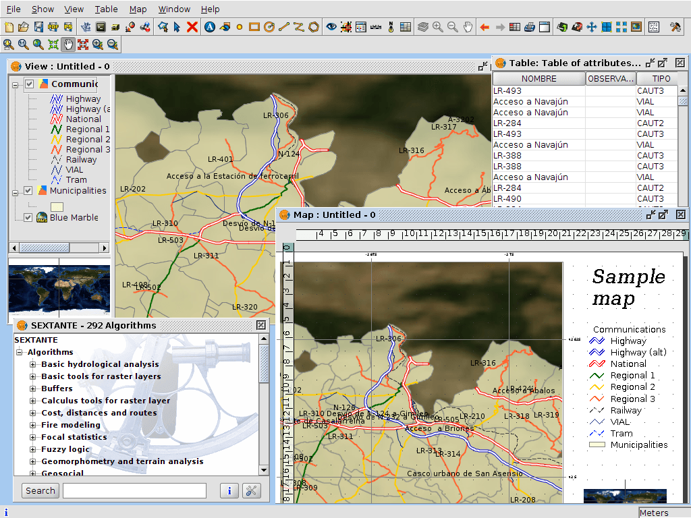

:Author: OSGeo-Live
:Reviewer: Cameron Shorter, LISAsoft
:Version: osgeo-live5.5
:License: Creative Commons Attribution 3.0 Unported (CC BY 3.0)

.. image:: ../../images/project_logos/logo-gvSIG.png
  :scale: 75 %
  :alt: project logo
  :align: right
  :target: http://www.gvsig.org/

.. image:: ../../images/logos/OSGeo_incubation.png
  :scale: 100 %
  :alt: OSGeo Project
  :align: right
  :target: http://www.osgeo.org/incubator/process/principles.html

gvSIG Desktop
================================================================================

Настольная ГИС
~~~~~~~~~~~~~~~~~~~~~~~~~~~~~~~~~~~~~~~~~~~~~~~~~~~~~~~~~~~~~~~~~~~~~~~~~~~~~~~~

gvSIG_ — настольная ГИС, предназначенная для сбора, хранения, обработки, 
анализа и развёртывания любой географически привязанной информации для
решения комплексных проблем управления и планирования. gvSIG известен
дружественным к пользователю интерфейсом, дающим возможность доступа
к наиболее распространённым форматам данных, как векторным, так и растровым. 
gvSIG имеет обширный набор средств для работы с географической информацией
(выборки, создание макетов, геообработка, сетевой анализ и т.д.), которые делают
её идеальным инструментом для пользователей, работающих в сфере ГИС.   

gvSIG известна тем, что: 

* интегрирует единый вид как для локальных, так и данных из удалённых источников по стандартам OGC ;
* легко расширяема и позволяет производить как последовательное развитие программы, так и возможность разработки решений "под заказ";           
* доступна на 20 языках (испанский, английский, немецкий, французский, итальянский и т.д.);
* доступна для Windows, Linux и Mac OS X.

Базовые функции
--------------------------------------------------------------------------------

* Предоставляет базовые ГИС-функции: открытие данных, навигация в окне карты, запрос информации с карты, измерения расстояний, тематическая картография, редактирование легенд с использованием их общих типов, подписывание объектов, разных типы выборки объектов, статистика по атрибутам, отношения таблиц, линковка таблиц, менеджер макетов, инструменты геообработки, функции CAD, обработка растров и т.д.         

* Работает с большинством распространённых форматов:

  * растровые данные: ECW, ENVI hdr, ERDAS img, (Geo)TIFF, GRASS;
  * векторные ГИС- и CAD-данные: shp-файлы, GML, KML, DGN, DXF, DWG;
  * базы данных: PostGIS, MySQL, Oracle, ArcSDE;
  * удалённые источники данных: ECWP, ArcIMS, стандарты OGC.

* Работа с клиентскими службами для локализации ресурсов данных в рамках SDI (каталоги и географические справочники): 

  * каталоги — Z3950, SRW, CSW (ISO/19115 and ebRIM);
  * географические справочники — ADL, WFS, WFS-G.
  
* Более 300 геоалгоритмов доступны через библиотеку SEXTANTE и интеграцию с GRASS.
  
* Интеграция развитые CAD-инструменты:

  * векторные данные: создание, изменение и удаление элементов;
  * командная консоль в стиле CAD;
  * инструменты типа сетки, командный стек, комплексная выборка элементов;
  * инструменты для создания элементов — точек, линий, полигонов, эллипсов и т.д.;
  * инструменты для модификации объектов типа вращения, симметрии и т.д.
  
* Встроенные развитые средства для работы с растрами:

  * привязка и перепроецирование;
  * экспорт, обрезка и т.д.;
  * легенды для растров, гистограммы;
  * фильтры, векторизация;
  * управление предпросмотром и регионами интереса.

* Поддержка скриптования
* Мощные средства перепроецирования посредством PROJ.4

Реализованные стандарты
--------------------------------------------------------------------------------

Развитая поддержка клиентов многих стандартов Open Geospatial 
Consortium (OGC):

* Загрузка слоёв WMS, WFS и WCS 
* Экспорт/импорт символики в SLD 
* Экспорт/импорт Web Map Context (WMC)
* Поиск в каталогах с помощью CSW (ISO/19115 и ebRIM)
* Поиск в географических справочниках с использованием рекомендаций WFS-G. 

Дополнительная информация 
--------------------------------------------------------------------------------

**Веб-сайт:** http://www.gvsig.org/

**Лицензия:**  `GPL версия 2 <http://www.gnu.org/licenses/gpl-2.0.html>`_

**Версия ПО:** 1.11

**Поддерживаемые платформы:** Windows, Linux, Mac

**Поддержка:** http://www.gvsig.org/web/organization/services

.. _gvSIG: http://www.gvsig.org

Начало работы
--------------------------------------------------------------------------------
    
* :doc:`Введение <../quickstart/gvsig_quickstart>`
