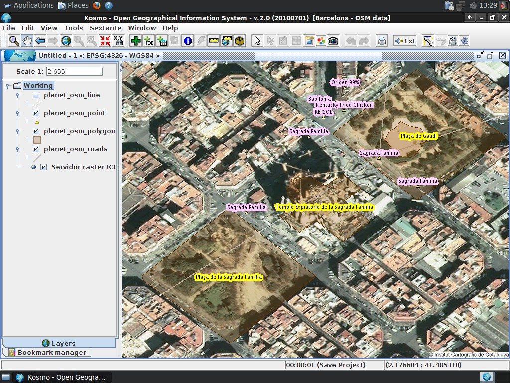

:Author: Sergio Baños Calvo
:Reviewer: Cameron Shorter, LISAsoft
:Version: osgeo-live5.5
:License: Creative Commons Attribution 3.0 Unported (CC BY 3.0)

.. image:: ../../images/project_logos/logo-Kosmo.png
  :scale: 100 %
  :alt: project logo
  :align: right
  :target: http://www.opengis.es/index.php?lang=en

Kosmo Desktop
================================================================================

Настольная ГИС
~~~~~~~~~~~~~~~~~~~~~~~~~~~~~~~~~~~~~~~~~~~~~~~~~~~~~~~~~~~~~~~~~~~~~~~~~~~~~~~~

Kosmo Desktop — дружественная к пользователю настольная ГИС, которая
позволяет просматривать, править и анализировать пространственные данные
в множестве растровых и векторных форматах, а также работать с базами
данных.    

Kosmo следует стандартам OGC и предоставляет отличную поддержку топологии.
Архитектура приложения, основанная на плагинах, позволяет легко
приспосабливать Kosmo к решению конкретных задач.      

Базовые функции
--------------------------------------------------------------------------------

Поддерживаемые форматы:

* Векторные данные: Shapefiles, GML, DXF, DWG, DGN, CSV (с любым расширением)
* Пространственные базы данных: PostgreSQL + PostGIS, Oracle, MySQL
* Растровые данные: ECW, MrSID, Tiff, JPG, GIF, PNG, BMP
* OGC-сервисы: WMS 1.0.0/1.1.0/1.3.0, WFS 1.0.0/1.1.0

Основные особенности:

* Дружественный к пользователю интерфейс, способствующий лёгкому освоению
* Доступны 12 языков интерфейса (английский, испанский, итальянский, немецкий, русский и другие)
* Продвинутый модуль для печати, основанный на OpenOffice (по расширению)
* Правила для согласования топологии: до / во время / после правки
* Проверка топологии и инструменты очистки данных (пересечения/ликвидация/очистка)
* Дополнение для геообработки: буфер / разложение / слияние / отсечение / пересечение / пространственное слияние / отличие (по расширению)
* Инструмент привязки растров (по расширению)
* Интегрирована библиотека SEXTANTE (по расширению)

Реализованные стандарты 
--------------------------------------------------------------------------------

* Web Map Service (WMS) 1.0.0/1.1.0/1.3.0
* Web Feature Service (WFS) 1.0.0/1.1.0
* Styled Layer Descriptor (SLD) (импорт/экспорт)

Дополнительная информация
--------------------------------------------------------------------------------

**Веб-сайт:** http://www.opengis.es

**Лицензия:**  `GPL версия 2  <http://www.gnu.org/licenses/gpl-2.0.html>`_

**Версия ПО:** 2.0.1

**Поддерживаемые платформы:** Windows, Linux

**Интерфейсы API:** Java

**Коммерческая поддержка:** http://www.saig.es/index.php?lang=en

Начало работы
--------------------------------------------------------------------------------
    
* :doc:`Введение <../quickstart/kosmo_quickstart>`
