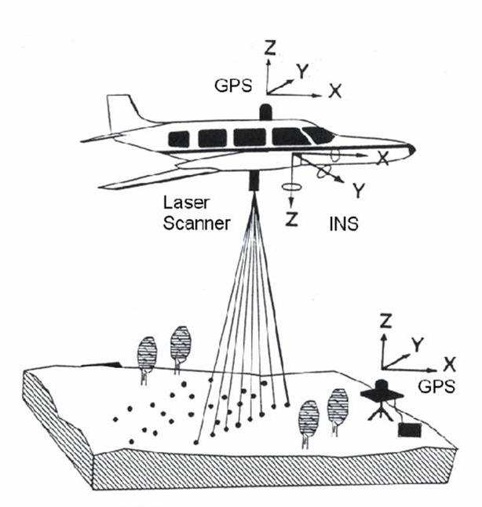

:Автор: Howard Butler
:Проверил: Cameron Shorter, LISAsoft
:Версия: osgeo-live5.5
:Лицензия: Creative Commons Attribution 3.0 Unported (CC BY 3.0)

libLAS
================================================================================

Работа с данными LiDAR
~~~~~~~~~~~~~~~~~~~~~~~~~~~~~~~~~~~~~~~~~~~~~~~~~~~~~~~~~~~~~~~~~~~~~~~~~~~~~~~~

libLAS — это C/C++ библиотека для чтения и записи данных в широко распространённом 
формате `LAS` `LiDAR`_. `Формат ASPRS LAS`_  это последовательный бинарный формат 
для хранения данных, поступающих от сенсоров LiDAR и программ, работающих с 
LiDAR, а также обмена ими.

LiDAR (*Light Detection and Ranging*, определение дистанции с помощью света) — это форма
высокоточного определения расстояний, подобно радарам, использующего луч лазера в
качестве электромагнитного излучения. Одним из видов выходных данных систем LiDAR
является "облако точек", которое представляет собой результат серии точечных измерений 
расстояний от сенсора до точки отражения излучения. Общим форматом хранения данных 
облаков точек является ASPRS **LAS**.

Базовые функции
--------------------------------------------------------------------------------

* C/C++/Python API для чтения, записи и манипуляций с данными LAS
* `Утилиты командной строки`_ на базе `LAStools`_ для манипуляций с данными LAS 
* Перепроецирование координат посредством `GDAL <http://gdal.org>`_

Дополнительная информация
--------------------------------------------------------------------------------

**Веб-сайт:** http://liblas.org

**Лицензия:** `BSD <http://ru.wikipedia.org/wiki/BSD_License>`_

**Версия ПО:** 1.7.0

**Поддерживаемые платформы:** Cross Platform C++ -- Mac OS X, Windows (посредством `OSGeo4W`_), и Linux

**Интерфейсы API:** C, C++, Python

**Поддержка:** `Общение и поддержка <http://liblas.org/community.html>`_

Начало работы
--------------------------------------------------------------------------------

* :doc:`Введение <../quickstart/liblas_quickstart>`

.. _`LIDAR`: http://en.wikipedia.org/wiki/LIDAR
.. _`LAStools`: http://www.cs.unc.edu/~isenburg/lastools/
.. _`Формат LAS`: http://www.lasformat.org/
.. _`ASPRS Standards Committee`: http://www.asprs.org/society/committees/standards/lidar_exchange_format.html
.. _`Формат ASPRS LAS`: http://www.asprs.org/society/committees/standards/lidar_exchange_format.html
.. _`Утилиты командной строки`: http://liblas.org/utilities/index.html
.. _`OSGeo4W`: http://trac.osgeo.org/osgeo4w/
