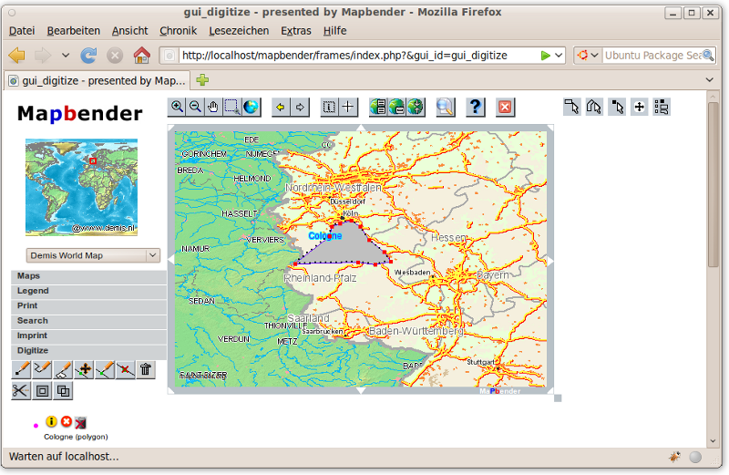

:Author: Astrid Emde
:Reviewer: Cameron Shorter, LISAsoft
:Version: osgeo-live5.5
:License: Creative Commons Attribution 3.0 Unported (CC BY 3.0)

.. image:: ../../images/project_logos/logo-Mapbender.png
  :scale: 100 %
  :alt: Логотип
  :align: right
  :target: http://www.mapbender.org

.. image:: ../../images/logos/OSGeo_project.png
  :scale: 90 %
  :alt: OSGeo Project
  :align: right
  :target: http://www.osgeo.org

Mapbender
================================================================================

Решение для геопорталов
~~~~~~~~~~~~~~~~~~~~~~~~~~~~~~~~~~~~~~~~~~~~~~~~~~~~~~~~~~~~~~~~~~~~~~~~~~~~~~~~

`Mapbender <http://www.mapbender.org>`_ является законченным проектом OSGeo. 
Это решение для организации онлайн-геопорталов, которое предоставляет доступ к 
пространственных инфраструктурным сервисам и позволяет публиковать, 
регистрировать, просматривать, изучать, отслеживать подобные сервисы. 

Mapbender — это "верхушка айсберга", мета-слой программного обеспечения, 
предоставляющий доступ к SDI-компонентам с соблюдением международных стандартов. 
Mapbender позволяет пользователям легко создавать настраиваемые клиенты в браузере
на основе широкого набора виджетов с минимальной необходимостью программирования
или вообще без него. Виджеты интегрируются с функциональностью сервера для обеспечения
расширенных возможностей — защищенного проксирования, оцифровки, автоматического
замыкания и других.

Управляемые Mapbender-приложения предоставляют прямой и простой способ обеспечения
сконцентрированной функциональности для операций с крупномасштабными распределёнными
SDI-компонентами. Это инструмент для  администраторов SDI, которым нужно поддерживать,
систематизировать и отслеживать картографические и геообъектные сервисы. Mapbender 
обеспечивает доступ для пользователей, групп и управляет доступом "компьютер - компьютер".
В дополнение к стандартным сервисам, таким, как OGC WMS и WFS-T, Mapbender позволяет
получить преимущество совместимых услуг из множества серверных платформ.

Клиентская часть Mapbender основана на HTML и JavaScript с использованием библиотек jQuery
и jQuery UI, которые предоставляют множество виджетов. Серверная часть реализована на PHP
и PostgreSQL/PostGIS. 

Mapbender предоставляет полностью новую перспективу управления SDI с использованием
только стандартного веб-браузера. 

Базовые функции
--------------------------------------------------------------------------------

* Лёгкое создание картографических веб-интерфейсов с использованием шаблонных приложений

  * добавление/удаление/изменение виджетов jQuery
  * изменение стилей с использованием jQuery UI (Themeroller) 
* Загрузка и предоставление доступа к OGC WMS (кэширование Capabilities) 

  * объединение загруженных WMS в оверлеи
  * правка видимости слоя
  * порядок
  * формат
  * изменение заголовка
  * расширение сервиса метаданных (ISO-профиль) на основе записи описания Capabilities для каталога с интерфейсом CS-W
* Загрузка и конфигурирование WFS для поиска и подсветки геообъектов
* Связывание WFS-T и WMS для обеспечения онлайн редактирования (совместно с кроссерверной возможностью замыкания, управления геометрией, например, разбивкой, объединением, клонированием)
* Создание пользователей и групп, назначение прав доступа сервисам и модулям
* Обработка WMC
* Подключение к удаленным  каталогам и (опционально) к *GeoNetwork Opensource*
* Предотвращение доступа пользователей при помощи модуля *OWS security proxy* через доверенные серверы
* Шифрованные протоколы контроля и уведомлений о статусе и сервисов автоматических обновления для удаленных сервисов OGC 
* Развёртывание клиентов на базе *OpenLayers* из сервиса репозиториев Mapbender
* Печать высококачественных карт с использованием ваших PDF-шаблонов
* ... и многое другое!

Реализованные стандарты
--------------------------------------------------------------------------------

* OGC Web Map Service (WMS) 1.0.0, 1.1.0, 1.1.1, 1.3.0
* OGC Web Feature Service (WFS) 1.0.0, 1.1.0
* OGC Web Map Context (WMC) 1.1.0 

Дополнительная информация
--------------------------------------------------------------------------------

**Веб-сайт:** http://www.mapbender.org/ 

**Лицензия:** Mapbender is dual licensed under the GNU General Public License and Simplified BSD license
  * http://svn.osgeo.org/mapbender/trunk/mapbender/license/gpl.txt  
  * http://svn.osgeo.org/mapbender/trunk/mapbender/license/simplified_bsd.txt

**Версия ПО:** 2.7.3

**Поддерживаемые платформы:** Windows, Linux, Mac

**Поддержка:** http://www.mapbender.org/Support

Начало работы
--------------------------------------------------------------------------------

* :doc:`Введение <../quickstart/mapbender_quickstart>`

