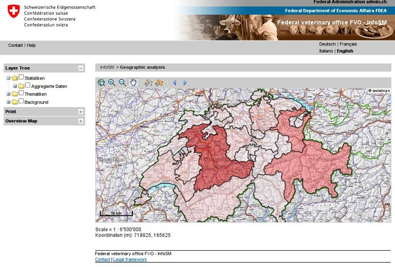

:Author: OSGeo-Live
:Author: Hamish Bowman
:Author: Eric Lemoine
:Reviewer: Cameron Shorter, LISAsoft
:Version: osgeo-live5.5
:License: Creative Commons Attribution 3.0 Unported (CC BY 3.0)

.. image:: ../../images/project_logos/logo-mapfish.png
  :scale: 100 %
  :alt: project logo
  :align: right
  :target: http://www.mapfish.org

.. image:: ../../images/logos/OSGeo_project.png
  :scale: 100 %
  :alt: OSGeo Project
  :align: right
  :target: http://www.osgeo.org

MapFish
================================================================================

Фреймворк для веб-картографии
~~~~~~~~~~~~~~~~~~~~~~~~~~~~~~~~~~~~~~~~~~~~~~~~~~~~~~~~~~~~~~~~~~~~~~~~~~~~~~~~

MapFish — это полнофункциональный и гибкий фреймворк для создания картографических
Web-приложений, отличающийся высокой производительностью и качеством разработки.

MapFish основан на базе Python-фреймворка общего назначения `Pylons <http://pylonshq.com>`_.

MapFish представляет собой геопространственное расширение Pylons.
Он предоставляет инструменты для разработки Web-сервисов, позволяющих создавать,
получать, обновлять и удалять данные.

MapFish содержит полный комплект JavaScript-инструментов, предназначенных
для разработки клиентских интерфейсов, включая инструменты тестирования JavaScript-приложений
и сжатия кода. Кроме того, MapFish включает в себя такие JavaScript-библиотеки,
как `ExtJS <http://extjs.com>`_, :doc:`OpenLayers <openlayers_overview>` и
`GeoExt <http://www.geoext.org>`_.

Поддерживаемые стандарты
--------------------------------------------------------------------------------

Поскольку входящие в состав фреймворка библиотеки OpenLayers и GeoExt поддерживают
такие стандарты `Open Geospatial Consortium
<http://www.opengeospatial.org/>`_, как WMS, WFS, WMC, KML, GML и т.д., то можно говорить о том, что
MapFish совместим со стандартами OGC.

Дополнительная информация
--------------------------------------------------------------------------------

**Веб-сайт:** http://www.mapfish.org

**Лицензия:** `BSD <http://ru.wikipedia.org/wiki/BSD_License>`_

**Версия ПО:** 2.2

**Поддерживаемые платформы:** Windows, Linux, Mac

**Поддержка:** http://trac.mapfish.org/trac/mapfish#Community

Начало работы
--------------------------------------------------------------------------------

* :doc:`Введение <../quickstart/mapfish_quickstart>`

