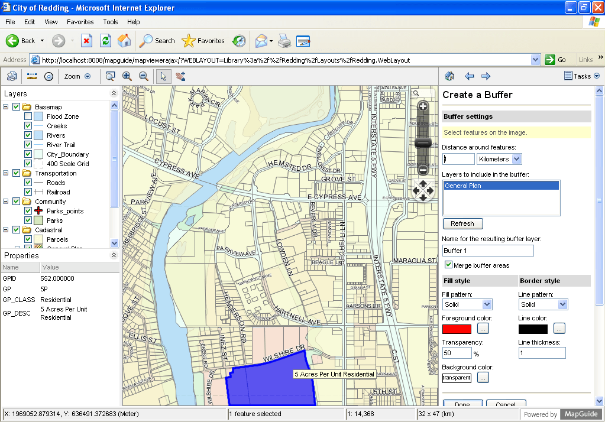

:Author: Trevor Wekel
:Reviewer: Cameron Shorter, LISAsoft
:Version: osgeo-live5.5draft
:License: Creative Commons Attribution 3.0 Unported (CC BY 3.0)

.. image:: ../../images/logos/OSGeo_project.png
  :scale: 100 %
  :alt: Проект OSGeo
  :align: right
  :target: http://www.osgeo.org

MapGuide Open Source
================================================================================

Веб-служба
--------------------------------------------------------------------------------

`MapGuide Open Source <http://mapguide.osgeo.org/>`_ — веб-платформа, позволяющая пользователям разрабатывать и публиковать
картографические веб-приложения и геопространственные веб-службы. MapGuide предоставляет интерактивное средство просмотра,
поддерживающее выделение объектов карты, просмотр свойств, картографические подсказки и такие операции, как построение буфера, выделение объектов, попадающих в заданную область, и измерение.

MapGuide включает базу данных на основе XML для управления содержимым. Maestro позволяет пользователям редактировать XML-базу
и создавать веб-сайты, не написав ни строчки кода. Также MapGuide поддерживает наиболее популярные файловые форматы
пространственных данных, базы данных и стандарты.

MapGuide может быть развернут на Linux или Windows, поддерживает веб-серверы Apache и IIS и предоставляет обширные API
для разработки приложений на PHP, .NET, Java и JavaScript. MapGuide Open Source распространяется под лицензией LGPL.

.. note:: По причине ограниченного места на DVD, MapGuide в настоящее время не установлен.

.. закомментировано, так как ручная установка сейчас не работает: Для установки откройте терминал и выполните команды ``cd gisvm/bin; sudo ./install_mapguide.sh``

Базовые функции
--------------------------------------------------------------------------------

**Интерактивный просмотр карты**

* Динамическое средство просмотра в браузере
* Выделение и свойства объектов карты
* Построение буферов и запросов
* Вывод на принтер и плоттер

**Качественное картографическое отображение**

* Детализация в зависимости от масштаба
* Тематическая стилизация на основе правил
* Рендеринг изображения с применением сглаживания
* Поддержка true color

**Встроенная база данных ресурсов для управления системой**

* Иерархическое хранилище XML-документов, определяющих карты, слои, подключения к источникам данных
* Определив источники данных и слои однажды, их можно использовать в нескольких картах
* Модель безопасности на основе разграничения доступа, поддерживающая наследование прав

**Единообразный доступ к данным**

* Доступ к векторным и растровым данным исключительно через Feature Data Objects API (FDO)
* Обеспечивает стандартизированный способ доступа к различным источникам данных, в том числе SHP, SDF, Oracle, MySQL и PostGIS.

**Гибкость в разработке приложений**

* Разрабатывайте ваши приложения на PHP, .NET или Java

**Обширные API на стороне сервера**

* Создавайте, запрашивайте, читайте и записывайте постоянные и сессионные XML-документы ресурсов
* Запрашивайте и модифицируйте данные объектов карты
* Выполняйте перепроецирование координат
* Создавайте, используйте и анализируйте геометрические объекты
* Манипулируйте картами и слоями, созданными "на лету".

**Быстрая, масштабируемая, безопасная серверная платформа**

* Полная многопоточность и использование преимуществ многоядерных серверов
* Балансирование нагрузки между серверами
* Использование пула подключений к базе данных
* Встроенное кэширование тайлов

**Поддержка нескольких платформ**

* Развертывание на Microsoft Windows или Linux
* Использование в качестве сервера Apache или Microsoft IIS
* Поддержка браузеров Microsoft Internet Explorer, Mozilla Firefox, Safari и Chrome

Реализованные стандарты
--------------------------------------------------------------------------------

* OGC Web Map Service 1.1.1 

Дополнительная информация
--------------------------------------------------------------------------------

**Веб-сайт:** http://mapguide.osgeo.org/

**Лицензия:** `LGPL <http://www.gnu.org/copyleft/lesser.html>`_

**Версия ПО:** 2.4.0 Pre-Release

**Поддерживаемые платформы:** Linux, Windows

**Коммерческая поддержка:** http://www.osgeo.org/search_profile

Начало работы
--------------------------------------------------------------------------------

* :doc:`Введение <../quickstart/mapguide_quickstart>`

