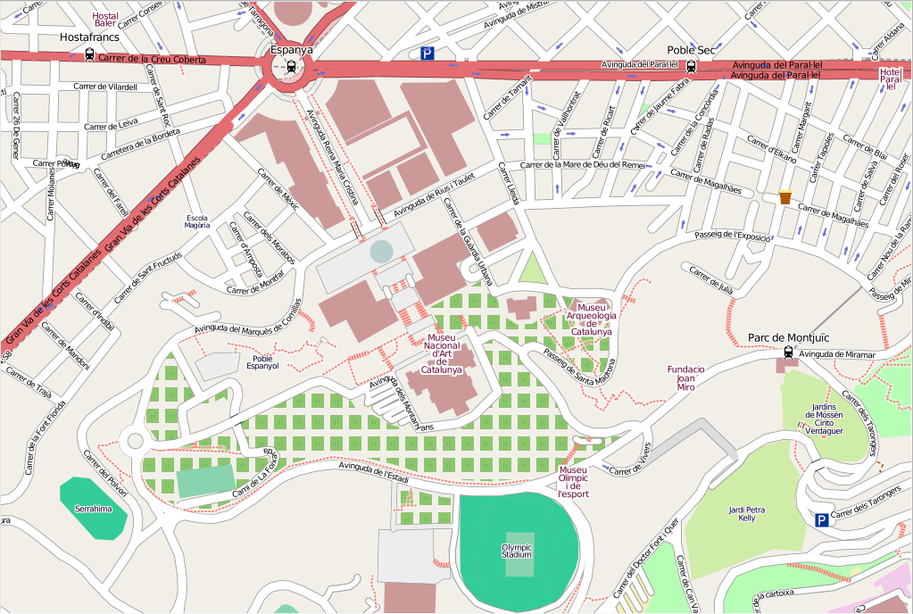

:Author: Dane Springmeyer
:Reviewer: Cameron Shorter, LISAsoft
:Version: osgeo-live6.0
:License: Creative Commons Attribution 3.0 Unported (CC BY 3.0)

.. image:: ../../images/project_logos/logo-mapnik.png
  :scale: 80 %
  :alt: логотип проекта
  :align: right
  :target: http://mapnik.org/

Mapnik
================================================================================

Движок отрисовки карт
~~~~~~~~~~~~~~~~~~~~~~~~~~~~~~~~~~~~~~~~~~~~~~~~~~~~~~~~~~~~~~~~~~~~~~~~~~~~~~~~

Mapnik — набор инструментов для рендеринга красивых карт с чёткими, мягкими контурами элементов
(что обеспечивается использованием качественных алгоритмов сглаживания), умным размещением надписей
и масштабируемыми условными знаками на базе SVG. Самым известным применением Mapnik является
его использование для отрисовки основных слоёв карты OpenStreetMap.

Как правило, Mapnik встраивается в приложения на языке Python, обеспечивающие интернет-доступ к этим картам,
хотя улучшения в механизме масштабирования привели к тому, что в последнее время Mapnik стал также применяться
для создания бумажных карт высокого разрешения.

Представляя собой, в сущности, коллекцию географических объектов (карта, слой, источник данных,
пространственный объект, геометрический примитив), библиотека не зависит от оконных систем
и может использоваться в любом серверном окружении. Она оптимизирована для отличной работы
в многопоточной среде и предназначена главным образом (хотя и не исключительно) для веб-разработки.

Высокоуровневые привязки к Python (boost.python) способствуют быстрой
разработке приложений с использованием Zope 3, Django и т. д.

Mapnik является кроссплатформенным ПО. Доступны пакеты для большинства дистрибутивов Linux,
а для установки под Mac OS X и Windows обычно используются инсталляторы.

 Дополнительная информация 
--------------------------------------------------------------------------------

**Веб-сайт:** http://www.mapnik.org/

**Лицензия:** `LGPL <http://www.gnu.org/copyleft/lesser.html>`_

**Версия ПО:** 2.0.0

**Поддерживаемые платформы:** Windows, Linux, Mac

**Интерфейсы API:** C++, Python

Начало работы
--------------------------------------------------------------------------------

* :doc:`Введение <../quickstart/mapnik_quickstart>`

