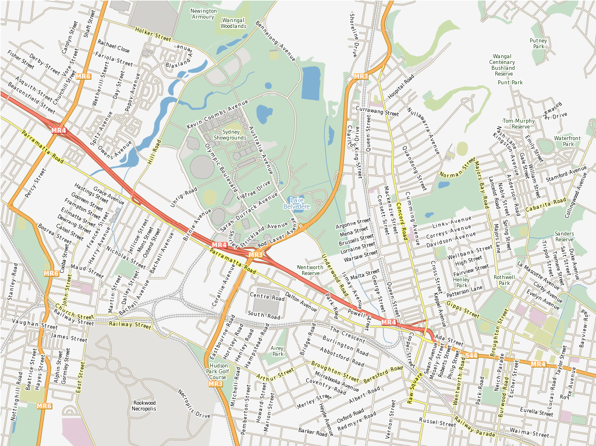

:Author: Alan Boudreault, Steve Lime
:Reviewer: Cameron Shorter, LISAsoft
:Version: osgeo-live5.5
:License: Creative Commons Attribution 3.0 Unported (CC BY 3.0)

.. image:: ../../images/logos/OSGeo_project.png
  :scale: 100 %
  :alt: Проект OSGeo
  :align: right
  :target: http://www.osgeo.org

MapServer
================================================================================

Веб-служба
~~~~~~~~~~~~~~~~~~~~~~~~~~~~~~~~~~~~~~~~~~~~~~~~~~~~~~~~~~~~~~~~~~~~~~~~~~~~~~~~

MapServer — написанная на языке программирования C система рендеринга 
географических данных с `открытым исходным кодом <http://www.opensource.org>`_. 
Помимо просмотра ГИС-данных, MapServer позволяет создавать растровые географические карты,
то есть карты, ссылающиеся на веб-контент. Например, веб-сайт
`Recreation Compass <http://www.dnr.state.mn.us/maps/compass.html>`_ Департамента
природных ресурсов штата Миннесота предоставляет пользователям более 10000
веб-страниц, отчётов и карт через единый интерфейс. Это же приложение служит
картографическим движком для других частей сайта, предоставляя пространственное
содержимое там, где это требуется.

MapServer изначально был разработан в рамках проекта ForNet Университета
Миннесоты (UMN) в сотрудничестве с NASA и Департаментом природных ресурсов
Миннесоты (MNDNR). Позднее он размещался на TerraSIP, спонсируемом NASA
совместном проекте UMN и консорциума по управлению земельными ресурсами.

В настоящее время MapServer — проект `OSGeo <http://www.osgeo.org>`_,
поддерживаемый растущим (приближающимся к 20) числом разработчиков со всего мира.
Он поддерживается группой разнообразных организаций, спонсирующих улучшения и
поддержку. Управление разработкой в рамках OSGeo осуществляется Комитетом по
управлению проектом MapServer, состоящим из разработчиков и контрибьюторов.

Базовые функции
--------------------------------------------------------------------------------

* Развитые средства картографического отображения

  * Отрисовка объектов и выполнение приложений, зависящие от масштаба
  * Подписывание объектов, включая обработку случаев наложения подписей
  * Поддержка шрифтов TrueType для подписей и условных знаков
  * Автоматическое создание элементов карты (масштабной линейки, обзорной карты и легенды)
  * Тематическое картографирование с выделением классов на основе логических и регулярных выражений
  * Поддержка подключаемых рендереров с драйверами для AGG, Cairo, GD, OpenGL и др.
  * Специальные средства для генерации тайловых изображений

* Изощрённая поддержка пространственных запросов

  * Идентификация пространственных объектов с помощью атрибутов, точки, ограничивающего прямоугольника или геометрии в рамках одного или нескольких слоёв
  * Поддержка запросов к растрам
  * Полностью настраиваемый вывод на основе шаблонов
  * Генерация выходных данных на основе запросов OGR

* поддержка популярных средств разработки и скриптинга

  * CGI/FastCGI
  * PHP, Python, Perl, Ruby, Java и .NET

* Кроссплатформенность

  * Linux, Windows, Mac OS X, Solaris, и не только

* Множество форматов растровых и векторных данных

  * Встроенная поддержка шейп-файлов ESRI, PostGIS, ESRI ArcSDE и Oracle Spatial
  * Многие другие форматы через GDAL и OGR

* Поддержка картографических проекций

  * Проецирование "на лету" в тысячи проекций с помощью библиотеки Proj.4

Реализованные стандарты
--------------------------------------------------------------------------------

* Поддержка многочисленных стандартов Open Geospatial Consortium (OGC)

  * WMS (клиент/сервер), нетранзакционный WFS (клиент/сервер), WMC, WCS, Filter Encoding, SLD, GML, SOS, OM

Демо
--------------------------------------------------------------------------------

* `Itasca <http://localhost/mapserver_demos/itasca/>`_

Документация
--------------------------------------------------------------------------------

* `Документация MapServer 6.0.3 <../../mapserver/doc/index.html>`_

Дополнительная информация
--------------------------------------------------------------------------------

**Веб-сайт:** http://www.mapserver.org/

**Лицензия:** `основанная на MIT <http://mapserver.org/copyright.html#license>`_

**Версия ПО:** 6.0.3

**Поддерживаемые платформы:** Windows, Linux, Mac

**Интерфейсы API:** C, PHP, Python, Perl, Ruby, Java и .NET

**Поддержка:** http://mapserver.org/community/

Начало работы
--------------------------------------------------------------------------------
    
* :doc:`Введение <../quickstart/mapserver_quickstart>`
